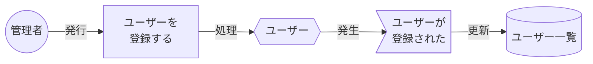
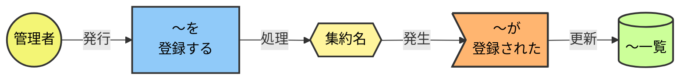
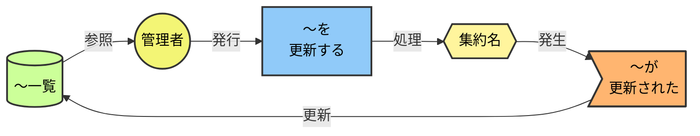
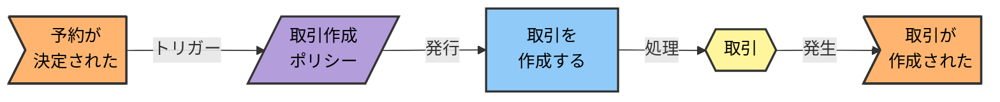
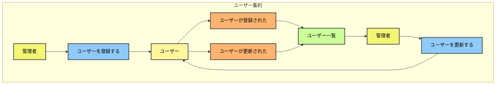
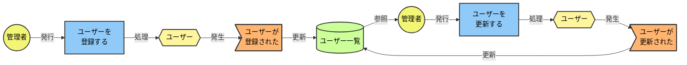
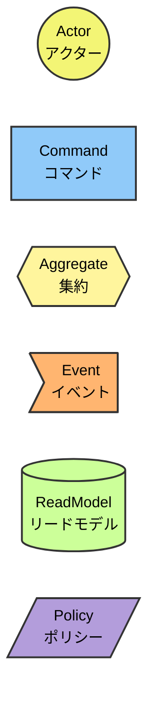
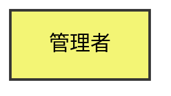

# EventStorming Mermaid記法ガイド

> **目的**: EventStorming図をMermaidで一貫性を保って作成・更新するためのルール

---

## 1. 要素とスタイル定義

### 色定義（classDef）

```
classDef actor fill:#F3F575,stroke:#333,stroke-width:2px,color:#000
classDef command fill:#90CAF9,stroke:#333,stroke-width:2px,color:#000
classDef aggregate fill:#FFF59D,stroke:#333,stroke-width:2px,color:#000
classDef event fill:#FFB570,stroke:#333,stroke-width:2px,color:#000
classDef readmodel fill:#CCFF99,stroke:#333,stroke-width:2px,color:#000
classDef policy fill:#B39DDB,stroke:#333,stroke-width:2px,color:#000
classDef system fill:#F48FB1,stroke:#333,stroke-width:2px,color:#000
```

### 将来対応（未実装）のスタイル

```
classDef command_future fill:#90CAF9,stroke:#999,color:#666,stroke-dasharray: 5 5
classDef event_future fill:#FFB570,stroke:#999,color:#666,stroke-dasharray: 5 5
```

---

## 2. ノード形状

### 要素別の形状

| 要素 | 形状構文 | 例 | 用途 |
|------|---------|-----|------|
| アクター | `((名前))` | `A1((管理者)):::actor` | 操作を行う人 |
| コマンド | `[名前]` | `C1[ユーザーを<br/>登録する]:::command` | 意図・操作 |
| 集約 | `{{名前}}` | `AG1{{ユーザー}}:::aggregate` | ドメインモデル |
| イベント | `>名前]` | `E1>ユーザーが<br/>登録された]:::event` | 発生した事実 |
| リードモデル | `[(名前)]` | `RM1[(ユーザー一覧)]:::readmodel` | 参照用データ |
| ポリシー | `[/名前/]` | `P1[/When 条件/]:::policy` | 自動処理ルール |

### 全体図と詳細図の使い分け

| 図の種類 | 形状 | エッジラベル | 用途 |
|---------|------|-------------|------|
| 全体図 | シンプル（`[]`のみ） | なし | 概要把握 |
| 詳細図 | 各要素固有の形状 | あり | 詳細理解 |

---

## 3. エッジラベル

### 標準ラベル

| 接続 | ラベル | 意味 |
|------|--------|------|
| アクター → コマンド | `-->｜発行｜` | アクターがコマンドを発行 |
| コマンド → 集約 | `-->｜処理｜` | 集約がコマンドを処理 |
| 集約 → イベント | `-->｜発生｜` | 処理結果としてイベント発生 |
| イベント → リードモデル | `-->｜更新｜` | イベントがリードモデルを更新 |
| リードモデル → アクター | `-->｜参照｜` | アクターがリードモデルを参照 |
| イベント → ポリシー | `-->｜トリガー｜` | イベントがポリシーを起動 |

### 使用例



---

## 4. 基本フローパターン

### パターン A: 登録フロー（新規作成）

```
Actor → Command → Aggregate → Event → ReadModel
```



### パターン B: 更新フロー（サイクル）

```
ReadModel → Actor → Command → Aggregate → Event → ReadModel
```



### パターン C: ポリシー起点（Saga）

```
Event → Policy → Command → Aggregate → Event
```



---

## 5. 全体図の構造

### subgraphで集約をグループ化



**ポイント:**
- `subgraph 英語名["日本語表示名"]` で日本語表示
- `direction LR` で左から右のフロー
- 全体図ではシンプルな `[]` 形状を使用
- エッジラベルは省略（図の簡潔さを優先）

---

## 6. 詳細図の構造

### 各要素固有の形状とエッジラベルを使用



**ポイント:**
- 各要素に固有の形状を使用（`(())`, `{{}}`, `>]`, `[()]`）
- エッジラベルで接続の意味を明示
- ノード内で `<br/>` を使って改行（可読性向上）
- コメント（`%% 〜`）でフローを区分

---

## 7. 凡例



---

## 8. 命名規則

### ノードID

```
A1, A2, ...   : Actor
C1, C2, ...   : Command
AG1, AG2, ... : Aggregate
E1, E2, ...   : Event
P1, P2, ...   : Policy
RM1, RM2, ... : ReadModel
S1, S2, ...   : System
```

### ラベル（日本語推奨）

| 要素 | 形式 | 例 |
|------|------|-----|
| Actor | ロール名 | `管理者`, `システム` |
| Command | 「〜を〜する」 | `ユーザーを登録する` |
| Aggregate | 名詞 | `ユーザー`, `予約` |
| Event | 「〜が〜された」 | `ユーザーが登録された` |
| Policy | 条件 | `取引作成ポリシー` |
| ReadModel | 「〜一覧」 | `ユーザー一覧` |

---

## 9. 矢印の使い分け

| 矢印 | 意味 | 用途 |
|------|------|------|
| `-->` | 実線 | 実装済みフロー |
| `-.->` | 点線 | 将来対応（未実装） |
| `==>` | 太線 | 強調（必要時のみ） |

---

## 10. ドキュメント構成テンプレート

```markdown
# EventStorming図（Mermaid）

> ソース: Miroボード（ボードID）
> 生成日時: YYYY-MM-DD

---

## 全体図
（全集約を1つのflowchartにまとめた概要図）

## 集約別詳細図
### ユーザー集約
（詳細図）
### パートナー集約
（詳細図）
...

## 凡例

## イベント → ReadModel マッピング一覧
（テーブル）

## 集約サマリー
### 各集約名
（テーブル）

## ソース情報
```

---

## 11. よくある間違い

### ❌ classDefをブロック外に書く

```mermaid
classDef actor fill:#F3F575  <!-- これは効かない -->

flowchart LR
    A1[管理者]:::actor
```

### ✅ classDefはブロック内に書く



### ❌ ノードIDの重複

同一ブロック内で `A1` を2回使うとエラー

### ✅ ユニークなIDを使う

`A1`, `A2` のように連番で区別

### ❌ 形状の閉じ忘れ

```mermaid
E1>イベント   <!-- 閉じの ] がない -->
```

### ✅ 正しい形状構文

```mermaid
E1>イベント]:::event
```

---

## 12. 実装との対応

| Mermaidラベル | 実装ファイル |
|--------------|-------------|
| `予約を作成する` | `CreateMatchingCommand.java` |
| `予約が作成された` | `MatchingCreatedEvent.java` |
| `予約` | `MatchingAggregate.java` |
| `予約一覧` | `MatchingProjection.java` |
| `取引作成ポリシー` | `MatchingToContractSaga.java` |

---

## 13. 参考リンク

- [Mermaid公式: Flowchart](https://mermaid.js.org/syntax/flowchart.html)
- [EventStorming図_Mermaid_Generated_v5.md](./EventStorming図_Mermaid_Generated_v5.md) - 生成例
- [Mermaid自動生成プロンプト.md](./Mermaid自動生成プロンプト.md) - 自動生成方法
