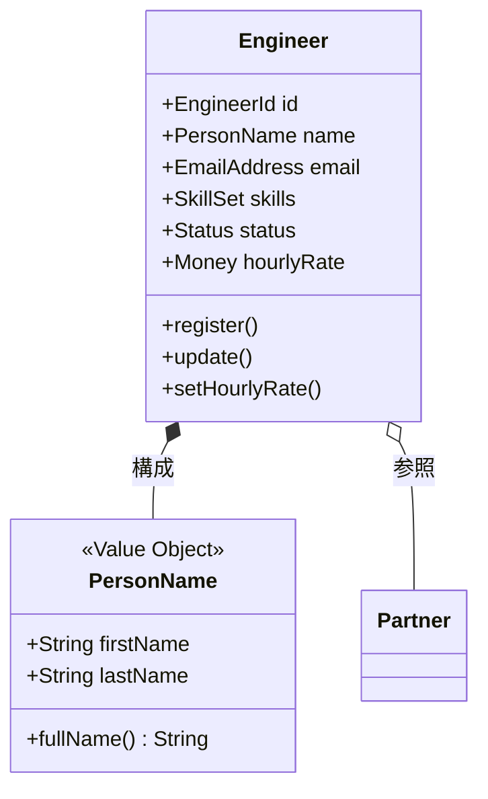
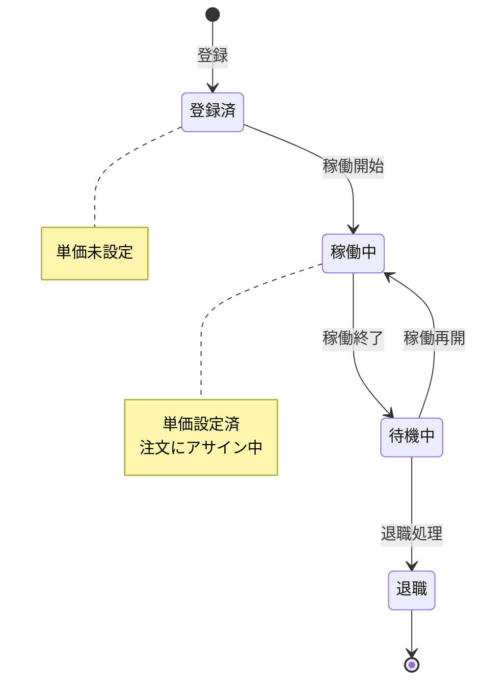
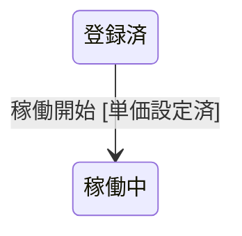
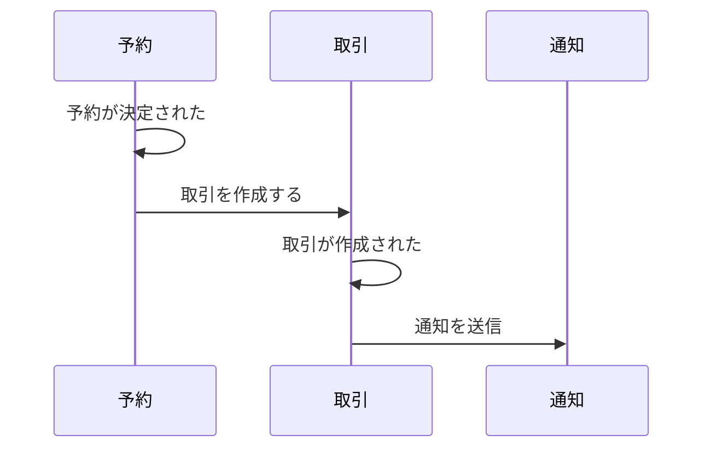
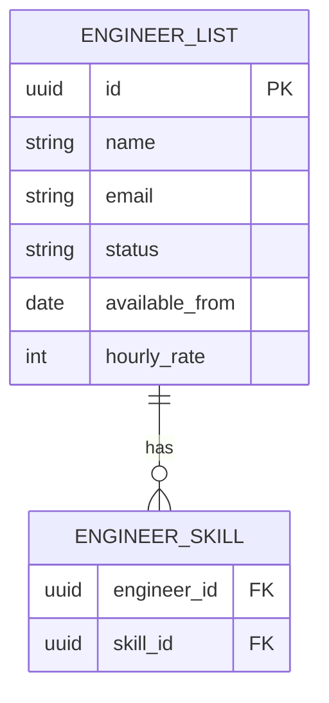

# ドメインモデリング ガイド

## 概要

このガイドでは、イベントストーミング完了後のドメインモデリングをMarkdown + Mermaidで記述する方法を説明します。

**目的:**
- 人間が読みやすいドキュメント
- AIが解析してコード生成に活用
- GitHubでそのままプレビュー可能

---

## ファイル構成

```
docs/20_ドメイン/
├── README.md                    # 全体概要
├── {コンテキスト名}/             # コンテキスト別ディレクトリ
│   ├── {集約名}集約.md    # 集約ドキュメント
│   └── ...
├── コンテキストマップ.md         # コンテキスト間の関係
├── 用語集.md                    # ユビキタス言語
└── 業務ルール/                  # ビジネスルール
```

**例:**
```
docs/20_ドメイン/
├── 販売コンテキスト/
│   ├── 注文集約.md
│   └── 商品集約.md
├── 会員コンテキスト/
│   └── ユーザー集約.md
└── ...
```

---

## 集約ドキュメントの構成

各集約は以下のセクションで構成します。

```markdown
# {集約名}集約

## 概要
集約の責務を1〜2文で説明

## 構造図
Mermaidのクラス図

## 状態遷移
Mermaidの状態遷移図（状態を持つ場合）

## コマンド
各コマンドの詳細（フィールド、制約、事前条件）

## イベント
各イベントのペイロード

## クエリ
リードモデルの検索条件

## 不変条件
常に満たすべきルール

## ビジネスルール
その他の重要なルール
```

---

## Mermaid記法ガイド

### クラス図（構造）



**記法:**
- `+` public, `-` private, `#` protected
- `<<Value Object>>` ステレオタイプ
- `*--` コンポジション（親と共に削除）
- `o--` 集約（独立したライフサイクル）
- `-->` 依存

### 状態遷移図



**ガード条件の表現:**



### シーケンス図（Saga/連携）



### ER図（リードモデル）



---

## コマンド定義の書き方

### 基本フォーマット

```markdown
### {コマンド名}

**実行者:** {Actor名}

| 項目 | 型 | 必須 | 制約 | 説明 |
|------|-----|------|------|------|
| name | PersonName | ✅ | - | ユーザー名 |
| email | EmailAddress | ✅ | 一意 | メールアドレス |
| skills | SkillSet | ✅ | 1つ以上 | 保有スキル |
| availableFrom | Date | - | 本日以降 | 稼働可能日 |

**事前条件:**
- 同一メールアドレスが存在しないこと

**事後条件:**
- ユーザー一覧に表示される

**発行イベント:** ユーザーが登録された
```

### 制約の表現

| 表記 | 意味 |
|------|------|
| `一意` | 重複不可 |
| `1つ以上` | 最低1件必須 |
| `本日以降` | 過去日付不可 |
| `3,000〜15,000` | 範囲指定 |
| `最大100文字` | 文字数制限 |
| `メール形式` | フォーマット |
| `{条件}の場合必須` | 条件付き必須 |

### 状態遷移コマンドの場合

```markdown
### 稼働を開始する

**実行者:** 管理者

**状態遷移:** 登録済 → 稼働中

**ガード条件:**
- 単価が設定されていること
- ステータスが「登録済」または「待機中」であること

**発行イベント:** 稼働が開始された
```

---

## イベント定義の書き方

```markdown
### ユーザーが登録された

| 項目 | 型 | 説明 |
|------|-----|------|
| engineerId | UUID | ユーザーID |
| name | PersonName | 名前 |
| email | String | メールアドレス |
| skills | List<SkillId> | スキルIDリスト |
| createdAt | DateTime | 作成日時 |
| createdBy | UserId | 作成者ID |
```

---

## クエリ定義の書き方

```markdown
## ユーザー一覧

### 表示カラム

| カラム | ソート | 説明 |
|--------|--------|------|
| 氏名 | ✅ | 姓名を結合 |
| ステータス | ✅ | 稼働状況 |
| スキル | - | タグ形式で表示 |
| 稼働可能日 | ✅ | - |
| 時給単価 | ✅ | マネージャー以上のみ表示 |

### 検索条件

| 条件 | 型 | 演算子 | デフォルト |
|------|-----|--------|-----------|
| ステータス | 複数選択 | IN | 退職以外 |
| スキル | 複数選択 | いずれか含む | - |
| 稼働可能日 | 日付 | 以前 | 今日 |
| 単価下限 | 数値 | 以上 | - |
| 単価上限 | 数値 | 以下 | - |
| キーワード | テキスト | 部分一致 | - |

### デフォルトソート
稼働可能日 昇順

### ページネーション
20件/ページ（最大100件）
```

---

## 不変条件の書き方

```markdown
## 不変条件

| ID | 条件 | 説明 |
|----|------|------|
| INV-001 | スキルは1つ以上 | スキルなしのユーザーは存在しない |
| INV-002 | 稼働中は退職不可 | 稼働終了してから退職処理 |
| INV-003 | パートナーなら partnerId 必須 | 所属区分と整合性を保つ |
| INV-004 | 単価未設定で稼働開始不可 | 稼働開始にはまず単価設定が必要 |
```

---

## 値オブジェクトの書き方

```markdown
## PersonName（人名）

**種別:** 複合値オブジェクト

| 項目 | 型 | 制約 |
|------|-----|------|
| firstName | String | 最大50文字, 必須 |
| lastName | String | 最大50文字, 必須 |

**メソッド:**
- `fullName()` - 姓名を結合して返す
- `formalName()` - 敬称付きで返す

---

## EmailAddress（メールアドレス）

**種別:** 単一値ラッパー

| 項目 | 型 | 制約 |
|------|-----|------|
| value | String | メール形式, 最大255文字 |

**メソッド:**
- `getDomain()` - ドメイン部分を取得

---

## Money（金額）

**種別:** 複合値オブジェクト

| 項目 | 型 | 制約 |
|------|-----|------|
| amount | Decimal | 0以上 |
| currency | Currency | デフォルト JPY |

**メソッド:**
- `add(Money)` - 加算（同一通貨のみ）
- `multiply(int)` - 乗算
- `isGreaterThan(Money)` - 比較
```

---

## AIへの指示の書き方

ドキュメント内にAI向けの実装指示を含める場合：

```markdown
<!-- AI実装メモ -->
<!--
- EmailAddressは shared/kernel に配置
- 一意性チェックは Repository で実装
- スキルのバリデーションは SkillSet 値オブジェクト内で実施
-->
```

または専用セクションを設ける：

```markdown
## 実装ノート

- `EmailAddress` は `shared/kernel/value-objects` に配置
- 一意性チェックは `EngineerRepository.existsByEmail()` で実装
- 状態遷移のガード条件は集約内のメソッドとして実装
```

---

## サンプル

完全なサンプルは以下を参照：
- [ユーザー集約](./examples/engineer集約.md)
