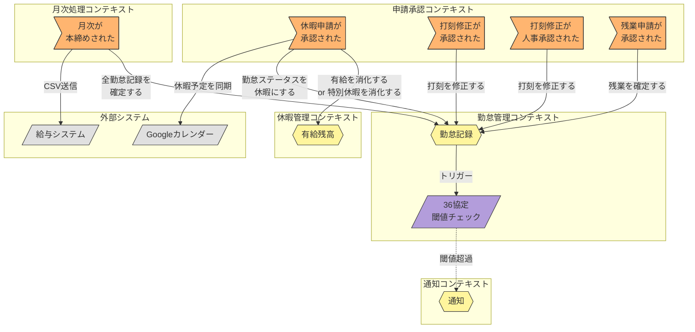

# イベントストーミング図: Saga（コンテキスト間連携）

> **更新日**: 2026-02-08
> **種別**: コンテキスト間連携

---

## 全体図

---

## Saga別詳細図

### 休暇承認 Saga

休暇申請が承認されると、休暇残高の消化と勤怠記録への反映が連動する。
休暇種別により有給消化 or 特別休暇消化に分岐する。

### 打刻修正承認 Saga

打刻修正が承認されると、勤怠記録の打刻データが修正される。
仮締め後の場合は人事承認を経てから勤怠記録に反映する。

### 残業承認 Saga

残業申請が承認されると、勤怠記録に残業が確定記録される。

### 月次本締め Saga

月次本締めにより、勤怠記録が確定し給与データがエクスポートされる。

---

## 凡例

---

## トリガーイベント → コマンド マッピング

| トリガーイベント | 発信元 | 発行コマンド | ターゲット |
|-----------------|--------|-------------|-----------|
| 休暇申請が承認された | 申請承認 | 有給を消化する / 特別休暇を消化する | 有給残高（休暇管理） |
| | | 勤怠ステータスを休暇にする | 勤怠記録（勤怠管理） |
| | | カレンダーに休暇予定を同期 | Googleカレンダー（外部） |
| 打刻修正が承認された | 申請承認 | 打刻を修正する | 勤怠記録（勤怠管理） |
| 打刻修正が人事承認された | 申請承認 | 打刻を修正する | 勤怠記録（勤怠管理） |
| 残業申請が承認された | 申請承認 | 残業を確定する | 勤怠記録（勤怠管理） |
| 月次が本締めされた | 月次処理 | 全勤怠記録を確定する | 勤怠記録（勤怠管理） |
| | | 給与データをエクスポートする | 給与システム（外部） |
| 36協定閾値超過検知 | 勤怠管理 | 通知を送信する | 通知（通知） |

---

## Sagaサマリー

| Saga名 | トリガーイベント | 関連コンテキスト | コマンド数 | 補足 |
|--------|-----------------|----------------|-----------|------|
| 休暇承認 | 休暇申請が承認された | 申請承認 → 休暇管理, 勤怠管理, 外部 | 3 | 有給 or 特別休暇消化 + 勤怠反映 + カレンダー同期 |
| 打刻修正承認 | 打刻修正が承認された / 人事承認された | 申請承認 → 勤怠管理 | 1 | 仮締め後は2段階承認（上長→人事）を経由 |
| 残業承認 | 残業申請が承認された | 申請承認 → 勤怠管理, 通知 | 1 | 残業確定 + 36協定チェック（条件分岐→通知） |
| 月次本締め | 月次が本締めされた | 月次処理 → 勤怠管理, 外部 | 2 | 全勤怠確定 + 給与CSVエクスポート |

<!-- 品質チェック結果
- [x] 主要4 Sagaパターンが図示されている
- [x] コンテキスト境界をまたぐ連携が明確
- [x] 外部システム（Google カレンダー、給与システム）が含まれている
- [x] 通知コンテキストが正式なコンテキストとして表現されている
- [x] 条件分岐（36協定閾値超過時のアラート）が表現されている
- [x] 休暇承認Sagaに有給/特別休暇の分岐がある
- [x] 打刻修正承認Sagaに仮締め後2段階承認の分岐がある
- [x] classDef色定義がES図と統一されている
-->
