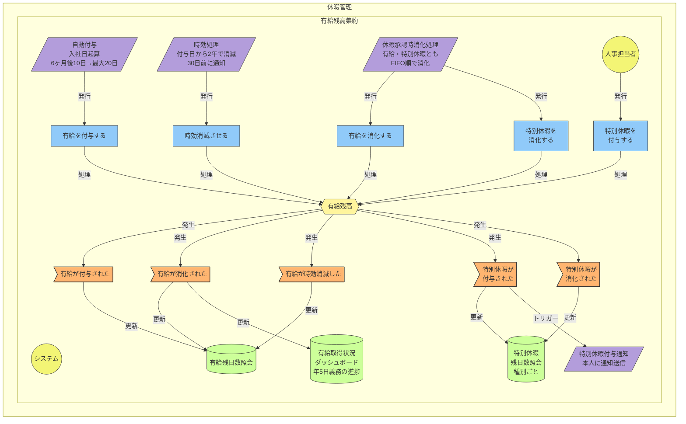
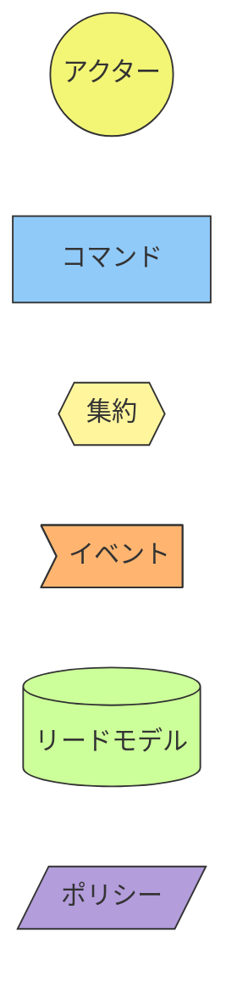

# イベントストーミング図: 休暇管理

> **更新日**: 2026-02-08
> **種別**: コアドメイン

---

## 全体図

---

## 凡例

---

## イベント → ReadModel マッピング

| イベント | ReadModel |
|----------|-----------|
| 有給が付与された | 有給残日数照会 |
| 有給が消化された | 有給残日数照会, 有給取得状況ダッシュボード |
| 有給が時効消滅した | 有給残日数照会 |
| 特別休暇が付与された | 特別休暇残日数照会 |
| 特別休暇が消化された | 特別休暇残日数照会 |

---

## 集約サマリー

### 有給残高集約

| 種別 | 名称 |
|------|------|
| コマンド | 有給を付与する, 有給を消化する, 時効消滅させる, 特別休暇を付与する, 特別休暇を消化する |
| イベント | 有給が付与された, 有給が消化された, 有給が時効消滅した, 特別休暇が付与された, 特別休暇が消化された |
| リードモデル | 有給残日数照会（従業員別）, 有給取得状況ダッシュボード（年5日義務の進捗）, 特別休暇残日数照会（種別ごと） |
| ポリシー | 自動付与（入社日起算、6ヶ月後10日→最大20日）, 時効処理（付与日+2年、30日前通知）, 休暇承認時消化処理（FIFO）, 特別休暇付与通知 |

> **設計判断**: 旧「休暇付与集約」（コマンド1個のみ）を有給残高集約に統合。
> 特別休暇は規程で付与日数が定義済みのため、有給残高と同一ライフサイクルで管理する。

<!-- 品質チェック結果
- [x] 自動処理ポリシーが4件定義されている（付与・時効・消化・特別休暇通知）
- [x] リードモデルに年5日取得義務の進捗ダッシュボードがある
- [x] 特別休暇が有給残高集約に統合されている（設計判断記録あり）
- [x] システムアクターが自動処理の起点として明示
- [x] 人事担当者が特別休暇付与の起点として明示
- [x] イベント→ReadModelマッピングが網羅的
-->
