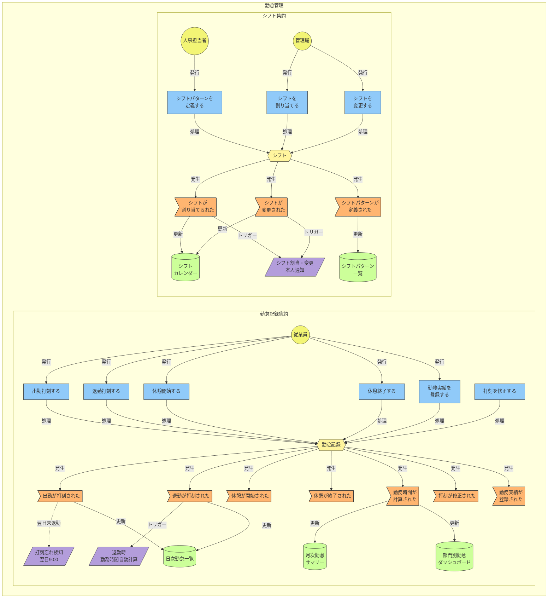
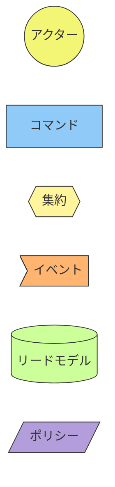

# イベントストーミング図: 勤怠管理

> **更新日**: 2026-02-08
> **種別**: コアドメイン

---

## 全体図

---

## 凡例

---

## イベント → ReadModel マッピング

| イベント | ReadModel |
|----------|-----------|
| 出勤が打刻された | 日次勤怠一覧 |
| 退勤が打刻された | 日次勤怠一覧 |
| 勤務時間が計算された | 月次勤怠サマリー, 部門別勤怠ダッシュボード |
| 打刻が修正された | 日次勤怠一覧, 月次勤怠サマリー |
| 勤務実績が登録された | 日次勤怠一覧 |
| シフトパターンが定義された | シフトパターン一覧 |
| シフトが割り当てられた | シフトカレンダー |
| シフトが変更された | シフトカレンダー |

---

## 集約サマリー

### 勤怠記録集約

| 種別 | 名称 |
|------|------|
| コマンド | 出勤打刻する, 退勤打刻する, 休憩開始する, 休憩終了する, 打刻を修正する, 勤務実績を登録する |
| イベント | 出勤が打刻された, 退勤が打刻された, 休憩が開始された, 休憩が終了された, 勤務時間が計算された, 打刻が修正された, 勤務実績が登録された |
| リードモデル | 日次勤怠一覧, 月次勤怠サマリー, 部門別勤怠ダッシュボード |
| ポリシー | 退勤時勤務時間自動計算, 打刻忘れ検知（翌日9:00） |

### シフト集約

| 種別 | 名称 |
|------|------|
| コマンド | シフトパターンを定義する, シフトを割り当てる, シフトを変更する |
| イベント | シフトパターンが定義された, シフトが割り当てられた, シフトが変更された |
| リードモデル | シフトカレンダー, シフトパターン一覧 |
| ポリシー | シフト割当・変更時の本人通知 |

<!-- 品質チェック結果
- [x] 全集約にコマンド・イベント・リードモデルが定義されている
- [x] アクターが明示されている（従業員、管理職、人事担当者）
- [x] ポリシー（自動処理）が記載されている（3件: 退勤時計算, 打刻忘れ検知, シフト変更通知）
- [x] Mermaid記法のclassDef色定義が統一されている
- [x] イベント→ReadModelマッピングが網羅的
-->
