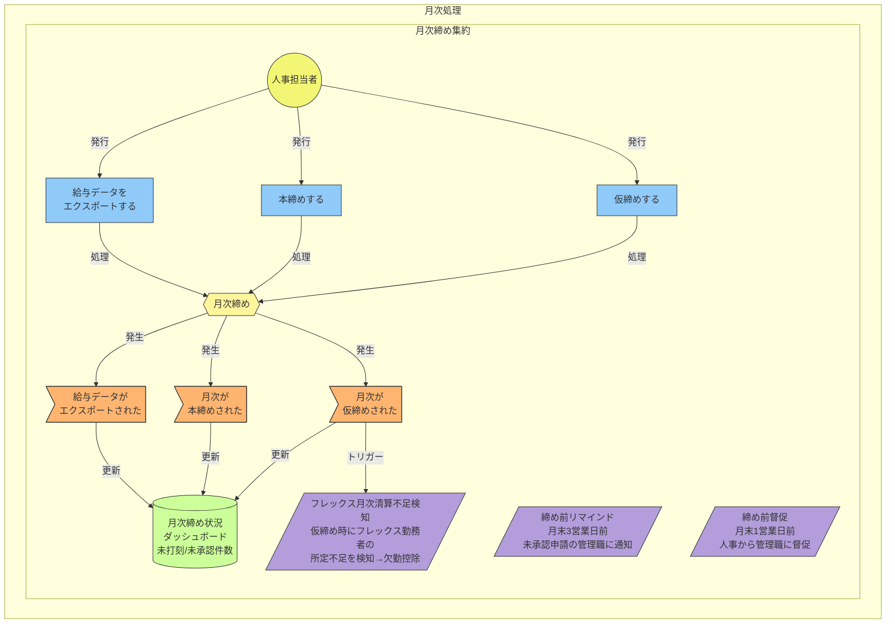
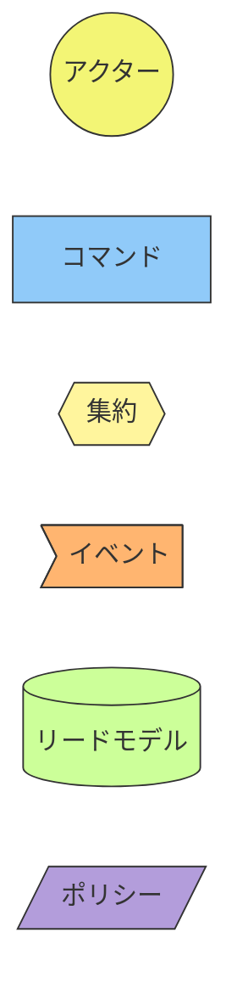

# イベントストーミング図: 月次処理

> **更新日**: 2026-02-08
> **種別**: 支援ドメイン

---

## 全体図

---

## 凡例

---

## イベント → ReadModel マッピング

| イベント | ReadModel |
|----------|-----------|
| 月次が仮締めされた | 月次締め状況ダッシュボード |
| 月次が本締めされた | 月次締め状況ダッシュボード |
| 給与データがエクスポートされた | 月次締め状況ダッシュボード |

---

## 集約サマリー

### 月次締め集約

| 種別 | 名称 |
|------|------|
| コマンド | 仮締めする, 本締めする, 給与データをエクスポートする |
| イベント | 月次が仮締めされた, 月次が本締めされた, 給与データがエクスポートされた |
| リードモデル | 月次締め状況ダッシュボード（未打刻/未承認件数） |
| ポリシー | 締め前リマインド（月末3営業日前、未承認申請の管理職に通知）, 締め前督促（月末1営業日前、人事から管理職に督促）, フレックス月次清算不足検知（仮締め時→欠勤控除） |

<!-- 品質チェック結果
- [x] 仮締め→本締めの2段階フローが定義
- [x] 給与エクスポートがコマンド/イベントで明示
- [x] リマインド・督促ポリシーが定義（3営業日前/1営業日前）
- [x] フレックス月次清算不足検知ポリシーが定義
- [x] 月次締め状況ダッシュボードがリードモデルにある
- [x] イベント→ReadModelマッピングが網羅的
-->
