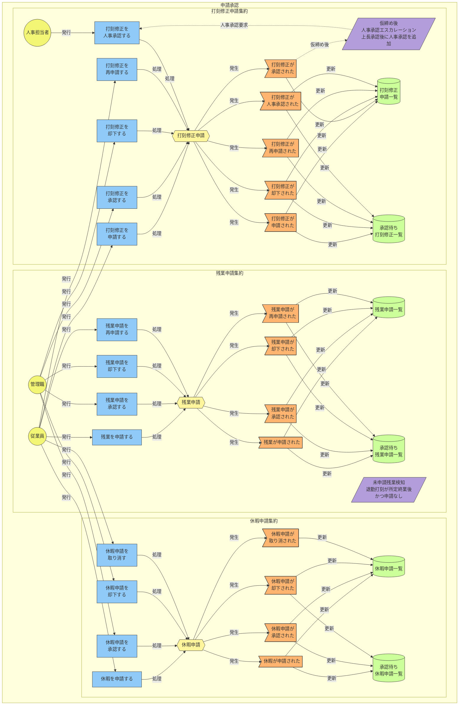
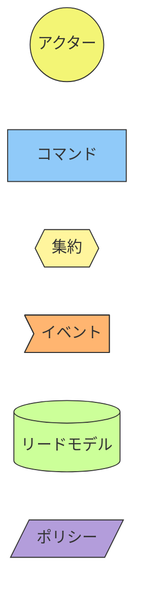

# イベントストーミング図: 申請承認

> **更新日**: 2026-02-08
> **種別**: コアドメイン

---

## 全体図

---

## 凡例

---

## イベント → ReadModel マッピング

| イベント | ReadModel |
|----------|-----------|
| 残業が申請された | 残業申請一覧, 承認待ち残業申請一覧 |
| 残業申請が承認された | 残業申請一覧, 承認待ち残業申請一覧 |
| 残業申請が却下された | 残業申請一覧, 承認待ち残業申請一覧 |
| 残業申請が再申請された | 残業申請一覧, 承認待ち残業申請一覧 |
| 休暇が申請された | 休暇申請一覧, 承認待ち休暇申請一覧 |
| 休暇申請が承認された | 休暇申請一覧, 承認待ち休暇申請一覧 |
| 休暇申請が却下された | 休暇申請一覧, 承認待ち休暇申請一覧 |
| 休暇申請が取り消された | 休暇申請一覧 |
| 打刻修正が申請された | 打刻修正申請一覧, 承認待ち打刻修正一覧 |
| 打刻修正が承認された | 打刻修正申請一覧 |
| 打刻修正が却下された | 打刻修正申請一覧, 承認待ち打刻修正一覧 |
| 打刻修正が再申請された | 打刻修正申請一覧, 承認待ち打刻修正一覧 |
| 打刻修正が人事承認された | 打刻修正申請一覧, 承認待ち打刻修正一覧 |

---

## 集約サマリー

### 残業申請集約

| 種別 | 名称 |
|------|------|
| コマンド | 残業を申請する, 残業申請を承認する, 残業申請を却下する, 残業申請を再申請する |
| イベント | 残業が申請された, 残業申請が承認された, 残業申請が却下された, 残業申請が再申請された |
| リードモデル | 残業申請一覧（従業員別）, 承認待ち残業申請一覧（管理職用） |
| ポリシー | 未申請残業検知（退勤打刻が所定終業後かつ申請なし → アラート送信） |

### 休暇申請集約

| 種別 | 名称 |
|------|------|
| コマンド | 休暇を申請する, 休暇申請を承認する, 休暇申請を却下する, 休暇申請を取り消す |
| イベント | 休暇が申請された, 休暇申請が承認された, 休暇申請が却下された, 休暇申請が取り消された |
| リードモデル | 休暇申請一覧（従業員別）, 承認待ち休暇申請一覧（管理職用） |

### 打刻修正申請集約

| 種別 | 名称 |
|------|------|
| コマンド | 打刻修正を申請する, 打刻修正を承認する, 打刻修正を却下する, 打刻修正を再申請する, 打刻修正を人事承認する |
| イベント | 打刻修正が申請された, 打刻修正が承認された, 打刻修正が却下された, 打刻修正が再申請された, 打刻修正が人事承認された |
| リードモデル | 打刻修正申請一覧（従業員別）, 承認待ち打刻修正一覧（管理職用） |
| ポリシー | 仮締め後人事承認エスカレーション（上長承認後に人事承認ステップを追加） |

<!-- 品質チェック結果
- [x] 全3集約にコマンド・イベント・リードモデルが定義されている
- [x] 申請→承認/却下の双方向フローがある（3集約とも）
- [x] 残業申請・打刻修正申請に再申請フローが含まれている
- [x] 休暇申請の取り消しフローが含まれている
- [x] 未申請残業検知ポリシーが定義されている
- [x] 仮締め後人事承認エスカレーションポリシーが定義されている
- [x] イベント→ReadModelマッピングが網羅的
-->
