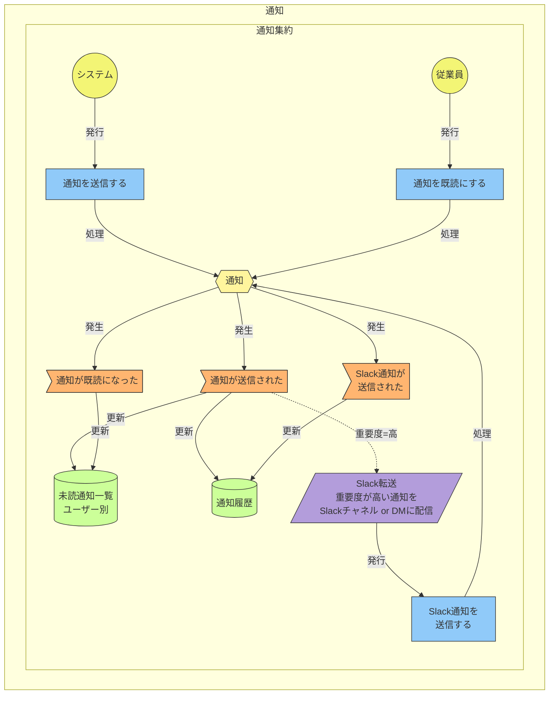
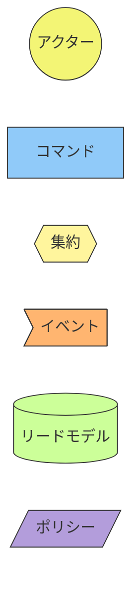

# イベントストーミング図: 通知

> **更新日**: 2026-02-08
> **種別**: 汎用サブドメイン

---

## 全体図

---

## 凡例

---

## イベント → ReadModel マッピング

| イベント | ReadModel |
|----------|-----------|
| 通知が送信された | 未読通知一覧, 通知履歴 |
| Slack通知が送信された | 通知履歴 |
| 通知が既読になった | 未読通知一覧 |

---

## 通知トリガー一覧

> 通知集約は「配送のみ」を担当。以下のトリガーは各コンテキストのポリシー/Sagaから発行される。

| # | トリガー | 発行元 | 重要度 | 宛先 |
|---|---------|--------|--------|------|
| 1 | 36協定アラート（月次30h超過） | 勤怠管理 | 高 | 上長 |
| 2 | 36協定アラート（月次40h超過） | 勤怠管理 | 高 | 上長, 人事 |
| 3 | 36協定アラート（月次45h到達） | 勤怠管理 | 高 | 上長, 人事, 本人 |
| 4 | 36協定アラート（年次300h超過） | 勤怠管理 | 高 | 上長, 人事 |
| 5 | 36協定アラート（年次360h到達） | 勤怠管理 | 高 | 上長, 人事, 本人 |
| 6 | 未申請残業アラート | 申請承認 | 中 | 上長 |
| 7 | 承認リマインド（3営業日前） | 月次処理 | 中 | 管理職 |
| 8 | 承認督促（1営業日前） | 月次処理 | 高 | 管理職, 人事 |
| 9 | 打刻忘れ通知 | 勤怠管理 | 中 | 本人 |
| 10 | シフト変更通知 | 勤怠管理 | 低 | 本人 |
| 11 | 特別休暇付与通知 | 休暇管理 | 低 | 本人 |
| 12 | 有給時効消滅30日前通知 | 休暇管理 | 中 | 本人 |
| 13 | 有給取得義務未達アラート | 休暇管理 | 高 | 上長, 人事, 本人 |

---

## 集約サマリー

### 通知集約

| 種別 | 名称 |
|------|------|
| コマンド | 通知を送信する, Slack通知を送信する, 通知を既読にする |
| イベント | 通知が送信された, Slack通知が送信された, 通知が既読になった |
| リードモデル | 未読通知一覧（ユーザー別）, 通知履歴 |
| ポリシー | Slack転送（重要度が高い通知をSlackチャネル or DMに配信） |

<!-- 品質チェック結果
- [x] 通知集約の責務が「配送のみ」に限定されている
- [x] アプリ内通知とSlack配信の二系統が定義されている
- [x] Slack転送ポリシーが重要度ベースで定義されている
- [x] 通知トリガー一覧で全13種の通知元が網羅されている
- [x] 各トリガーの重要度・宛先が明示されている
- [x] イベント→ReadModelマッピングが網羅的
-->
