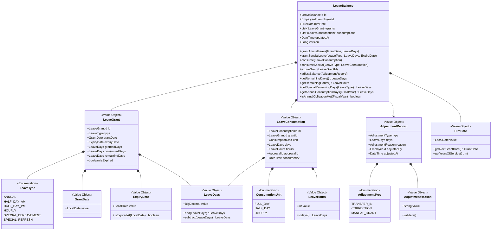
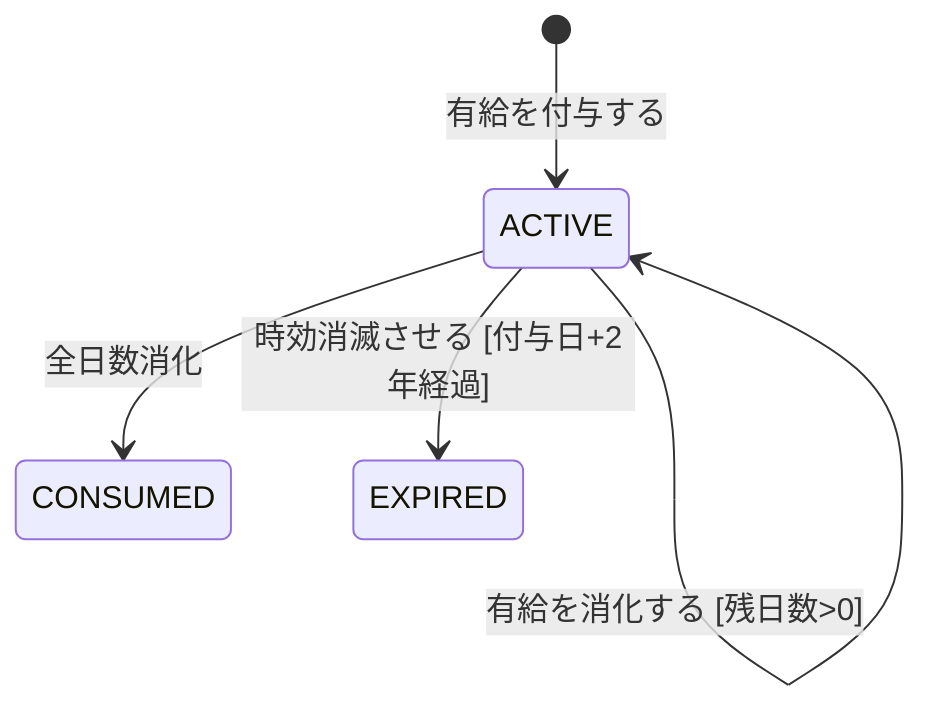

# 有給残高集約

## 概要

従業員の有給休暇の付与・消化・時効消滅を管理し、残日数を正確に追跡する。入社日起算の自動付与、FIFO消化、2年時効、年5日取得義務の法令要件を実装する。

> **設計判断**: 休暇付与集約は本集約に統合した。特別休暇の付与も有給残高として管理する方が、残日数の一元管理と年5日取得義務のチェックが簡潔になるため。

**コンテキスト:** 休暇管理

---

## 構造図

---

## 状態遷移

有給残高集約自体には明示的な状態遷移はない。個々の LeaveGrant が以下の状態を持つ:

---

## コマンド

### 有給を付与する

**実行者:** システム（自動）

| 項目 | 型 | 必須 | 制約 | 説明 |
|------|-----|------|------|------|
| employeeId | EmployeeId | Yes | 存在する従業員 | 対象従業員 |
| grantDate | GrantDate | Yes | 付与基準日 | 付与日 |
| days | LeaveDays | Yes | 付与テーブルに準拠 | 付与日数 |

**事前条件:**
- 同一付与基準日で未付与であること

**発行イベント:** 有給が付与された

### 有給付与テーブル

| 勤続年数 | 付与日数 |
|---------|---------|
| 0.5年 | 10日 |
| 1.5年 | 11日 |
| 2.5年 | 12日 |
| 3.5年 | 14日 |
| 4.5年 | 16日 |
| 5.5年 | 18日 |
| 6.5年以上 | 20日 |

### 有給を消化する

**実行者:** システム（休暇承認時に自動実行）

| 項目 | 型 | 必須 | 制約 | 説明 |
|------|-----|------|------|------|
| unit | ConsumptionUnit | Yes | FULL_DAY/HALF_DAY/HOURLY | 消化単位 |
| days | LeaveDays | No | unit=FULL_DAY時: 1.0, HALF_DAY時: 0.5 | 消化日数 |
| hours | LeaveHours | No | unit=HOURLY時: 1-8 | 消化時間 |
| approvalId | ApprovalId | Yes | 承認済み休暇申請 | 承認ID |

**事前条件:**
- 残日数 ≧ 消化日数
- 時間単位有給の場合、年間上限40h未満であること

**消化順序:** FIFO（ExpiryDateが近いLeaveGrantから消化）

**発行イベント:** 有給が消化された

### 特別休暇を付与する

**実行者:** 人事担当者

| 項目 | 型 | 必須 | 制約 | 説明 |
|------|-----|------|------|------|
| type | LeaveType | Yes | SPECIAL_* | 特別休暇種別 |
| days | LeaveDays | Yes | 種別ごとの上限 | 付与日数 |
| expiryDate | ExpiryDate | Yes | 付与日以降 | 有効期限 |

**発行イベント:** 特別休暇が付与された

### 特別休暇を消化する

**実行者:** システム（休暇承認時に自動実行）

| 項目 | 型 | 必須 | 制約 | 説明 |
|------|-----|------|------|------|
| type | LeaveType | Yes | SPECIAL_* | 消化対象の特別休暇種別 |
| unit | ConsumptionUnit | Yes | FULL_DAY/HALF_DAY | 消化単位（時間単位不可） |
| days | LeaveDays | Yes | 種別の残日数以内 | 消化日数 |
| approvalId | ApprovalId | Yes | 承認済み休暇申請 | 承認ID |

**事前条件:**
- 指定種別の残日数 ≧ 消化日数
- 有効期限内であること

**消化順序:** 種別ごとに分離消化（有給FIFOとは混ざらない）

**発行イベント:** 特別休暇が消化された

### 時効消滅させる

**実行者:** システム（日次バッチ自動実行）

| 項目 | 型 | 必須 | 制約 | 説明 |
|------|-----|------|------|------|
| grantId | LeaveGrantId | Yes | ACTIVE状態のGrant | 対象付与 |

**事前条件:**
- 付与日から2年が経過していること
- LeaveGrantがACTIVE状態であること

**発行イベント:** 有給が時効消滅した

### 有給残高を手動調整する

**実行者:** 人事担当者

| 項目 | 型 | 必須 | 制約 | 説明 |
|------|-----|------|------|------|
| employeeId | EmployeeId | Yes | 存在する従業員 | 対象従業員 |
| type | AdjustmentType | Yes | TRANSFER_IN/CORRECTION/MANUAL_GRANT | 調整種別 |
| days | LeaveDays | Yes | -20.0 〜 +20.0 | 調整日数（負は減算） |
| reason | AdjustmentReason | Yes | 10-500文字 | 調整理由 |

**事前条件:**
- 調整後の残日数 ≧ 0

**発行イベント:** 有給残高が手動調整された

---

## イベント

### 有給が付与された

| 項目 | 型 | 説明 |
|------|-----|------|
| leaveBalanceId | LeaveBalanceId | 有給残高ID |
| employeeId | EmployeeId | 従業員ID |
| grantId | LeaveGrantId | 付与ID |
| grantDate | GrantDate | 付与日 |
| grantedDays | LeaveDays | 付与日数 |
| expiryDate | ExpiryDate | 有効期限 |
| totalRemainingDays | LeaveDays | 付与後の残日数合計 |

### 有給が消化された

| 項目 | 型 | 説明 |
|------|-----|------|
| leaveBalanceId | LeaveBalanceId | 有給残高ID |
| employeeId | EmployeeId | 従業員ID |
| consumptionId | LeaveConsumptionId | 消化ID |
| grantId | LeaveGrantId | 消化元のGrant ID |
| unit | ConsumptionUnit | 消化単位 |
| days | LeaveDays | 消化日数 |
| approvalId | ApprovalId | 承認ID |
| totalRemainingDays | LeaveDays | 消化後の残日数合計 |

### 有給が時効消滅した

| 項目 | 型 | 説明 |
|------|-----|------|
| leaveBalanceId | LeaveBalanceId | 有給残高ID |
| employeeId | EmployeeId | 従業員ID |
| grantId | LeaveGrantId | 消滅対象のGrant ID |
| expiredDays | LeaveDays | 消滅日数（未消化分） |
| totalRemainingDays | LeaveDays | 消滅後の残日数合計 |

### 特別休暇が付与された

| 項目 | 型 | 説明 |
|------|-----|------|
| leaveBalanceId | LeaveBalanceId | 有給残高ID |
| employeeId | EmployeeId | 従業員ID |
| grantId | LeaveGrantId | 付与ID |
| type | LeaveType | 特別休暇種別 |
| grantedDays | LeaveDays | 付与日数 |
| expiryDate | ExpiryDate | 有効期限 |

### 特別休暇が消化された

| 項目 | 型 | 説明 |
|------|-----|------|
| leaveBalanceId | LeaveBalanceId | 有給残高ID |
| employeeId | EmployeeId | 従業員ID |
| consumptionId | LeaveConsumptionId | 消化ID |
| type | LeaveType | 特別休暇種別 |
| days | LeaveDays | 消化日数 |
| approvalId | ApprovalId | 承認ID |
| remainingDays | LeaveDays | 当該種別の残日数 |

### 有給残高が手動調整された

| 項目 | 型 | 説明 |
|------|-----|------|
| leaveBalanceId | LeaveBalanceId | 有給残高ID |
| employeeId | EmployeeId | 従業員ID |
| adjustmentType | AdjustmentType | 調整種別 |
| adjustedDays | LeaveDays | 調整日数 |
| reason | AdjustmentReason | 調整理由 |
| adjustedBy | EmployeeId | 調整実行者（人事） |
| totalRemainingDays | LeaveDays | 調整後の残日数合計 |

---

## クエリ

### 有給残日数照会

#### 表示カラム

| カラム | ソート | 権限 | 説明 |
|--------|--------|------|------|
| totalRemainingDays | - | 本人+上長+人事 | 残日数合計 |
| totalRemainingHours | - | 同上 | 残時間（時間単位有給） |
| hourlyUsedThisYear | - | 同上 | 今年度の時間単位消化数 |
| annualConsumedDays | - | 同上 | 年5日義務の進捗 |
| nextExpiryDate | - | 同上 | 次の時効日 |
| nextExpiryDays | - | 同上 | 時効予定日数 |

#### 検索条件

| 条件 | 型 | 演算子 | デフォルト |
|------|-----|--------|-----------|
| employeeId | EmployeeId | = | ログインユーザー |
| fiscalYear | FiscalYear | = | 当年度 |

### 有給取得状況ダッシュボード

#### 表示カラム

| カラム | ソート | 権限 | 説明 |
|--------|--------|------|------|
| employeeName | ○ | 上長+人事 | 従業員名 |
| grantedDays | - | 同上 | 付与日数 |
| consumedDays | ○ | 同上 | 消化日数 |
| remainingDays | ○ | 同上 | 残日数 |
| obligationMet | ○ | 同上 | 年5日義務達成 |
| nextExpiryDate | ○ | 同上 | 次の時効日 |

#### 検索条件

| 条件 | 型 | 演算子 | デフォルト |
|------|-----|--------|-----------|
| departmentId | DepartmentId | = | 上長の部署 |
| fiscalYear | FiscalYear | = | 当年度 |
| obligationMet | boolean | = | 全て |

### 特別休暇残日数照会

#### 表示カラム

| カラム | ソート | 権限 | 説明 |
|--------|--------|------|------|
| type | - | 本人+人事 | 特別休暇種別 |
| grantedDays | - | 同上 | 付与日数 |
| consumedDays | - | 同上 | 消化日数 |
| remainingDays | - | 同上 | 残日数 |
| expiryDate | ○（デフォルト昇順） | 同上 | 有効期限 |

#### 検索条件

| 条件 | 型 | 演算子 | デフォルト |
|------|-----|--------|-----------|
| employeeId | EmployeeId | = | ログインユーザー |
| type | LeaveType | = | 全SPECIAL_*種別 |

---

## 不変条件

| ID | 条件 | 説明 |
|----|------|------|
| INV-LB-001 | 残日数 ≧ 0 | マイナス残高は不可 |
| INV-LB-002 | 時間単位有給 ≦ 40h/年 | 法定上限 |
| INV-LB-003 | 有給消化はFIFO順 | 時効が近い付与分から消化 |
| INV-LB-004 | 時効後の消化不可 | 時効消滅したGrantからは消化できない |
| INV-LB-005 | 特別休暇は種別内で消化 | 慶弔は慶弔枠、リフレッシュはリフレッシュ枠からのみ消化 |
| INV-LB-006 | 手動調整は理由必須 | AdjustmentReasonが空の手動調整は不可 |

---

## ビジネスルール

### 年5日取得義務チェック

- 基準日から10ヶ月経過時点で年5日未達の場合、従業員+上長にアラート
- 基準日から11ヶ月経過時点で未達の場合、人事にもエスカレーション

### 時効通知

- 時効30日前に従業員に通知
- 時効日に自動で時効消滅処理を実行

### 半日有給と時間単位有給の関係

- 半日有給: 0.5日消化（年間日数上限なし）
- 時間単位有給: 8h = 1日換算（年5日分=40h上限）
- 両者は別枠管理

### 特別休暇の消化ルール

- 特別休暇は種別ごとに独立して消化する（有給FIFOとは分離）
- 時間単位での特別休暇消化は不可（FULL_DAY/HALF_DAYのみ）
- 有効期限切れの特別休暇は自動消滅（時効と同じバッチで処理）

---

## 更新制限

| 操作 | 制限 |
|------|------|
| 付与 | システム自動のみ（手動は手動調整コマンドで代替） |
| 消化 | 承認済み休暇申請経由のみ（直接消化不可） |
| 時効消滅 | システム自動のみ（手動取消不可） |
| 手動調整 | 人事担当者のみ、理由必須 |

---

## 履歴管理方針

- LeaveGrant（付与記録）: イミュータブル。追記のみで更新・削除しない
- LeaveConsumption（消化記録）: イミュータブル。承認済み申請と1:1対応
- AdjustmentRecord（調整記録）: イミュータブル。全調整の監査証跡を保持
- 残日数は常に「付与合計 - 消化合計 - 時効合計 + 調整合計」の計算で算出

---

## 実装ノート

### Standard パターン

- LeaveGrant は別テーブルで管理（付与単位でレコード）
- LeaveConsumption も別テーブル（消化単位でレコード）
- AdjustmentRecord も別テーブル（調整単位でレコード）
- 残日数は LeaveGrant.grantedDays - sum(LeaveConsumption.days) - sum(expired) + sum(adjustments) で計算
- 時間単位有給の年間上限は年度内の HOURLY 消化の合計で判定
- 付与バッチは日次実行（入社日起算の基準日到達をチェック）
- 時効バッチは日次実行（ExpiryDate到達をチェック）

<!-- 品質チェック結果
- [x] 構造図に全属性・値オブジェクトが定義
- [x] 休暇付与集約を統合した設計判断が明記
- [x] 有給付与テーブル（勤続年数→日数）が定義
- [x] FIFO消化ルールが不変条件として定義
- [x] 時間単位有給の年間上限（40h）が定義
- [x] 年5日取得義務チェックのタイミングが数値化
- [x] 時効通知（30日前）が定義
- [x] コマンド6件（ES図5件+手動調整）全定義
- [x] イベント6件（ES図5件+手動調整）ペイロード定義済み
- [x] クエリ3件（ES図リードモデル完全対応）検索条件付き
- [x] 特別休暇の種別分離消化ルールが定義
- [x] 更新制限・履歴管理方針が定義
-->
