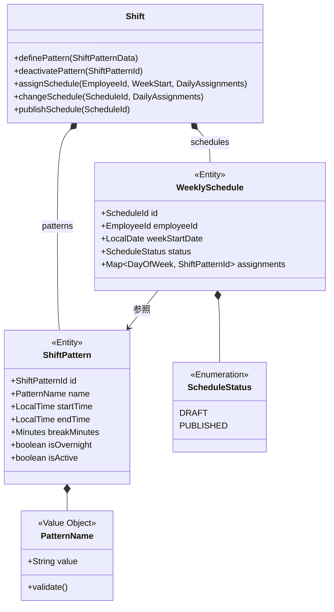
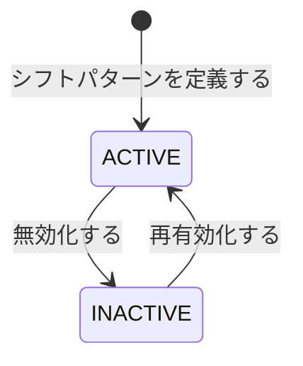
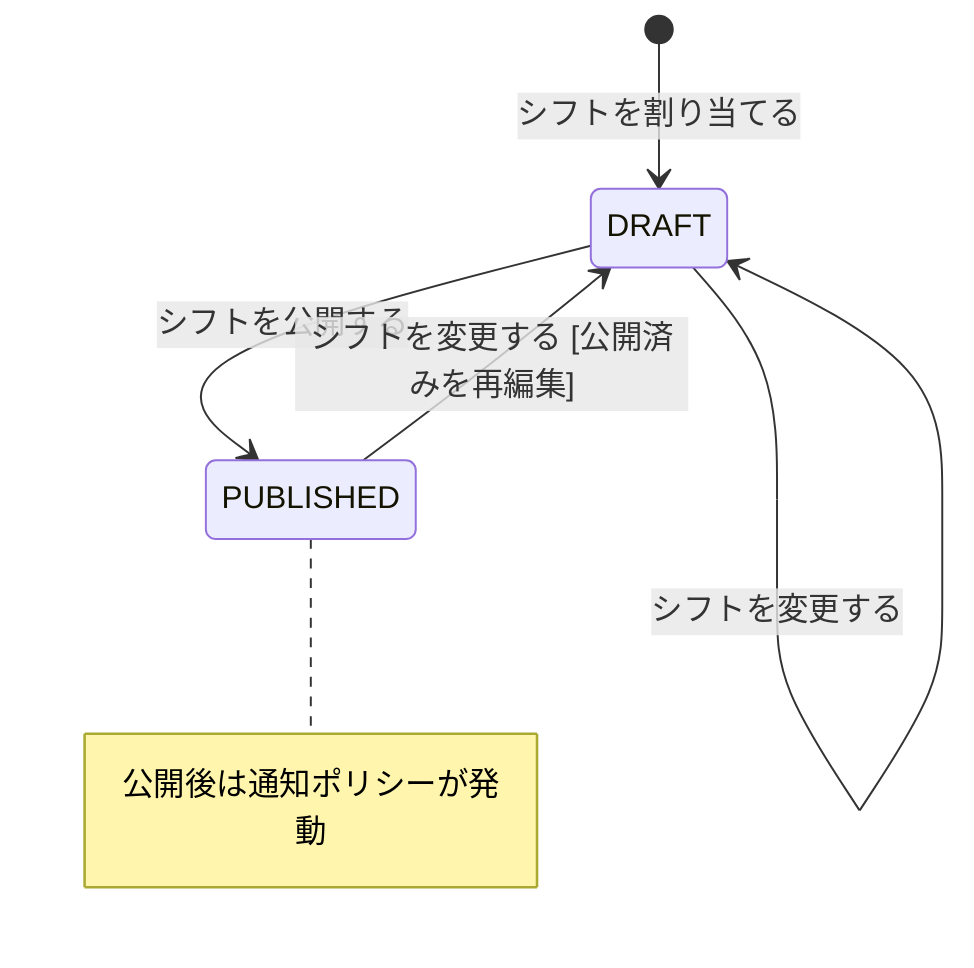

# シフト集約

## 概要

シフトパターンの定義と従業員への週単位のシフト割当を管理する。パターンはマスタとして定義し、割当は下書き→公開のライフサイクルで運用する。承認フローは不要。

**コンテキスト:** 勤怠管理
**MVP:** 対象外（Phase 2以降で実装予定）

---

## 構造図

---

## 状態遷移

### シフトパターン

### 週次スケジュール

### 状態遷移ルール

| 遷移 | From | To | ガード条件 |
|------|------|-----|-----------|
| パターン定義 | - | ACTIVE | パターン名が一意であること |
| パターン無効化 | ACTIVE | INACTIVE | 未来の割当で使用されていないこと |
| スケジュール作成 | - | DRAFT | 対象週に既存スケジュールがないこと |
| スケジュール変更 | DRAFT/PUBLISHED | DRAFT | - |
| スケジュール公開 | DRAFT | PUBLISHED | 割当済みの日が1日以上あること |

---

## コマンド

### シフトパターンを定義する

**実行者:** 人事担当者

| 項目 | 型 | 必須 | 制約 | 説明 |
|------|-----|------|------|------|
| name | PatternName | ✅ | 一意、2-20文字 | パターン名（早番、遅番等） |
| startTime | LocalTime | ✅ | - | 勤務開始時刻 |
| endTime | LocalTime | ✅ | - | 勤務終了時刻 |
| breakMinutes | Minutes | ✅ | 0-120分 | 休憩時間 |
| isOvernight | boolean | ✅ | - | 日跨ぎフラグ（夜勤対応） |

**事前条件:**
- 同名のパターンが存在しないこと

**発行イベント:** シフトパターンが定義された

### シフトを割り当てる

**実行者:** 管理職

| 項目 | 型 | 必須 | 制約 | 説明 |
|------|-----|------|------|------|
| employeeId | EmployeeId | ✅ | 存在する従業員 | 対象従業員 |
| weekStartDate | LocalDate | ✅ | 月曜日であること | 週の開始日 |
| assignments | Map<DayOfWeek, ShiftPatternId> | ✅ | 1日以上、有効パターンのみ | 曜日→パターン |

**事前条件:**
- 対象週に既存スケジュールがないこと
- 指定パターンがすべてACTIVEであること

**事後条件:**
- DRAFT状態で作成される

**発行イベント:** シフトが割り当てられた

### シフトを変更する

**実行者:** 管理職

| 項目 | 型 | 必須 | 制約 | 説明 |
|------|-----|------|------|------|
| scheduleId | ScheduleId | ✅ | 存在するスケジュール | 対象スケジュール |
| assignments | Map<DayOfWeek, ShiftPatternId> | ✅ | 有効パターンのみ | 更新する曜日→パターン |

**事前条件:**
- 指定パターンがすべてACTIVEであること

**事後条件:**
- PUBLISHEDだった場合はDRAFTに戻る

**発行イベント:** シフトが変更された

### シフトを公開する

**実行者:** 管理職

| 項目 | 型 | 必須 | 制約 | 説明 |
|------|-----|------|------|------|
| scheduleId | ScheduleId | ✅ | 存在するDRAFTスケジュール | 対象スケジュール |

**事前条件:**
- スケジュールがDRAFTであること
- 割当済みの日が1日以上あること

**事後条件:**
- PUBLISHED状態に遷移
- シフト割当・変更通知ポリシーが発動（本人に通知）

**発行イベント:** シフトが割り当てられた（公開時も同イベントを再利用）

---

## イベント

### シフトパターンが定義された

| 項目 | 型 | 説明 |
|------|-----|------|
| patternId | ShiftPatternId | パターンID |
| name | PatternName | パターン名 |
| startTime | LocalTime | 開始時刻 |
| endTime | LocalTime | 終了時刻 |
| isOvernight | boolean | 夜勤フラグ |

### シフトが割り当てられた

| 項目 | 型 | 説明 |
|------|-----|------|
| scheduleId | ScheduleId | スケジュールID |
| employeeId | EmployeeId | 対象従業員 |
| weekStartDate | LocalDate | 週開始日 |
| assignments | Map<DayOfWeek, ShiftPatternId> | 曜日→パターン |
| status | ScheduleStatus | DRAFT or PUBLISHED |

### シフトが変更された

| 項目 | 型 | 説明 |
|------|-----|------|
| scheduleId | ScheduleId | スケジュールID |
| employeeId | EmployeeId | 対象従業員 |
| changedDays | Map<DayOfWeek, ShiftPatternId> | 変更された曜日→パターン |
| previousStatus | ScheduleStatus | 変更前ステータス |

---

## クエリ

### シフトカレンダー

#### 表示カラム

| カラム | ソート | 権限 | 説明 |
|--------|--------|------|------|
| 従業員名 | ✅ | 管理職 | 部下名 |
| 週開始日 | ✅（デフォルト昇順） | 管理職/本人 | weekStartDate |
| 月〜日のパターン | - | 管理職/本人 | 各曜日のパターン名 |
| ステータス | - | 管理職 | DRAFT/PUBLISHED |

#### 検索条件

| 条件 | 型 | 演算子 | デフォルト |
|------|-----|--------|-----------|
| 従業員 | EmployeeId | = | 全員（管理職）/ 本人 |
| 期間 | LocalDate | range | 今週〜4週先 |

### シフトパターン一覧

#### 表示カラム

| カラム | ソート | 権限 | 説明 |
|--------|--------|------|------|
| パターン名 | ✅（デフォルト昇順） | 人事/管理職 | name |
| 勤務時間 | - | 人事/管理職 | startTime〜endTime |
| 休憩 | - | 人事/管理職 | breakMinutes |
| 夜勤 | - | 人事/管理職 | isOvernight |
| 有効 | - | 人事 | isActive |

---

## 不変条件

| ID | 条件 | 説明 |
|----|------|------|
| INV-SH-001 | パターン名は一意 | 同名のパターンは登録不可 |
| INV-SH-002 | 割当は有効パターンのみ | INACTIVE パターンは割当不可 |
| INV-SH-003 | 1日に1パターン | 同一従業員の同一日に複数パターン不可 |

---

## ビジネスルール

### 夜勤（日跨ぎ）パターン

- isOvernight = true の場合、endTime < startTime を許容
- 勤務時間計算: 24h - startTime + endTime - breakMinutes
- 例: 22:00〜翌7:00（休憩60分）= 8時間勤務

### 通知ポリシー

- スケジュールがPUBLISHEDになった時点で対象従業員に通知
- 変更によりPUBLISHED→DRAFTに戻った後、再PUBLISHEDで再通知

---

## 実装ノート

### Standard パターン

- MVP対象外のため、実装優先度は低い
- シフトパターンはマスタデータ的な扱い（変更頻度低）
- 週次スケジュールは勤怠記録の所定勤務時間の算出に使用される
- DRAFT/PUBLISHEDのライフサイクルにより、公開前の調整が可能
- フレックス勤務者の所定不足検知は月次処理コンテキスト側で実施

<!-- 品質チェック結果
- [x] 全コマンド（4つ: 定義/割当/変更/公開）に対応するイベントが定義されている
- [x] 不変条件が具体的な条件で定義されている（3件）
- [x] 状態遷移にガード条件がある（パターンACTIVE/INACTIVE、スケジュールDRAFT/PUBLISHED）
- [x] 値オブジェクトの等価性条件が明確（PatternName: value）
- [x] クエリ定義にカラムと検索条件がある（2リードモデル）
- [x] 夜勤（日跨ぎ）対応が定義されている
- [x] 通知ポリシーの発動条件が明確
-->
