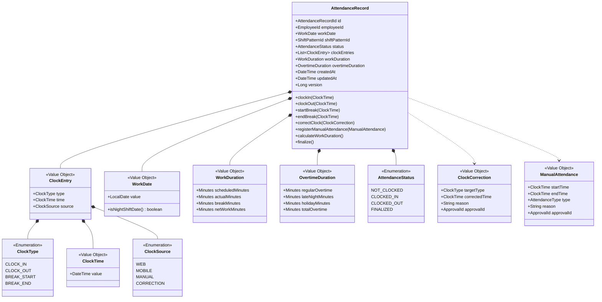
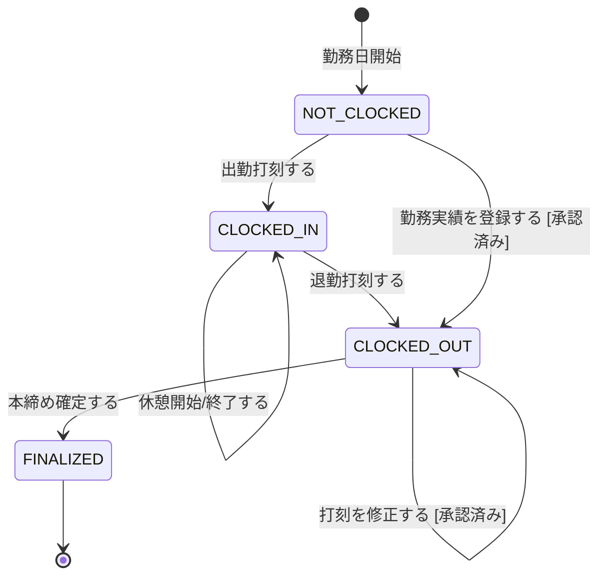

# 勤怠記録集約

## 概要

従業員の1勤務日の出退勤・休憩の打刻を管理し、勤務時間（所定内・残業・深夜）を計算する。勤怠管理システムの中核エンティティ。

**コンテキスト:** 勤怠管理

---

## 構造図

---

## 状態遷移

### 状態遷移ルール

| 遷移 | From | To | ガード条件 |
|------|------|-----|-----------|
| 出勤打刻 | NOT_CLOCKED | CLOCKED_IN | 当日に未出勤 |
| 退勤打刻 | CLOCKED_IN | CLOCKED_OUT | 出勤打刻済み |
| 休憩開始/終了 | CLOCKED_IN | CLOCKED_IN | 出勤中 |
| 打刻修正 | CLOCKED_OUT | CLOCKED_OUT | 承認済みの修正申請あり、本締め前 |
| 勤務実績登録 | NOT_CLOCKED | CLOCKED_OUT | 承認済みの手動登録申請あり |
| 本締め確定 | CLOCKED_OUT | FINALIZED | 月次本締めSagaからの内部呼び出し |

---

## コマンド

### 出勤打刻する

**実行者:** 従業員

| 項目 | 型 | 必須 | 制約 | 説明 |
|------|-----|------|------|------|
| employeeId | EmployeeId | Yes | 存在する従業員 | 打刻者 |
| clockTime | ClockTime | Yes | 現在時刻±5分 | 打刻時刻 |
| source | ClockSource | Yes | WEB/MOBILE | 打刻元 |

**事前条件:**
- 当日の勤怠記録が NOT_CLOCKED であること
- シフトが割り当てられていること

**発行イベント:** 出勤が打刻された

### 退勤打刻する

**実行者:** 従業員

| 項目 | 型 | 必須 | 制約 | 説明 |
|------|-----|------|------|------|
| employeeId | EmployeeId | Yes | 存在する従業員 | 打刻者 |
| clockTime | ClockTime | Yes | 出勤時刻より後 | 打刻時刻 |
| source | ClockSource | Yes | WEB/MOBILE | 打刻元 |

**事前条件:**
- 当日の勤怠記録が CLOCKED_IN であること

**発行イベント:** 退勤が打刻された

**後続処理（ポリシー）:** 勤務時間を自動計算する

### 休憩開始する

**実行者:** 従業員

| 項目 | 型 | 必須 | 制約 | 説明 |
|------|-----|------|------|------|
| employeeId | EmployeeId | Yes | 存在する従業員 | 打刻者 |
| clockTime | ClockTime | Yes | 出勤時刻より後 | 休憩開始時刻 |
| source | ClockSource | Yes | WEB/MOBILE | 打刻元 |

**事前条件:**
- CLOCKED_IN であること
- 休憩中でないこと（未終了のBREAK_STARTがない）

**発行イベント:** 休憩が開始された

### 休憩終了する

**実行者:** 従業員

| 項目 | 型 | 必須 | 制約 | 説明 |
|------|-----|------|------|------|
| employeeId | EmployeeId | Yes | 存在する従業員 | 打刻者 |
| clockTime | ClockTime | Yes | 休憩開始時刻より後 | 休憩終了時刻 |
| source | ClockSource | Yes | WEB/MOBILE | 打刻元 |

**事前条件:**
- CLOCKED_IN であること
- 休憩中であること（未終了のBREAK_STARTがある）

**発行イベント:** 休憩が終了された

### 打刻を修正する

**実行者:** システム（承認済み打刻修正申請に基づき自動実行）

| 項目 | 型 | 必須 | 制約 | 説明 |
|------|-----|------|------|------|
| correction | ClockCorrection | Yes | 承認済みの修正申請 | 修正内容 |

**事前条件:**
- 打刻修正申請が承認済みであること
- 勤怠記録が FINALIZED でないこと

**発行イベント:** 打刻が修正された

**後続処理:** 勤務時間を再計算する

### 勤務実績を登録する

**実行者:** システム（承認済み手動登録申請に基づき自動実行）

| 項目 | 型 | 必須 | 制約 | 説明 |
|------|-----|------|------|------|
| manualAttendance | ManualAttendance | Yes | 承認済みの登録申請 | 手動勤務データ |

**事前条件:**
- 手動登録申請が上長承認済みであること
- 当日の勤怠記録が NOT_CLOCKED であること

**発行イベント:** 勤務実績が登録された

**後続処理:** 勤務時間を自動計算する

### 本締め確定する

**実行者:** システム（月次締めSagaからの内部呼び出し）

| 項目 | 型 | 必須 | 制約 | 説明 |
|------|-----|------|------|------|
| monthlyClosingId | MonthlyClosingId | Yes | FINALIZED状態の月次締め | 月次締めID |

**事前条件:**
- 勤怠記録が CLOCKED_OUT であること
- 月次締めが FINALIZED であること

**発行イベント:** 勤怠記録が確定された

---

## イベント

### 出勤が打刻された

| 項目 | 型 | 説明 |
|------|-----|------|
| attendanceRecordId | AttendanceRecordId | 勤怠記録ID |
| employeeId | EmployeeId | 従業員ID |
| workDate | WorkDate | 勤務日 |
| clockTime | ClockTime | 出勤時刻 |
| source | ClockSource | 打刻元 |

### 退勤が打刻された

| 項目 | 型 | 説明 |
|------|-----|------|
| attendanceRecordId | AttendanceRecordId | 勤怠記録ID |
| employeeId | EmployeeId | 従業員ID |
| clockTime | ClockTime | 退勤時刻 |
| source | ClockSource | 打刻元 |

### 休憩が開始された

| 項目 | 型 | 説明 |
|------|-----|------|
| attendanceRecordId | AttendanceRecordId | 勤怠記録ID |
| employeeId | EmployeeId | 従業員ID |
| clockTime | ClockTime | 休憩開始時刻 |

### 休憩が終了された

| 項目 | 型 | 説明 |
|------|-----|------|
| attendanceRecordId | AttendanceRecordId | 勤怠記録ID |
| employeeId | EmployeeId | 従業員ID |
| clockTime | ClockTime | 休憩終了時刻 |
| breakMinutes | Minutes | 今回の休憩時間 |

### 勤務時間が計算された

| 項目 | 型 | 説明 |
|------|-----|------|
| attendanceRecordId | AttendanceRecordId | 勤怠記録ID |
| employeeId | EmployeeId | 従業員ID |
| workDuration | WorkDuration | 勤務時間 |
| overtimeDuration | OvertimeDuration | 残業時間内訳 |

### 打刻が修正された

| 項目 | 型 | 説明 |
|------|-----|------|
| attendanceRecordId | AttendanceRecordId | 勤怠記録ID |
| employeeId | EmployeeId | 従業員ID |
| targetType | ClockType | 修正対象の打刻種別 |
| beforeTime | ClockTime | 修正前の時刻 |
| afterTime | ClockTime | 修正後の時刻 |
| approvalId | ApprovalId | 承認ID |

### 勤務実績が登録された

| 項目 | 型 | 説明 |
|------|-----|------|
| attendanceRecordId | AttendanceRecordId | 勤怠記録ID |
| employeeId | EmployeeId | 従業員ID |
| workDate | WorkDate | 勤務日 |
| startTime | ClockTime | 勤務開始時刻 |
| endTime | ClockTime | 勤務終了時刻 |
| type | AttendanceType | 勤務種別 |
| approvalId | ApprovalId | 承認ID |

### 勤怠記録が確定された

| 項目 | 型 | 説明 |
|------|-----|------|
| attendanceRecordId | AttendanceRecordId | 勤怠記録ID |
| employeeId | EmployeeId | 従業員ID |
| workDate | WorkDate | 勤務日 |
| monthlyClosingId | MonthlyClosingId | 月次締めID |

---

## クエリ

### 日次勤怠一覧

#### 表示カラム

| カラム | ソート | 権限 | 説明 |
|--------|--------|------|------|
| workDate | ○（デフォルト降順） | 本人+上長+人事 | 勤務日 |
| clockIn | - | 同上 | 出勤時刻 |
| clockOut | - | 同上 | 退勤時刻 |
| breakMinutes | - | 同上 | 休憩時間 |
| netWorkMinutes | - | 同上 | 実労働時間 |
| overtimeMinutes | ○ | 同上 | 残業時間 |
| status | ○ | 同上 | ステータス |

#### 検索条件

| 条件 | 型 | 演算子 | デフォルト |
|------|-----|--------|-----------|
| employeeId | EmployeeId | = | ログインユーザー |
| workDate | DateRange | BETWEEN | 当月 |
| status | AttendanceStatus | = | 全て |

### 月次勤怠サマリー

#### 表示カラム

| カラム | ソート | 権限 | 説明 |
|--------|--------|------|------|
| employeeName | ○ | 上長+人事 | 従業員名 |
| workDays | - | 同上 | 出勤日数 |
| totalWorkHours | ○ | 同上 | 総労働時間 |
| totalOvertimeHours | ○ | 同上 | 総残業時間 |
| lateNightHours | - | 同上 | 深夜勤務時間 |
| paidLeaveUsed | - | 同上 | 有給使用日数 |

#### 検索条件

| 条件 | 型 | 演算子 | デフォルト |
|------|-----|--------|-----------|
| departmentId | DepartmentId | = | 上長の部署 |
| month | ClosingMonth | = | 当月 |

### 部門別勤怠ダッシュボード

#### 表示カラム

| カラム | ソート | 権限 | 説明 |
|--------|--------|------|------|
| departmentName | ○ | 管理職+人事 | 部署名 |
| headCount | - | 同上 | 所属人数 |
| avgOvertimeHours | ○ | 同上 | 平均残業時間 |
| maxOvertimeHours | ○ | 同上 | 最大残業時間 |
| overtimeAlertCount | ○ | 同上 | 36協定超過アラート件数 |
| missingClockCount | ○ | 同上 | 未打刻件数 |
| attendanceRate | ○ | 同上 | 出勤率 |

#### 検索条件

| 条件 | 型 | 演算子 | デフォルト |
|------|-----|--------|-----------|
| departmentId | DepartmentId | = | 管理職は自部門、人事は全部門 |
| month | ClosingMonth | = | 当月 |

---

## 不変条件

| ID | 条件 | 説明 |
|----|------|------|
| INV-ATT-001 | 出勤時刻 < 退勤時刻 | 出勤は退勤より前 |
| INV-ATT-002 | 休憩は出勤-退勤の間 | 休憩時刻は勤務時間内 |
| INV-ATT-003 | FINALIZED後は変更不可 | 本締め後の勤怠記録は不変 |
| INV-ATT-004 | 1勤務日1レコード | 同一従業員・同一勤務日に重複なし |
| INV-ATT-005 | 休憩は開始→終了の対 | BREAK_STARTとBREAK_ENDは必ず対で存在 |

---

## ビジネスルール

### 勤務時間計算

| 勤務パターン | 計算ルール |
|-------------|-----------|
| 固定時間制 | (退勤-出勤)-休憩。所定8h超が残業 |
| シフト制 | (退勤-出勤)-休憩。シフト所定超が残業 |
| フレックス | 月単位清算。月の所定（暦日数×8÷7）超が残業 |

### 割増率

| 区分 | 時間帯/条件 | 割増率 |
|------|-----------|-------|
| 時間外 | 所定超 | ×1.25 |
| 深夜 | 22:00-5:00 | ×1.25 |
| 時間外+深夜 | 所定超かつ22:00-5:00 | ×1.50 |
| 休日 | 法定休日 | ×1.35 |
| 休日+深夜 | 法定休日かつ22:00-5:00 | ×1.60 |

### 夜勤ルール

- 勤務開始日 = 勤務日
- 夜勤明け = 明け休み（勤務日カウントなし）
- 深夜割増は暦日の22:00-5:00で判定

### 打刻忘れ検知

- 翌日9:00時点で出勤打刻があるが退勤打刻がない場合、従業員に通知
- 通知から24時間経過しても未対応の場合、上長にもエスカレーション通知
- 打刻忘れが月3回以上の場合、人事にも通知

---

## 更新制限

| 操作 | 制限 |
|------|------|
| 出勤/退勤打刻 | 従業員本人のみ。現在時刻±5分以内 |
| 休憩開始/終了 | 従業員本人のみ。CLOCKED_IN状態でのみ可 |
| 打刻修正 | システム自動のみ（承認済み打刻修正申請経由） |
| 勤務実績登録 | システム自動のみ（承認済み手動登録申請経由） |
| 本締め確定 | システム自動のみ（月次締めSaga経由） |
| FINALIZED後の変更 | 一切不可 |

---

## 履歴管理方針

- ClockEntry（打刻ログ）: イミュータブル。追記のみで更新・削除しない
- 打刻修正時は新しいClockEntry（source=CORRECTION）を追加し、元の打刻は保持
- 勤務時間（WorkDuration, OvertimeDuration）: ミュータブル。計算結果を上書き保持
- 再計算時は計算前の値を操作ログに記録
- 操作ログは全操作をイミュータブルに記録（打刻・修正・再計算・確定）

---

## 実装ノート

### Standard パターン

- JOOQによる型安全なクエリ実装
- トランザクション境界はサービス層で管理
- リポジトリはドメインオブジェクトを返却
- 楽観的ロック用の version フィールドを活用
- 打刻ログは別テーブルでイミュータブル管理（追記のみ）
- 勤怠サマリー（WorkDuration, OvertimeDuration）はミュータブルで計算結果を保持
- 部門別ダッシュボードはマテリアライズドビューで実装（月次集計のパフォーマンス確保）

<!-- 品質チェック結果
- [x] 構造図に全属性・値オブジェクトが定義されている
- [x] 状態遷移が4状態で定義、ガード条件あり
- [x] コマンド7件（ES図6件+本締め確定）全定義
- [x] イベント8件（ES図7件+勤怠記録確定）ペイロード定義済み
- [x] クエリ3件（ES図リードモデル完全対応）検索条件付き
- [x] 不変条件が5件、ID付きで定義
- [x] 勤務時間計算ルール（3パターン）と割増率が数値化
- [x] 夜勤ルールが明記されている
- [x] 打刻忘れ検知ルールが定義
- [x] 更新制限・履歴管理方針が定義
-->
