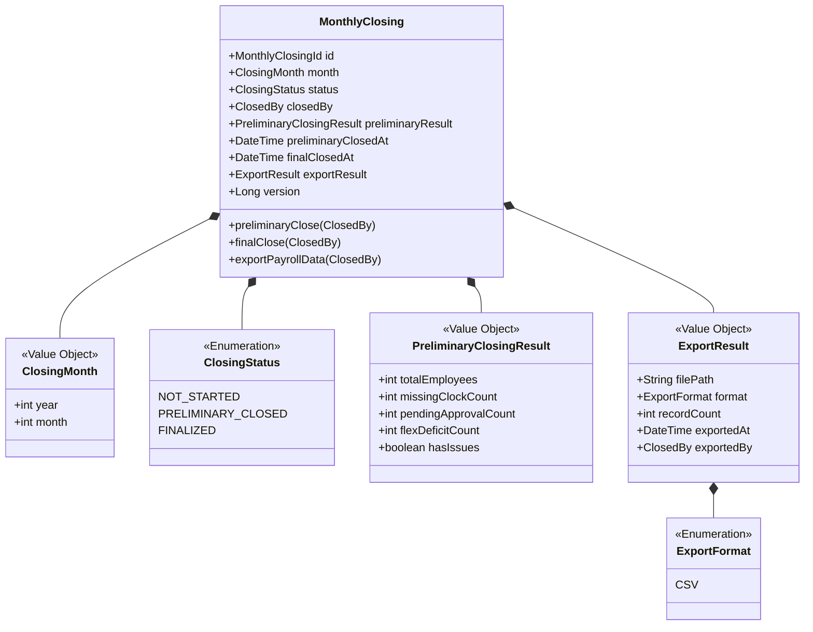
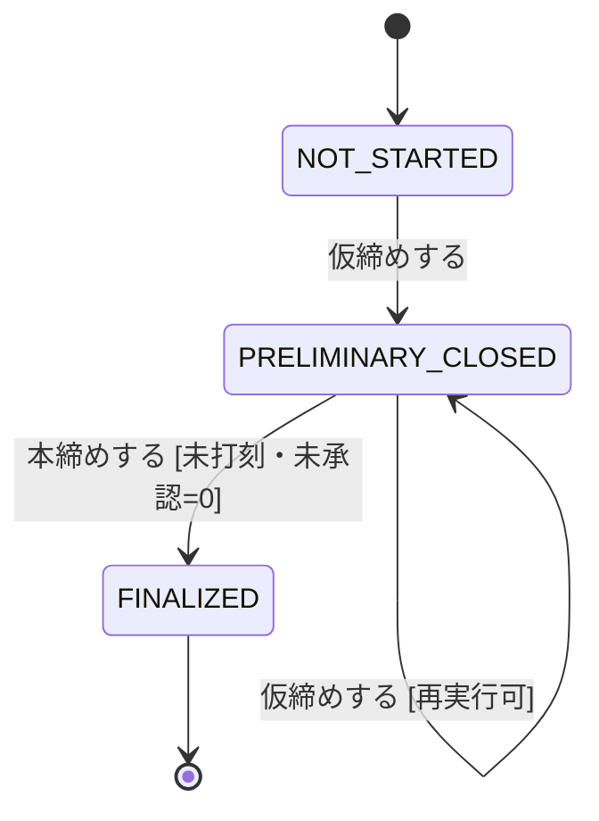

# 月次締め集約

## 概要

月次の勤怠データを仮締め→本締めの2段階で確定し、給与システム向けのCSVデータをエクスポートする。本締め後の勤怠記録は不可変となる。

**コンテキスト:** 月次処理

---

## 構造図

---

## 状態遷移

### 状態遷移ルール

| 遷移 | From | To | ガード条件 |
|------|------|-----|-----------|
| 仮締め | NOT_STARTED | PRELIMINARY_CLOSED | 当月が終了している |
| 仮締め再実行 | PRELIMINARY_CLOSED | PRELIMINARY_CLOSED | 未打刻/未承認がまだある場合 |
| 本締め | PRELIMINARY_CLOSED | FINALIZED | 未打刻=0 かつ 未承認=0 |

---

## コマンド

### 仮締めする

**実行者:** 人事担当者

| 項目 | 型 | 必須 | 制約 | 説明 |
|------|-----|------|------|------|
| month | ClosingMonth | Yes | 当月以前 | 対象月 |

**事前条件:**
- 対象月が終了していること
- FINALIZED でないこと

**発行イベント:** 月次が仮締めされた

**後続処理:**
- 未打刻・未承認がある場合、該当者と上長にリマインド通知
- フレックス勤務者の月所定不足を検知し、PreliminaryClosingResultに記録

### 本締めする

**実行者:** 人事担当者

| 項目 | 型 | 必須 | 制約 | 説明 |
|------|-----|------|------|------|
| month | ClosingMonth | Yes | 仮締め済みの月 | 対象月 |

**事前条件:**
- PRELIMINARY_CLOSED であること
- 未打刻件数 = 0
- 未承認件数 = 0

**発行イベント:** 月次が本締めされた

**後続処理（Saga）:**
- 対象月の全勤怠記録を FINALIZED に変更
- 給与データエクスポートを自動実行

### 給与データをエクスポートする

**実行者:** 人事担当者 / システム（本締め後に自動実行）

| 項目 | 型 | 必須 | 制約 | 説明 |
|------|-----|------|------|------|
| month | ClosingMonth | Yes | FINALIZED済みの月 | 対象月 |

**事前条件:**
- FINALIZED であること

**発行イベント:** 給与データがエクスポートされた

**処理内容:**
- 対象月の全勤怠データをCSV形式で出力
- 同一月の再実行は上書き（冪等）
- ファイルはS3に保存し、ダウンロードURLを提供
- 本締め後に自動実行、不具合時に人事が手動再実行可

---

## イベント

### 月次が仮締めされた

| 項目 | 型 | 説明 |
|------|-----|------|
| monthlyClosingId | MonthlyClosingId | 月次締めID |
| month | ClosingMonth | 対象月 |
| closedBy | ClosedBy | 実行者 |
| totalEmployees | int | 対象従業員数 |
| missingClockCount | int | 未打刻件数 |
| pendingApprovalCount | int | 未承認件数 |
| flexDeficitCount | int | フレックス所定不足者数 |
| hasIssues | boolean | 問題ありフラグ |

### 月次が本締めされた

| 項目 | 型 | 説明 |
|------|-----|------|
| monthlyClosingId | MonthlyClosingId | 月次締めID |
| month | ClosingMonth | 対象月 |
| closedBy | ClosedBy | 実行者 |
| totalEmployees | int | 確定対象従業員数 |
| finalClosedAt | DateTime | 本締め日時 |

### 給与データがエクスポートされた

| 項目 | 型 | 説明 |
|------|-----|------|
| monthlyClosingId | MonthlyClosingId | 月次締めID |
| month | ClosingMonth | 対象月 |
| filePath | String | エクスポートファイルパス |
| format | ExportFormat | 出力形式 |
| recordCount | int | レコード数 |
| exportedBy | ClosedBy | 実行者（自動/手動） |
| exportedAt | DateTime | エクスポート日時 |

---

## クエリ

### 月次締め状況ダッシュボード

#### 表示カラム

| カラム | ソート | 権限 | 説明 |
|--------|--------|------|------|
| month | ○（デフォルト降順） | 人事 | 対象月 |
| status | ○ | 同上 | 締めステータス |
| totalEmployees | - | 同上 | 対象従業員数 |
| missingClockCount | ○ | 同上 | 未打刻件数 |
| pendingApprovalCount | ○ | 同上 | 未承認件数 |
| flexDeficitCount | - | 同上 | フレックス所定不足者数 |
| exportStatus | - | 同上 | エクスポート状況 |
| finalClosedAt | ○ | 同上 | 本締め日時 |

#### 検索条件

| 条件 | 型 | 演算子 | デフォルト |
|------|-----|--------|-----------|
| month | ClosingMonth | BETWEEN | 直近12ヶ月 |
| status | ClosingStatus | = | 全て |

---

## 不変条件

| ID | 条件 | 説明 |
|----|------|------|
| INV-MC-001 | FINALIZED後は再実行不可 | 本締め後の月次締めは変更不可 |
| INV-MC-002 | 本締めは未打刻/未承認=0 | 全データが揃っていること |
| INV-MC-003 | 月次1回のみFINALIZE | 同月に複数回の本締め不可 |

---

## ビジネスルール

### 締め前リマインド

| タイミング | 通知先 | 内容 |
|-----------|-------|------|
| 月末3営業日前 | 未承認の上長 | 承認リマインド |
| 月末1営業日前 | 未承認の上長 + 人事 | 承認督促 |

### フレックス月次清算不足検知

- 仮締め時にフレックス勤務者の月所定時間（暦日数×8÷7）と実労働時間を比較
- 所定不足がある場合、flexDeficitCountとしてPreliminaryClosingResultに記録
- 不足者リストを人事に通知（欠勤控除判断用）
- 本締め前に不足者の処理が必要（欠勤控除 or 有給充当）

### 冪等性要件

- 仮締めは何度実行しても同じ結果（PreliminaryClosingResult）を返す
- 本締め処理中に中断した場合、再実行で完了まで進む
- エクスポートは同一月に対して再実行可能（上書き）

### 給与連携SLA

- 締め翌営業日中にCSVエクスポートを完了すること
- 超過時は人事にエスカレーション通知

---

## 更新制限

| 操作 | 制限 |
|------|------|
| 仮締め | 人事担当者のみ。FINALIZED後は不可 |
| 本締め | 人事担当者のみ。PRELIMINARY_CLOSED状態かつ未打刻/未承認=0時のみ |
| エクスポート | 人事担当者 or システム自動。FINALIZED状態のみ |
| 再エクスポート | 人事担当者のみ（手動トリガー）。同一月は上書き |

---

## 履歴管理方針

- 仮締め実行ログ: 実行者・日時・PreliminaryClosingResultをイミュータブルに記録
- 本締め実行ログ: 実行者・日時を記録。本締め後の変更は不可
- エクスポート実行ログ: 実行者・日時・ファイルパス・レコード数を記録。再実行時は新しいログを追記（旧ログは保持）
- 全ログは監査証跡として保持し削除不可

---

## 実装ノート

### Standard パターン

- 月次締めの状態管理はMonthlyClosingテーブルで行う
- 仮締め結果（未打刻件数、未承認件数、フレックス不足者数）はスナップショットとして保存
- 本締め→勤怠記録FINALIZE→エクスポートはトランザクションで管理
- CSVエクスポートは非同期ジョブとして実行（大量データ対応）
- エクスポートファイルはS3に保存し、ダウンロードURLを提供
- 実行ログは別テーブルで管理（closing_operation_logs）

<!-- 品質チェック結果
- [x] 構造図に全属性・値オブジェクトが定義
- [x] 仮締め→本締めの2段階遷移がガード条件付き
- [x] 冪等性要件が明記
- [x] 締め前リマインドのタイミングが数値化
- [x] 給与連携SLAが定義
- [x] 不変条件3件
- [x] コマンド3件（ES図完全対応）全定義
- [x] イベント3件（ES図完全対応）ペイロード定義済み
- [x] クエリ1件（月次締め状況ダッシュボード）検索条件付き
- [x] フレックス月次清算不足検知ルールが定義
- [x] 更新制限・履歴管理方針が定義
-->
