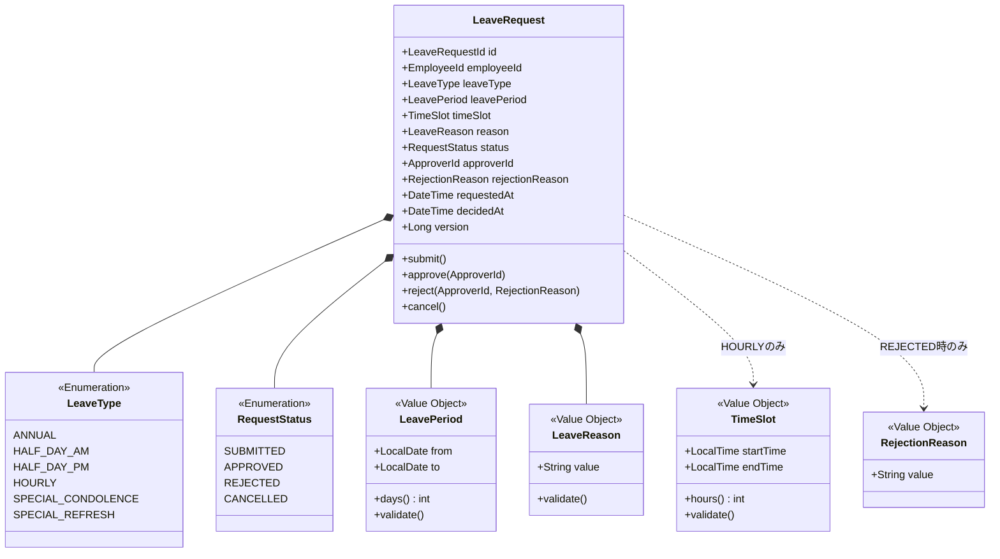
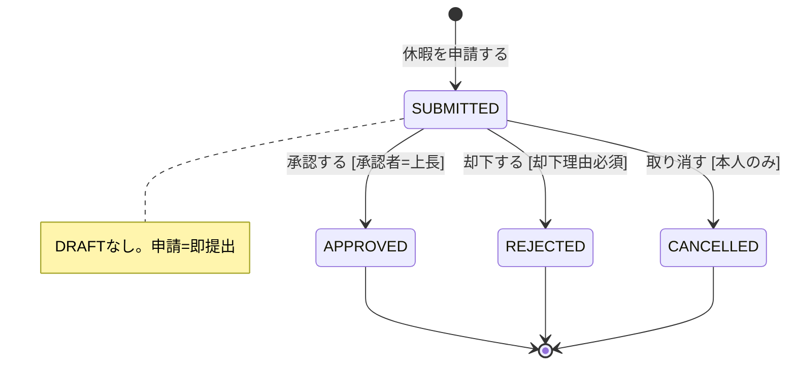

# 休暇申請集約

## 概要

従業員の休暇申請を管理し、上長の承認ワークフローを制御する。有給休暇（年次/半日/時間単位）と特別休暇（慶弔/リフレッシュ）を統一的に扱い、承認時に有給残高の消化処理と連動する。

**コンテキスト:** 申請承認

---

## 構造図

---

## 状態遷移

### 状態遷移ルール

| 遷移 | From | To | ガード条件 |
|------|------|-----|-----------|
| 申請 | - | SUBMITTED | 休暇種別+取得期間が入力済み、有給残高チェック（有給種別の場合） |
| 承認 | SUBMITTED | APPROVED | 承認者が申請者の上長であること |
| 却下 | SUBMITTED | REJECTED | 承認者が上長であること、却下理由必須 |
| 取り消し | SUBMITTED | CANCELLED | 申請者本人であること |

**SUBMITTED中の編集は不可。** 内容変更が必要な場合は取り消して再申請する。

---

## コマンド

### 休暇を申請する

**実行者:** 従業員（本人）

| 項目 | 型 | 必須 | 制約 | 説明 |
|------|-----|------|------|------|
| leaveType | LeaveType | ✅ | Enum値 | 休暇種別 |
| leavePeriod | LeavePeriod | ✅ | from ≤ to | 取得期間（単一日の場合 from == to） |
| timeSlot | TimeSlot | 条件付 | HOURLY時のみ必須、1時間単位、上限5時間 | 取得時間帯 |
| reason | LeaveReason | 条件付 | 特別休暇は必須、10-200文字 | 申請理由 |

**事前条件:**
- 有給種別の場合、取得日数分の有給残高があること
- 同一日に承認済み休暇がないこと

**事後条件:**
- ステータスが SUBMITTED で作成される

**日付制限:** なし（事後申請可。チャット等で事前連絡済みの場合、休暇取得後に正式申請→承認の運用を許容）

**発行イベント:** 休暇が申請された

### 休暇申請を承認する

**実行者:** 管理職（上長）

| 項目 | 型 | 必須 | 制約 | 説明 |
|------|-----|------|------|------|
| requestId | LeaveRequestId | ✅ | 存在するSUBMITTED申請 | 対象申請 |
| approverId | ApproverId | ✅ | 申請者の上長 | 承認者 |

**事前条件:**
- 申請が SUBMITTED であること
- 承認者が申請者の上長であること

**発行イベント:** 休暇申請が承認された

**Saga連携:** 承認後、休暇承認Sagaが発動:
1. 有給種別 → 有給残高の消化（FIFO順）
2. 特別休暇 → 特別休暇残高の消化
3. 勤怠ステータスを休暇に更新
4. Googleカレンダーに休暇予定を同期

### 休暇申請を却下する

**実行者:** 管理職（上長）

| 項目 | 型 | 必須 | 制約 | 説明 |
|------|-----|------|------|------|
| requestId | LeaveRequestId | ✅ | 存在するSUBMITTED申請 | 対象申請 |
| approverId | ApproverId | ✅ | 申請者の上長 | 承認者 |
| rejectionReason | RejectionReason | ✅ | 10-200文字 | 却下理由 |

**事前条件:**
- 申請が SUBMITTED であること

**発行イベント:** 休暇申請が却下された

### 休暇申請を取り消す

**実行者:** 従業員（本人）

| 項目 | 型 | 必須 | 制約 | 説明 |
|------|-----|------|------|------|
| requestId | LeaveRequestId | ✅ | 存在するSUBMITTED申請 | 対象申請 |

**事前条件:**
- 申請が SUBMITTED であること（承認前のみ取り消し可能）
- 申請者本人であること

**発行イベント:** 休暇申請が取り消された

---

## イベント

### 休暇が申請された

| 項目 | 型 | 説明 |
|------|-----|------|
| requestId | LeaveRequestId | 申請ID |
| employeeId | EmployeeId | 申請者 |
| leaveType | LeaveType | 休暇種別 |
| leavePeriod | LeavePeriod | 取得期間 |
| timeSlot | TimeSlot | 取得時間帯（HOURLYのみ） |
| requestedAt | DateTime | 申請日時 |

### 休暇申請が承認された

| 項目 | 型 | 説明 |
|------|-----|------|
| requestId | LeaveRequestId | 申請ID |
| employeeId | EmployeeId | 申請者 |
| leaveType | LeaveType | 休暇種別 |
| leavePeriod | LeavePeriod | 取得期間 |
| approverId | ApproverId | 承認者 |
| decidedAt | DateTime | 承認日時 |

### 休暇申請が却下された

| 項目 | 型 | 説明 |
|------|-----|------|
| requestId | LeaveRequestId | 申請ID |
| employeeId | EmployeeId | 申請者 |
| rejectionReason | RejectionReason | 却下理由 |
| approverId | ApproverId | 却下者 |
| decidedAt | DateTime | 却下日時 |

### 休暇申請が取り消された

| 項目 | 型 | 説明 |
|------|-----|------|
| requestId | LeaveRequestId | 申請ID |
| employeeId | EmployeeId | 申請者 |
| cancelledAt | DateTime | 取消日時 |

---

## クエリ

### 休暇申請一覧（従業員別）

#### 表示カラム

| カラム | ソート | 権限 | 説明 |
|--------|--------|------|------|
| 休暇種別 | - | 本人 | LeaveTypeの表示名 |
| 取得期間 | ✅ | 本人 | from〜to |
| 取得時間帯 | - | 本人 | HOURLYのみ表示 |
| ステータス | - | 本人 | 状態バッジ |
| 申請日 | ✅（デフォルト降順） | 本人 | requestedAt |
| 承認者 | - | 本人 | 承認者名 |

#### 検索条件

| 条件 | 型 | 演算子 | デフォルト |
|------|-----|--------|-----------|
| ステータス | RequestStatus | = | 全件 |
| 休暇種別 | LeaveType | = | 全件 |
| 取得期間 | LeavePeriod | range | 当月 |

### 承認待ち休暇申請一覧（管理職用）

#### 表示カラム

| カラム | ソート | 権限 | 説明 |
|--------|--------|------|------|
| 申請者名 | ✅ | 管理職 | 部下名 |
| 休暇種別 | - | 管理職 | LeaveTypeの表示名 |
| 取得期間 | ✅（デフォルト昇順） | 管理職 | from〜to |
| 申請理由 | - | 管理職 | reason |
| 申請日 | ✅ | 管理職 | requestedAt |

#### 検索条件

| 条件 | 型 | 演算子 | デフォルト |
|------|-----|--------|-----------|
| 申請者名 | String | like | - |
| 休暇種別 | LeaveType | = | 全件 |
| 取得期間 | LeavePeriod | range | 当月 |

---

## 不変条件

| ID | 条件 | 説明 |
|----|------|------|
| INV-LV-001 | 承認者 ≠ 申請者 | 自己承認不可 |
| INV-LV-002 | APPROVED/CANCELLED後は変更不可 | 終端状態の保護 |
| INV-LV-003 | 却下理由はREJECTED時必須 | rejectionReason != null |
| INV-LV-004 | 同一日に承認済み休暇がないこと | 重複取得防止 |
| INV-LV-005 | 有給残高が十分であること | 有給種別の場合、取得日数分の残高チェック |
| INV-LV-006 | 特別休暇は理由必須 | SPECIAL_* の場合 reason != null |

---

## ビジネスルール

### 休暇種別ごとの消化ルール

| 種別 | 消化対象 | 単位 | 残高チェック |
|------|---------|------|-------------|
| ANNUAL | 年次有給残高 | 1日 | 必須 |
| HALF_DAY_AM/PM | 年次有給残高 | 0.5日 | 必須 |
| HOURLY | 年次有給残高 | 時間（1h単位、上限5h/日） | 必須 |
| SPECIAL_CONDOLENCE | 慶弔休暇残高 | 1日 | 必須 |
| SPECIAL_REFRESH | リフレッシュ休暇残高 | 1日 | 必須 |

### 半日休暇のルール

- HALF_DAY_AM: 午前休。午後から出勤
- HALF_DAY_PM: 午後休。午前で退勤
- 同一日にAM+PMの取得は不可（ANNUALで申請すること）

### 時間単位有給のルール

- 最小単位: 1時間
- 1日の上限: 5時間
- 年間上限: 年5日分（法定）
- TimeSlot で startTime/endTime を指定

### 事後申請

- 過去日付の申請に制限なし
- チャット等で事前連絡→休暇取得後に正式申請→承認の運用を想定

---

## 実装ノート

### Standard パターン

- 残業申請と同じ申請→承認/却下のワークフローパターン
- 申請の共通インターフェース `Request` を検討（状態遷移・承認フローの共通化）
- 有給残高チェックは休暇管理コンテキストへの問い合わせ（コンテキスト間クエリ）
- 承認後の有給消化はSaga（休暇承認Saga）で非同期実行
- ステータス変更履歴は `LeaveRequestStatusHistory` テーブルで管理

### 閲覧権限

- 従業員: 自分の申請のみ閲覧可能
- 管理職: 直属の部下の申請を閲覧可能

<!-- 品質チェック結果
- [x] 全コマンド（4つ）に対応するイベントが定義されている
- [x] 不変条件が具体的な数値/条件で定義されている（6件）
- [x] 状態遷移にガード条件がある（4遷移すべて）
- [x] 値オブジェクトの等価性条件が明確（LeavePeriod: from+to、TimeSlot: start+end）
- [x] クエリ定義にカラムと検索条件がある（2リードモデル）
- [x] 休暇種別ごとの消化ルールが定義されている
- [x] 半日休暇・時間単位有給の固有ルールが定義されている
- [x] Saga連携（休暇承認Saga）が明記されている
-->
