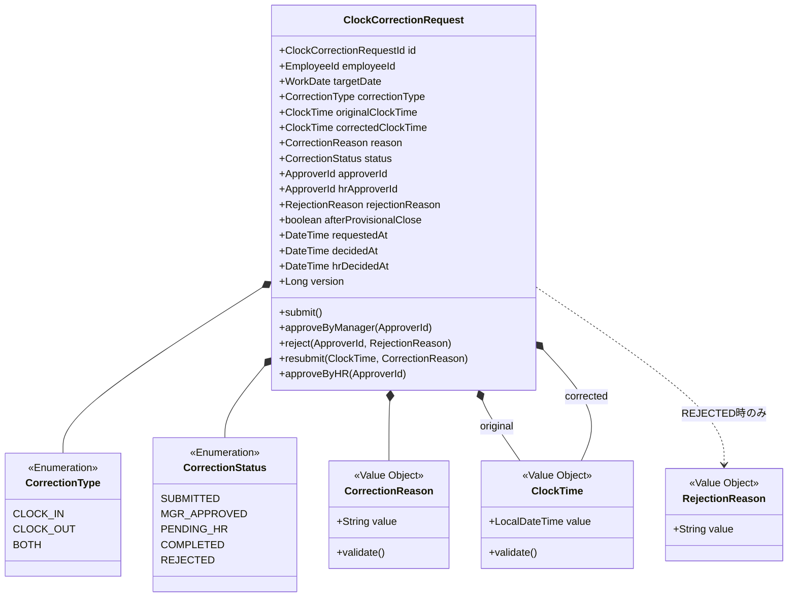
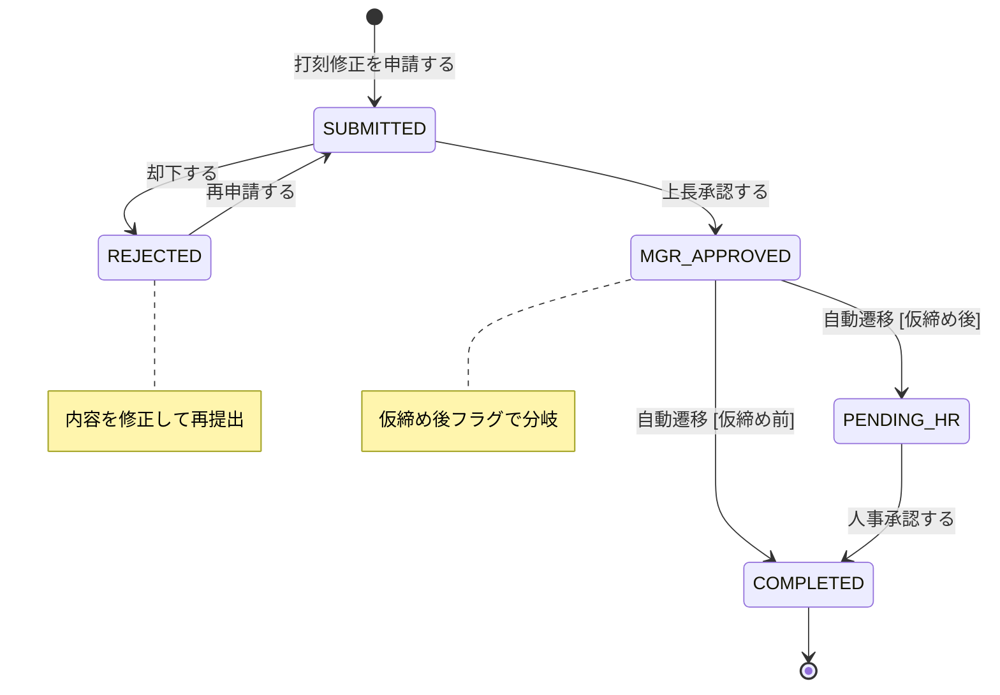

# 打刻修正申請集約

## 概要

従業員の打刻修正申請を管理し、上長承認＋条件付き人事承認の2段階ワークフローを制御する。仮締め後の修正は人事承認エスカレーションが発動し、承認後に勤怠記録の打刻データが修正される。

**コンテキスト:** 申請承認

---

## 構造図

---

## 状態遷移

### 状態遷移ルール

| 遷移 | From | To | ガード条件 |
|------|------|-----|-----------|
| 申請 | - | SUBMITTED | 修正種別+対象日+修正後時刻+理由が入力済み |
| 上長承認 | SUBMITTED | MGR_APPROVED | 承認者が申請者の上長であること |
| 却下 | SUBMITTED | REJECTED | 承認者が上長であること、却下理由必須 |
| 再申請 | REJECTED | SUBMITTED | 修正内容が更新されていること |
| 自動確定 | MGR_APPROVED | COMPLETED | afterProvisionalClose == false |
| 人事エスカレーション | MGR_APPROVED | PENDING_HR | afterProvisionalClose == true |
| 人事承認 | PENDING_HR | COMPLETED | 人事担当者権限 |

**仮締め後フラグの判定タイミング:** 申請時に対象月の仮締め状態をチェックし、フラグを設定する。

---

## コマンド

### 打刻修正を申請する

**実行者:** 従業員（本人）

| 項目 | 型 | 必須 | 制約 | 説明 |
|------|-----|------|------|------|
| targetDate | WorkDate | ✅ | 過去の勤務日 | 修正対象日 |
| correctionType | CorrectionType | ✅ | Enum値 | 出勤/退勤/両方 |
| correctedClockTime | ClockTime | ✅ | 修正前と異なること | 希望する打刻時刻 |
| reason | CorrectionReason | ✅ | 10-200文字 | 修正理由 |

**事前条件:**
- 対象日の勤怠記録が存在すること
- 同一日同一種別の未確定申請がないこと
- 修正前打刻時刻はシステムが自動取得

**事後条件:**
- ステータスが SUBMITTED で作成される
- afterProvisionalClose フラグが設定される（対象月の仮締め状態を参照）

**発行イベント:** 打刻修正が申請された

### 打刻修正を承認する（上長）

**実行者:** 管理職（上長）

| 項目 | 型 | 必須 | 制約 | 説明 |
|------|-----|------|------|------|
| requestId | ClockCorrectionRequestId | ✅ | 存在するSUBMITTED申請 | 対象申請 |
| approverId | ApproverId | ✅ | 申請者の上長 | 承認者 |

**事前条件:**
- 申請が SUBMITTED であること
- 承認者が申請者の上長であること

**事後条件:**
- afterProvisionalClose == false → COMPLETED に自動遷移、Saga発動
- afterProvisionalClose == true → PENDING_HR に遷移

**発行イベント:** 打刻修正が承認された

### 打刻修正を却下する

**実行者:** 管理職（上長）

| 項目 | 型 | 必須 | 制約 | 説明 |
|------|-----|------|------|------|
| requestId | ClockCorrectionRequestId | ✅ | 存在するSUBMITTED申請 | 対象申請 |
| approverId | ApproverId | ✅ | 申請者の上長 | 承認者 |
| rejectionReason | RejectionReason | ✅ | 10-200文字 | 却下理由 |

**事前条件:**
- 申請が SUBMITTED であること

**発行イベント:** 打刻修正が却下された

### 打刻修正を再申請する

**実行者:** 従業員（本人）

| 項目 | 型 | 必須 | 制約 | 説明 |
|------|-----|------|------|------|
| requestId | ClockCorrectionRequestId | ✅ | 存在するREJECTED申請 | 対象申請 |
| correctedClockTime | ClockTime | ✅ | 修正前と異なること | 更新した希望時刻 |
| reason | CorrectionReason | ✅ | 10-200文字 | 更新した修正理由 |

**事前条件:**
- 申請が REJECTED であること
- 申請者本人であること

**発行イベント:** 打刻修正が再申請された

### 打刻修正を人事承認する

**実行者:** 人事担当者

| 項目 | 型 | 必須 | 制約 | 説明 |
|------|-----|------|------|------|
| requestId | ClockCorrectionRequestId | ✅ | 存在するPENDING_HR申請 | 対象申請 |
| hrApproverId | ApproverId | ✅ | 人事担当者権限 | 人事承認者 |

**事前条件:**
- 申請が PENDING_HR であること
- 人事担当者権限を持つこと

**発行イベント:** 打刻修正が人事承認された

**Saga連携:** COMPLETED到達後、打刻修正承認Sagaが発動:
- 勤怠記録の打刻データを修正
- 勤務時間が再計算される

---

## イベント

### 打刻修正が申請された

| 項目 | 型 | 説明 |
|------|-----|------|
| requestId | ClockCorrectionRequestId | 申請ID |
| employeeId | EmployeeId | 申請者 |
| targetDate | WorkDate | 対象日 |
| correctionType | CorrectionType | 修正種別 |
| afterProvisionalClose | boolean | 仮締め後フラグ |
| requestedAt | DateTime | 申請日時 |

### 打刻修正が承認された

| 項目 | 型 | 説明 |
|------|-----|------|
| requestId | ClockCorrectionRequestId | 申請ID |
| employeeId | EmployeeId | 申請者 |
| approverId | ApproverId | 上長承認者 |
| afterProvisionalClose | boolean | 仮締め後フラグ |
| decidedAt | DateTime | 承認日時 |

### 打刻修正が却下された

| 項目 | 型 | 説明 |
|------|-----|------|
| requestId | ClockCorrectionRequestId | 申請ID |
| employeeId | EmployeeId | 申請者 |
| rejectionReason | RejectionReason | 却下理由 |
| approverId | ApproverId | 却下者 |
| decidedAt | DateTime | 却下日時 |

### 打刻修正が再申請された

| 項目 | 型 | 説明 |
|------|-----|------|
| requestId | ClockCorrectionRequestId | 申請ID |
| employeeId | EmployeeId | 申請者 |
| correctedClockTime | ClockTime | 更新した修正後時刻 |
| requestedAt | DateTime | 再申請日時 |

### 打刻修正が人事承認された

| 項目 | 型 | 説明 |
|------|-----|------|
| requestId | ClockCorrectionRequestId | 申請ID |
| employeeId | EmployeeId | 申請者 |
| hrApproverId | ApproverId | 人事承認者 |
| hrDecidedAt | DateTime | 人事承認日時 |

---

## クエリ

### 打刻修正申請一覧（従業員別）

#### 表示カラム

| カラム | ソート | 権限 | 説明 |
|--------|--------|------|------|
| 対象日 | ✅ | 本人 | targetDate |
| 修正種別 | - | 本人 | 出勤/退勤/両方 |
| 修正前→修正後 | - | 本人 | 打刻時刻の差分表示 |
| ステータス | - | 本人 | 状態バッジ（5状態） |
| 申請日 | ✅（デフォルト降順） | 本人 | requestedAt |
| 仮締め後 | - | 本人 | フラグ表示 |

#### 検索条件

| 条件 | 型 | 演算子 | デフォルト |
|------|-----|--------|-----------|
| ステータス | CorrectionStatus | = | 全件 |
| 対象日 | WorkDate | range | 当月 |

### 承認待ち打刻修正一覧（管理職用）

#### 表示カラム

| カラム | ソート | 権限 | 説明 |
|--------|--------|------|------|
| 申請者名 | ✅ | 管理職 | 部下名 |
| 対象日 | ✅（デフォルト昇順） | 管理職 | targetDate |
| 修正種別 | - | 管理職 | 出勤/退勤/両方 |
| 修正前→修正後 | - | 管理職 | 差分表示 |
| 修正理由 | - | 管理職 | reason |
| 仮締め後 | - | 管理職 | フラグ表示 |

#### 検索条件

| 条件 | 型 | 演算子 | デフォルト |
|------|-----|--------|-----------|
| 申請者名 | String | like | - |
| 対象日 | WorkDate | range | 当月 |

---

## 不変条件

| ID | 条件 | 説明 |
|----|------|------|
| INV-FX-001 | 承認者 ≠ 申請者 | 自己承認不可 |
| INV-FX-002 | COMPLETED後は変更不可 | 終端状態の保護 |
| INV-FX-003 | 却下理由はREJECTED時必須 | rejectionReason != null |
| INV-FX-004 | 修正後時刻 ≠ 修正前時刻 | 同一時刻への修正は不可 |
| INV-FX-005 | 人事承認はPENDING_HR状態のみ | 仮締め後フローの制御 |
| INV-FX-006 | 同一日同一種別の未確定申請がないこと | 重複防止 |

---

## ビジネスルール

### 仮締め後人事承認エスカレーション

| 条件 | 処理 |
|------|------|
| 申請時に対象月が仮締め前 | afterProvisionalClose = false。上長承認で直接COMPLETED |
| 申請時に対象月が仮締め後 | afterProvisionalClose = true。上長承認後、人事承認が追加で必要 |

**判定タイミング:** 申請時（submit時に月次締めコンテキストへ問い合わせ）

### 修正種別ごとの処理

| 種別 | 修正対象 | Saga時の処理 |
|------|---------|-------------|
| CLOCK_IN | 出勤打刻時刻 | 勤怠記録の出勤時刻を更新 |
| CLOCK_OUT | 退勤打刻時刻 | 勤怠記録の退勤時刻を更新→勤務時間再計算 |
| BOTH | 出退勤両方 | 両方更新→勤務時間再計算 |

---

## 実装ノート

### Standard パターン

- 残業申請・休暇申請と同じ申請→承認ワークフローの拡張版
- 申請の共通インターフェース `Request` に2段階承認の拡張を検討
- 仮締め状態の確認は月次処理コンテキストへのコンテキスト間クエリ
- COMPLETED到達後の打刻修正はSaga（打刻修正承認Saga）で非同期実行
- ステータス変更履歴は `ClockCorrectionStatusHistory` テーブルで管理
- MGR_APPROVED → COMPLETED/PENDING_HR の自動遷移はドメインイベントハンドラで実装

### 閲覧権限

- 従業員: 自分の申請のみ閲覧可能
- 管理職: 直属の部下の申請を閲覧可能
- 人事担当者: PENDING_HR状態の全申請を閲覧可能

<!-- 品質チェック結果
- [x] 全コマンド（5つ）に対応するイベントが定義されている
- [x] 不変条件が具体的な数値/条件で定義されている（6件）
- [x] 状態遷移にガード条件がある（7遷移すべて）
- [x] 値オブジェクトの等価性条件が明確（ClockTime: value、CorrectionReason: value）
- [x] クエリ定義にカラムと検索条件がある（2リードモデル）
- [x] 2段階承認の分岐ロジック（仮締め後判定）が定義されている
- [x] 修正種別ごとのSaga処理が定義されている
- [x] 人事承認の権限と状態制約が明確
-->
