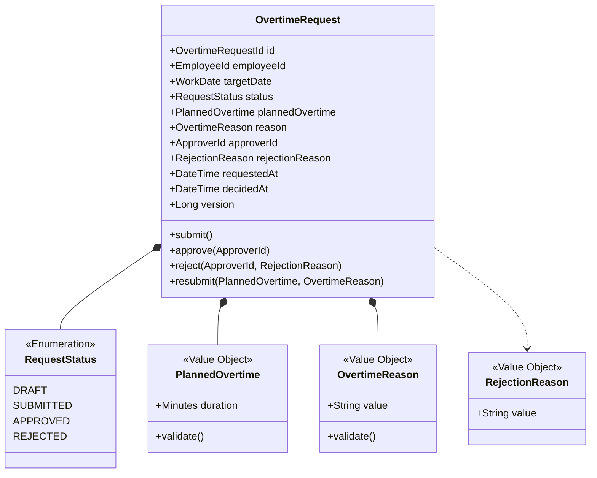
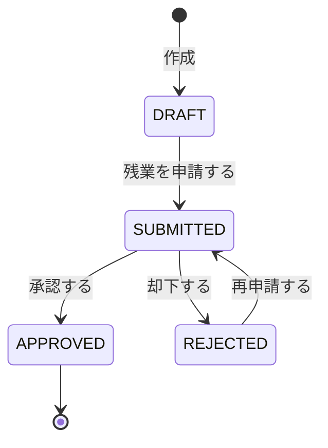

# 残業申請集約

## 概要

従業員の残業申請を管理し、上長の承認ワークフローを制御する。36協定の上限チェックと連動し、法令遵守を保証する。

**コンテキスト:** 申請承認

---

## 構造図

---

## 状態遷移

### 状態遷移ルール

| 遷移 | From | To | ガード条件 |
|------|------|-----|-----------|
| 申請 | DRAFT | SUBMITTED | 予定残業時間+理由が入力済み |
| 承認 | SUBMITTED | APPROVED | 上長権限 |
| 却下 | SUBMITTED | REJECTED | 上長権限、却下理由必須 |
| 再申請 | REJECTED | SUBMITTED | 内容修正済み |

---

## コマンド

### 残業を申請する

**実行者:** 従業員

| 項目 | 型 | 必須 | 制約 | 説明 |
|------|-----|------|------|------|
| targetDate | WorkDate | Yes | 当日または翌営業日 | 残業予定日 |
| plannedOvertime | PlannedOvertime | Yes | 15分単位、1-240分 | 予定残業時間 |
| reason | OvertimeReason | Yes | 10-200文字 | 残業理由 |

**事前条件:**
- 同一勤務日に承認済み申請がないこと
- 事後申請の場合、翌営業日中であること

**発行イベント:** 残業が申請された

### 残業申請を承認する

**実行者:** 管理職（上長）

| 項目 | 型 | 必須 | 制約 | 説明 |
|------|-----|------|------|------|
| requestId | OvertimeRequestId | Yes | 存在するSUBMITTED申請 | 対象申請 |
| approverId | ApproverId | Yes | 申請者の上長 | 承認者 |

**事前条件:**
- 申請が SUBMITTED であること
- 承認者が申請者の上長であること

**発行イベント:** 残業申請が承認された

### 残業申請を却下する

**実行者:** 管理職（上長）

| 項目 | 型 | 必須 | 制約 | 説明 |
|------|-----|------|------|------|
| requestId | OvertimeRequestId | Yes | 存在するSUBMITTED申請 | 対象申請 |
| approverId | ApproverId | Yes | 申請者の上長 | 却下者 |
| rejectionReason | RejectionReason | Yes | 10-500文字 | 却下理由 |

**事前条件:**
- 申請が SUBMITTED であること
- 承認者が申請者の上長であること

**発行イベント:** 残業申請が却下された

### 残業申請を再申請する

**実行者:** 従業員

| 項目 | 型 | 必須 | 制約 | 説明 |
|------|-----|------|------|------|
| requestId | OvertimeRequestId | Yes | 存在するREJECTED申請 | 対象申請 |
| plannedOvertime | PlannedOvertime | Yes | 15分単位、1-240分 | 修正後の予定残業時間 |
| reason | OvertimeReason | Yes | 10-200文字 | 修正後の残業理由 |

**事前条件:**
- 申請が REJECTED であること
- 申請者本人であること

**発行イベント:** 残業申請が再申請された

---

## イベント

### 残業が申請された

| 項目 | 型 | 説明 |
|------|-----|------|
| overtimeRequestId | OvertimeRequestId | 残業申請ID |
| employeeId | EmployeeId | 申請者ID |
| targetDate | WorkDate | 残業予定日 |
| plannedOvertime | PlannedOvertime | 予定残業時間 |
| reason | OvertimeReason | 残業理由 |
| requestedAt | DateTime | 申請日時 |

### 残業申請が承認された

| 項目 | 型 | 説明 |
|------|-----|------|
| overtimeRequestId | OvertimeRequestId | 残業申請ID |
| employeeId | EmployeeId | 申請者ID |
| targetDate | WorkDate | 残業予定日 |
| plannedOvertime | PlannedOvertime | 承認された残業時間 |
| approverId | ApproverId | 承認者ID |
| decidedAt | DateTime | 承認日時 |

### 残業申請が却下された

| 項目 | 型 | 説明 |
|------|-----|------|
| overtimeRequestId | OvertimeRequestId | 残業申請ID |
| employeeId | EmployeeId | 申請者ID |
| targetDate | WorkDate | 残業予定日 |
| approverId | ApproverId | 却下者ID |
| rejectionReason | RejectionReason | 却下理由 |
| decidedAt | DateTime | 却下日時 |

### 残業申請が再申請された

| 項目 | 型 | 説明 |
|------|-----|------|
| overtimeRequestId | OvertimeRequestId | 残業申請ID |
| employeeId | EmployeeId | 申請者ID |
| targetDate | WorkDate | 残業予定日 |
| plannedOvertime | PlannedOvertime | 修正後の予定残業時間 |
| reason | OvertimeReason | 修正後の残業理由 |
| resubmittedAt | DateTime | 再申請日時 |

---

## クエリ

### 残業申請一覧

#### 表示カラム

| カラム | ソート | 権限 | 説明 |
|--------|--------|------|------|
| targetDate | ○（デフォルト降順） | 本人+上長+人事 | 残業予定日 |
| plannedOvertime | ○ | 同上 | 予定残業時間 |
| reason | - | 同上 | 残業理由 |
| status | ○ | 同上 | ステータス |
| requestedAt | ○ | 同上 | 申請日時 |
| decidedAt | - | 同上 | 承認/却下日時 |

#### 検索条件

| 条件 | 型 | 演算子 | デフォルト |
|------|-----|--------|-----------|
| employeeId | EmployeeId | = | ログインユーザー |
| targetDate | DateRange | BETWEEN | 当月 |
| status | RequestStatus | = | 全て |

### 承認待ち残業申請一覧

#### 表示カラム

| カラム | ソート | 権限 | 説明 |
|--------|--------|------|------|
| employeeName | ○ | 上長+人事 | 申請者名 |
| targetDate | ○ | 同上 | 残業予定日 |
| plannedOvertime | ○ | 同上 | 予定残業時間 |
| reason | - | 同上 | 残業理由 |
| requestedAt | ○（デフォルト昇順） | 同上 | 申請日時 |

#### 検索条件

| 条件 | 型 | 演算子 | デフォルト |
|------|-----|--------|-----------|
| subordinateOf | ApproverId | = | ログインユーザーの部下 |
| targetDate | DateRange | BETWEEN | 当月 |

---

## 不変条件

| ID | 条件 | 説明 |
|----|------|------|
| INV-OT-001 | 承認者 ≠ 申請者 | 自己承認不可 |
| INV-OT-002 | APPROVED後は変更不可 | 承認後の申請は不変 |
| INV-OT-003 | 却下理由は必須 | REJECTED時は理由あり |

---

## ビジネスルール

### 36協定チェック（承認時に実行）

| チェック | 閾値 | 超過時の処理 |
|---------|------|------------|
| 月次累計 | 45h | 承認に人事追加承認が必要 |
| 年次累計 | 360h | 承認に人事追加承認が必要 |
| 特別条項月次 | 100h未満 | 承認不可 |
| 特別条項年次 | 720h | 承認不可 |
| 月45h超回数 | 年6回 | 6回到達後は承認不可 |
| 2-6ヶ月平均 | 80h | 超過見込みで承認不可 |

### 事後申請ルール

- 当日の退勤後〜翌営業日中: 通常承認
- 翌営業日超過: 人事確認が追加で必要

### 未申請残業検知

- 退勤打刻が所定終業時刻を超過し、かつ残業申請がない場合にアラート
- 翌営業日の午前中に従業員へ通知（事後申請の催促）
- 3営業日経過しても未申請の場合、上長にもエスカレーション通知

---

## 更新制限

| 操作 | 制限 |
|------|------|
| 申請 | 従業員本人のみ |
| 承認/却下 | 申請者の上長のみ。SUBMITTED状態でのみ可 |
| 再申請 | 従業員本人のみ。REJECTED状態でのみ可。回数制限なし |
| APPROVED後の変更 | 一切不可 |

---

## 履歴管理方針

- 全状態遷移を操作ログとして記録（実行者・日時・操作内容）
- 36協定チェック結果も承認時に記録（月次累計・年次累計のスナップショット）
- 操作ログはイミュータブル（追記のみ、削除不可）
- 再申請時は修正前の内容も履歴に保持（差分追跡可能）

---

## 実装ノート

### Standard パターン

- 休暇申請・打刻修正申請も同じ状態遷移パターン（DRAFT→SUBMITTED→APPROVED/REJECTED）
- 申請の共通インターフェース `Request` を検討（状態遷移・承認フローの共通化）
- 36協定チェックは外部サービスとして実装（勤怠記録の累計時間を参照）
- 操作ログは別テーブルで管理（overtime_request_operation_logs）

<!-- 品質チェック結果
- [x] 構造図に全属性・値オブジェクトが定義
- [x] 状態遷移4状態、ガード条件あり
- [x] コマンド4件（ES図完全対応）全定義
- [x] イベント4件（ES図完全対応）ペイロード定義済み
- [x] クエリ2件（残業申請一覧、承認待ち一覧）検索条件付き
- [x] 不変条件3件
- [x] 36協定チェックが数値化されている
- [x] 事後申請ルールが定義されている
- [x] 未申請残業検知ルールが定義
- [x] 更新制限・履歴管理方針が定義
-->
