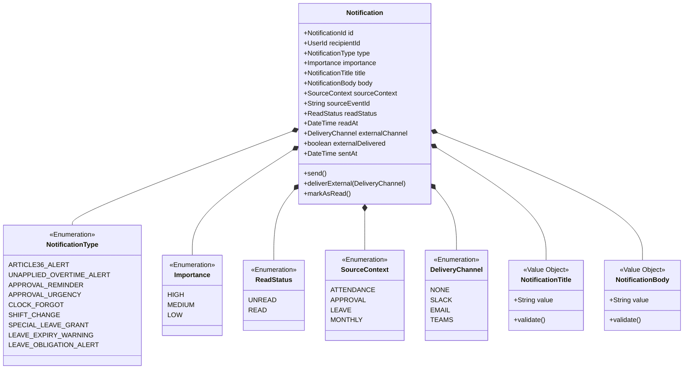
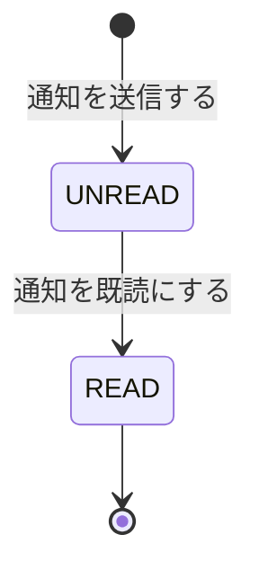

# 通知集約

## 概要

各コンテキストから発行された通知を受け取り、アプリ内通知の配送と外部チャンネルへの転送を管理する。通知の「配送のみ」を責務とし、通知内容の生成は発信元コンテキストが担う。

**コンテキスト:** 通知
**種別:** 汎用サブドメイン

---

## 構造図

---

## 状態遷移

### 状態遷移ルール

| 遷移 | From | To | ガード条件 |
|------|------|-----|-----------|
| 送信 | - | UNREAD | 宛先ユーザーが存在すること |
| 既読 | UNREAD | READ | 宛先ユーザー本人であること |

---

## コマンド

### 通知を送信する

**実行者:** システム（各コンテキストのSaga/ポリシーから発行）

| 項目 | 型 | 必須 | 制約 | 説明 |
|------|-----|------|------|------|
| recipientId | UserId | ✅ | 存在するユーザー | 宛先 |
| type | NotificationType | ✅ | Enum値 | 通知種別 |
| importance | Importance | ✅ | Enum値 | 重要度 |
| title | NotificationTitle | ✅ | 1-100文字 | 見出し |
| body | NotificationBody | ✅ | 1-1000文字 | 本文 |
| sourceContext | SourceContext | ✅ | Enum値 | 発信元 |
| sourceEventId | String | - | - | トレーサビリティ用 |

**事前条件:**
- 宛先ユーザーが存在すること

**事後条件:**
- UNREAD状態で作成
- 重要度HIGHの場合、外部配信ポリシーが発動

**発行イベント:** 通知が送信された

### 外部通知を送信する

**実行者:** システム（外部配信ポリシーから発行）

| 項目 | 型 | 必須 | 制約 | 説明 |
|------|-----|------|------|------|
| notificationId | NotificationId | ✅ | 存在する通知 | 対象通知 |
| channel | DeliveryChannel | ✅ | NONE以外 | 配信チャンネル |

**事前条件:**
- 対象通知が存在すること
- まだ外部配信されていないこと

**事後条件:**
- externalChannel と externalDelivered が更新される

**発行イベント:** 外部通知が送信された

### 通知を既読にする

**実行者:** 従業員（本人）

| 項目 | 型 | 必須 | 制約 | 説明 |
|------|-----|------|------|------|
| notificationId | NotificationId | ✅ | 存在するUNREAD通知 | 対象通知 |

**事前条件:**
- 通知がUNREADであること
- 宛先ユーザー本人であること

**発行イベント:** 通知が既読になった

---

## イベント

### 通知が送信された

| 項目 | 型 | 説明 |
|------|-----|------|
| notificationId | NotificationId | 通知ID |
| recipientId | UserId | 宛先 |
| type | NotificationType | 通知種別 |
| importance | Importance | 重要度 |
| sourceContext | SourceContext | 発信元 |
| sentAt | DateTime | 送信日時 |

### 外部通知が送信された

| 項目 | 型 | 説明 |
|------|-----|------|
| notificationId | NotificationId | 通知ID |
| channel | DeliveryChannel | 配信チャンネル |
| deliveredAt | DateTime | 配信日時 |

### 通知が既読になった

| 項目 | 型 | 説明 |
|------|-----|------|
| notificationId | NotificationId | 通知ID |
| recipientId | UserId | 既読者 |
| readAt | DateTime | 既読日時 |

---

## クエリ

### 未読通知一覧（ユーザー別）

#### 表示カラム

| カラム | ソート | 権限 | 説明 |
|--------|--------|------|------|
| 重要度 | ✅ | 本人 | HIGH/MEDIUM/LOWバッジ |
| タイトル | - | 本人 | 通知見出し |
| 発信元 | - | 本人 | sourceContext表示名 |
| 送信日時 | ✅（デフォルト降順） | 本人 | sentAt |

#### 検索条件

| 条件 | 型 | 演算子 | デフォルト |
|------|-----|--------|-----------|
| 重要度 | Importance | = | 全件 |
| 発信元 | SourceContext | = | 全件 |

### 通知履歴

#### 表示カラム

| カラム | ソート | 権限 | 説明 |
|--------|--------|------|------|
| 重要度 | ✅ | 本人 | バッジ |
| タイトル | - | 本人 | 通知見出し |
| 種別 | - | 本人 | NotificationType表示名 |
| 発信元 | - | 本人 | sourceContext表示名 |
| 送信日時 | ✅（デフォルト降順） | 本人 | sentAt |
| 既読 | - | 本人 | 既読/未読 |
| 外部配信 | - | 本人 | チャンネル名 or なし |

#### 検索条件

| 条件 | 型 | 演算子 | デフォルト |
|------|-----|--------|-----------|
| 重要度 | Importance | = | 全件 |
| 種別 | NotificationType | = | 全件 |
| 既読状態 | ReadStatus | = | 全件 |
| 期間 | DateTime | range | 直近30日 |

---

## 不変条件

| ID | 条件 | 説明 |
|----|------|------|
| INV-NTF-001 | 既読は本人のみ | 他者の通知を既読にできない |
| INV-NTF-002 | READ後はUNREADに戻せない | 既読は不可逆 |
| INV-NTF-003 | 外部配信は1回のみ | 同一通知への二重配信防止 |

---

## ビジネスルール

### 外部配信ポリシー

| 重要度 | 外部配信 | チャンネル決定ロジック |
|--------|---------|---------------------|
| HIGH | 自動配信 | ユーザー設定 or システムデフォルト |
| MEDIUM | 配信しない | - |
| LOW | 配信しない | - |

**チャンネル決定の優先順位:**
1. ユーザー個人設定があればそれを使用
2. なければシステムデフォルト（初期: SLACK）
3. チャンネルが未設定の場合はアプリ内通知のみ

### 通知トリガー一覧

> 通知集約は「配送のみ」を担当。以下のトリガーは各コンテキストのポリシー/Sagaから発行される。

| # | トリガー | 発行元 | 重要度 | 宛先 |
|---|---------|--------|--------|------|
| 1 | 36協定アラート（月次30h超過） | 勤怠管理 | HIGH | 上長 |
| 2 | 36協定アラート（月次40h超過） | 勤怠管理 | HIGH | 上長, 人事 |
| 3 | 36協定アラート（月次45h到達） | 勤怠管理 | HIGH | 上長, 人事, 本人 |
| 4 | 36協定アラート（年次300h超過） | 勤怠管理 | HIGH | 上長, 人事 |
| 5 | 36協定アラート（年次360h到達） | 勤怠管理 | HIGH | 上長, 人事, 本人 |
| 6 | 未申請残業アラート | 申請承認 | MEDIUM | 上長 |
| 7 | 承認リマインド（3営業日前） | 月次処理 | MEDIUM | 管理職 |
| 8 | 承認督促（1営業日前） | 月次処理 | HIGH | 管理職, 人事 |
| 9 | 打刻忘れ通知 | 勤怠管理 | MEDIUM | 本人 |
| 10 | シフト変更通知 | 勤怠管理 | LOW | 本人 |
| 11 | 特別休暇付与通知 | 休暇管理 | LOW | 本人 |
| 12 | 有給時効消滅30日前通知 | 休暇管理 | MEDIUM | 本人 |
| 13 | 有給取得義務未達アラート | 休暇管理 | HIGH | 上長, 人事, 本人 |

---

## 実装ノート

### Standard パターン

- 通知は「配送のみ」の汎用サブドメイン。ビジネスロジックは最小限
- 複数宛先の通知は宛先ごとに1件ずつNotificationを生成
- 外部配信は非同期処理（メッセージキュー経由）
- 外部チャンネルのアダプタパターンで拡張可能（Slack/Email/Teams等）
- DeliveryChannelはEnum拡張で新チャンネルを追加可能
- 通知テンプレートは発信元コンテキストが管理（通知集約はtitle/bodyを受け取るだけ）
- 大量通知時のバッチ送信を考慮（36協定アラートで全上長に一斉送信等）

### 閲覧権限

- 従業員: 自分宛の通知のみ閲覧・既読可能

<!-- 品質チェック結果
- [x] 全コマンド（3つ: 送信/外部送信/既読）に対応するイベントが定義されている
- [x] 不変条件が具体的な条件で定義されている（3件）
- [x] 状態遷移にガード条件がある（UNREAD→READ: 本人のみ）
- [x] 値オブジェクトの等価性条件が明確（NotificationTitle: value、NotificationBody: value）
- [x] クエリ定義にカラムと検索条件がある（2リードモデル）
- [x] 外部配信ポリシーが汎用的に定義されている（チャンネル非依存）
- [x] 通知トリガー一覧（13種）がES図と一致している
-->
