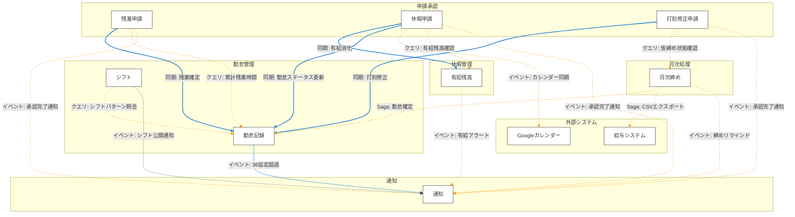
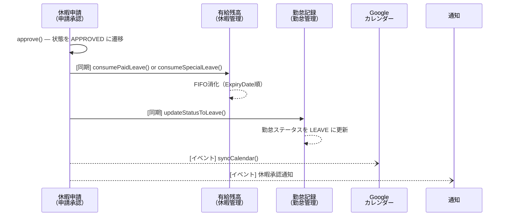
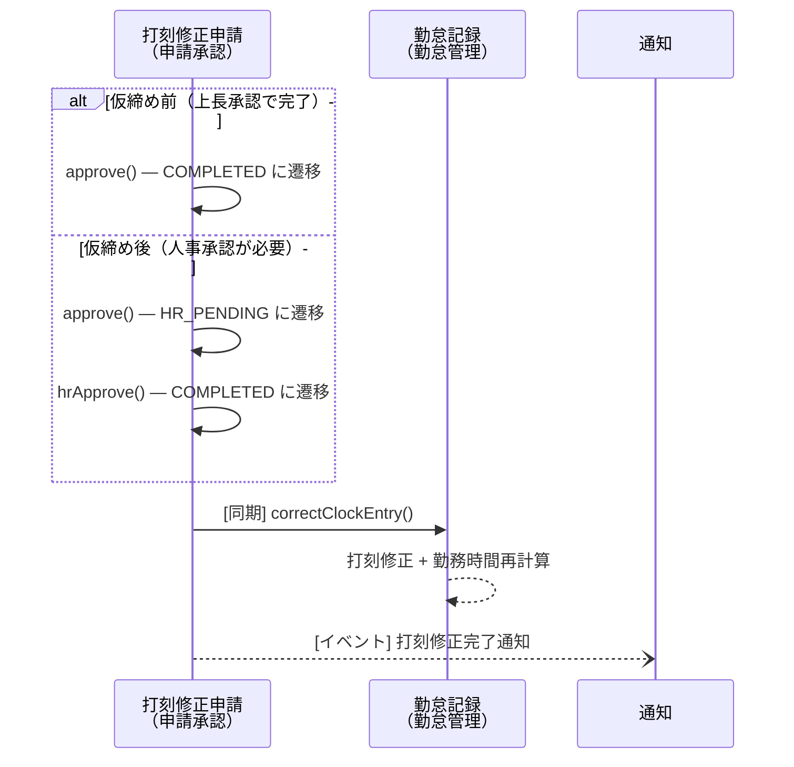
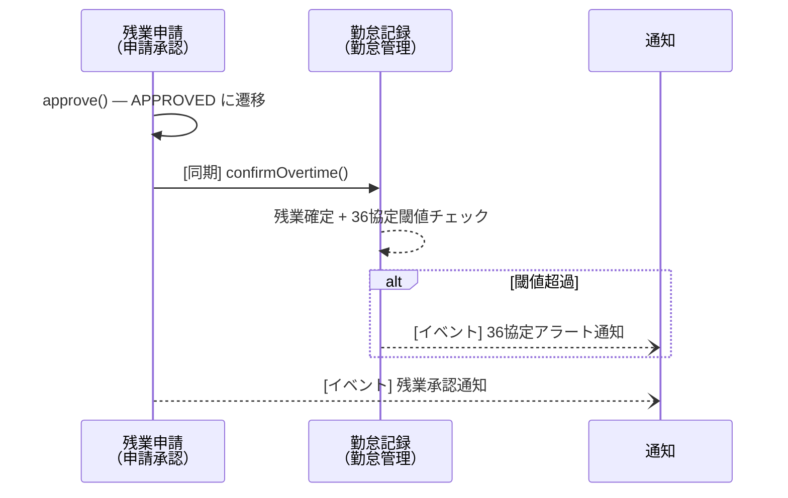
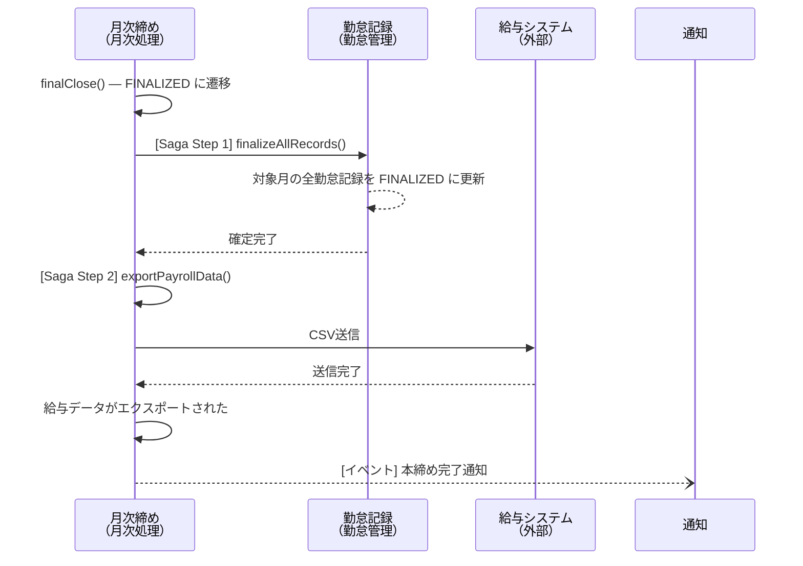
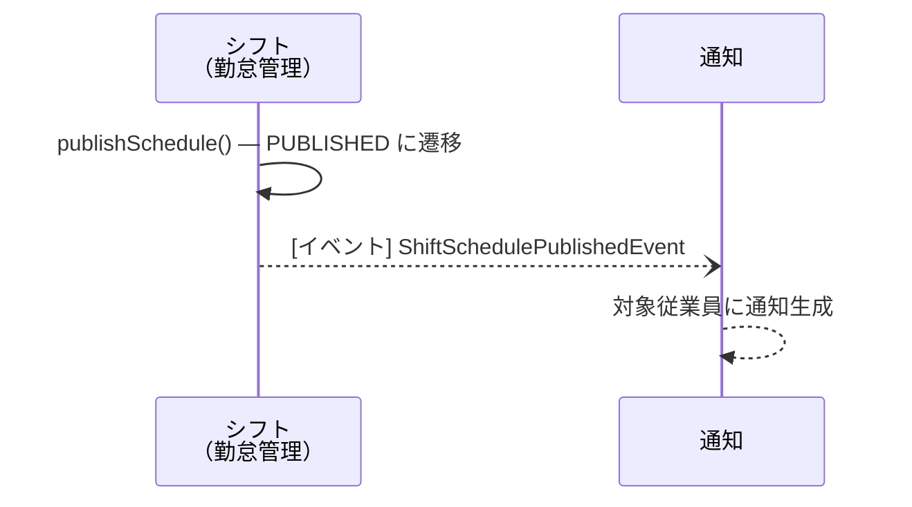

# コンテキスト間連携設計

> **更新日**: 2026-02-09
> **前提**: モジュラーモノリス（Spring Boot 4.x / Java 25 / PostgreSQL 16.x）、同一JVM・同一DBで運用

---

## 概要

本システムは5つの境界づけられたコンテキスト（勤怠管理、申請承認、休暇管理、月次処理、通知）で構成される。
本ドキュメントは、コンテキスト間の連携方式と共有データの参照パターンを定義する。

### 対象読者

AIコーディングエージェントおよび実装者。
本ドキュメントを読めば、コンテキスト間の「繋ぎ目」を迷わず実装できることを目的とする。

### コンテキスト一覧

| コンテキスト | 種別 | 集約 | 役割 |
|-------------|------|------|------|
| 勤怠管理 | コア | 勤怠記録、シフト | 日次の勤怠データ管理（打刻・勤務時間計算・シフト） |
| 申請承認 | コア | 残業申請、休暇申請、打刻修正申請 | 各種申請の作成・承認ワークフロー |
| 休暇管理 | コア | 有給残高 | 有給・特別休暇の付与・消化・残日数管理 |
| 月次処理 | 支援 | 月次締め | 月次の仮締め・本締め・給与エクスポート |
| 通知 | 汎用 | 通知 | アプリ内通知の生成・配信・既読管理 |

---

## アーキテクチャ方針

### 連携パターン

モジュラーモノリス（同一JVM・同一DB）において、以下の3パターンを使い分ける。

| パターン | 用途 | 技術 | 一貫性 |
|---------|------|------|--------|
| **同期サービス呼び出し** | 即時に整合性が必要な連携 | Spring `@Service` 直接注入（DI） | 強い一貫性（同一トランザクション） |
| **ドメインイベント** | 非同期で十分な後続処理 | Spring `ApplicationEventPublisher` + `@TransactionalEventListener` | 結果整合性 |
| **Sagaオーケストレーション** | 複数ステップ＋中断復旧が必要な処理 | Spring `ApplicationEventPublisher` + Sagaオーケストレータ | Saga内で段階的に保証 |

### 選択基準

```
即時に整合性が必要？
  ├─ YES → 同期サービス呼び出し（@Service DI）
  │        例: 有給消化、勤怠ステータス更新、打刻修正
  └─ NO  → 失敗時にロールバックが必要？
              ├─ YES → Sagaオーケストレーション
              │        例: 月次本締め（勤怠確定+CSVエクスポート）
              └─ NO  → ドメインイベント（fire-and-forget）
                       例: 通知送信、カレンダー同期
```

### パターン別実装方針

#### 同期サービス呼び出し

コンテキスト境界を越える同期呼び出しは、**インターフェースを呼び出し元コンテキストに定義**し、実装を呼び出し先コンテキストに配置する（依存性逆転）。

```java
// 申請承認コンテキスト（呼び出し元）にインターフェースを定義
package com.example.approval.port.out;

public interface LeaveBalancePort {
    void consumePaidLeave(String employeeId, LeaveConsumptionCommand command);
    void consumeSpecialLeave(String employeeId, SpecialLeaveConsumptionCommand command);
}
```

```java
// 休暇管理コンテキスト（呼び出し先）に実装を配置
package com.example.leave.adapter.in;

@Service
public class LeaveBalanceAdapter implements LeaveBalancePort {
    private final LeaveBalanceService leaveBalanceService;

    @Override
    @Transactional
    public void consumePaidLeave(String employeeId, LeaveConsumptionCommand command) {
        leaveBalanceService.consumePaidLeave(employeeId, command);
    }
}
```

#### ドメインイベント

```java
// イベント定義（共有カーネルまたは発行元コンテキスト）
package com.example.shared.event;

public record OvertimeApprovedEvent(
    String overtimeRequestId,
    String employeeId,
    LocalDate targetDate,
    Duration approvedDuration,
    Instant occurredAt
) implements DomainEvent {}
```

```java
// イベント発行（申請承認コンテキスト）
@Service
public class OvertimeRequestService {
    private final ApplicationEventPublisher eventPublisher;

    @Transactional
    public void approve(String requestId, String approverId) {
        // ... 承認処理 ...
        eventPublisher.publishEvent(new OvertimeApprovedEvent(
            requestId, request.getEmployeeId(),
            request.getTargetDate(), request.getRequestedDuration(),
            Instant.now()
        ));
    }
}
```

```java
// イベント購読（通知コンテキスト）
@Component
public class NotificationEventListener {

    @TransactionalEventListener(phase = TransactionPhase.AFTER_COMMIT)
    public void onOvertimeApproved(OvertimeApprovedEvent event) {
        // 36協定チェック → 閾値超過なら通知生成
    }
}
```

---

## 共有データ参照パターン

### 従業員マスタ

#### 問題

全5コンテキストが従業員情報（氏名・部門・役職等）を参照する。従業員マスタは本システムの管理対象外（人事システムが管理元）だが、API レスポンスで氏名表示やアクセス制御に必要。

#### 方針: クロスコンテキスト直接JOIN

モジュラーモノリスの同一DB内で、各コンテキストが `employees` テーブルを直接 JOIN で参照する。VIEW は作成しない。将来のマイクロサービス分割時にはAPI呼び出しに切り替える。

#### 前提テーブル

```sql
-- 共有スキーマ（人事システムからの同期データ）
CREATE TABLE employees (
    employee_id    VARCHAR(36)  PRIMARY KEY,
    email          VARCHAR(255) NOT NULL UNIQUE,
    name           VARCHAR(100) NOT NULL,
    department_id  VARCHAR(36)  NOT NULL,
    department_name VARCHAR(100) NOT NULL,
    position       VARCHAR(50),
    manager_id     VARCHAR(36)  REFERENCES employees(employee_id),
    employment_type VARCHAR(20) NOT NULL DEFAULT 'FULL_TIME',
    hire_date      DATE         NOT NULL,
    is_active      BOOLEAN      NOT NULL DEFAULT TRUE,
    created_at     TIMESTAMPTZ  NOT NULL DEFAULT NOW(),
    updated_at     TIMESTAMPTZ  NOT NULL DEFAULT NOW()
);

CREATE INDEX idx_employees_department ON employees(department_id);
CREATE INDEX idx_employees_manager ON employees(manager_id);
```

#### 実装パターン

```java
// 勤怠記録のリポジトリで従業員名を直接JOINで取得
@Repository
public class AttendanceRecordRepositoryImpl implements AttendanceRecordRepository {

    public AttendanceRecordWithEmployee findByIdWithEmployee(String recordId) {
        return jdbcTemplate.queryForObject("""
            SELECT ar.*, e.name AS employee_name, e.department_name
            FROM attendance_records ar
            JOIN employees e ON ar.employee_id = e.employee_id
            WHERE ar.attendance_record_id = ?
            """, recordId);
    }
}
```

#### 適用対象

| コンテキスト | 集約 | JOINするFK | 用途 |
|-------------|------|-----------|------|
| 勤怠管理 | 勤怠記録 | `employee_id` | 氏名表示、部門別集計 |
| 勤怠管理 | シフト | `employee_id` | シフト割当対象者 |
| 申請承認 | 残業申請 | `employee_id`, `approver_id` | 申請者名・承認者名表示 |
| 申請承認 | 休暇申請 | `employee_id`, `approver_id` | 申請者名・承認者名表示 |
| 申請承認 | 打刻修正申請 | `employee_id`, `approver_id`, `hr_approver_id` | 申請者名・承認者名・人事承認者名表示 |
| 休暇管理 | 有給残高 | `employee_id` | 従業員別残高照会 |
| 月次処理 | 月次締め | （集計時にJOIN） | 部門別集計・給与エクスポート |
| 通知 | 通知 | `recipient_id` | 通知宛先の氏名・メール |

---

## コンテキスト間連携一覧



**凡例**: 実線（青）= 同期呼び出し、破線（橙）= ドメインイベント/非同期

---

## 連携詳細

### 1. 休暇承認 Saga

| 項目 | 内容 |
|------|------|
| トリガー | `休暇申請が承認された`（申請承認コンテキスト） |
| パターン | 同期サービス呼び出し + ドメインイベント |
| 理由 | 有給消化・勤怠更新は即時整合性が必要（残高不整合を防ぐ）。カレンダー同期は外部APIで失敗しうるため非同期 |

#### シーケンス



#### インターフェース定義

```java
// 有給消化（申請承認 → 休暇管理）
public interface LeaveBalancePort {
    /**
     * 有給休暇を消化する（FIFO: ExpiryDate順）
     * @throws InsufficientBalanceException 残日数不足
     */
    void consumePaidLeave(String employeeId, LeaveConsumptionCommand command);

    /**
     * 特別休暇を消化する
     * @throws InsufficientBalanceException 残日数不足
     * @throws InvalidLeaveTypeException 特別休暇種別不正
     */
    void consumeSpecialLeave(String employeeId, SpecialLeaveConsumptionCommand command);
}

public record LeaveConsumptionCommand(
    String leaveRequestId,    // トレーサビリティ用
    LocalDate startDate,
    LocalDate endDate,
    LeaveUnit unit,           // FULL_DAY / HALF_DAY / HOURLY
    BigDecimal daysConsumed   // 消化日数（半日=0.5、時間単位=時間/8）
) {}
```

```java
// 勤怠ステータス更新（申請承認 → 勤怠管理）
public interface AttendanceRecordPort {
    /**
     * 指定期間の勤怠ステータスを LEAVE に更新する
     * @throws RecordAlreadyFinalizedException 本締め済みの場合
     */
    void updateStatusToLeave(String employeeId, AttendanceLeaveCommand command);
}

public record AttendanceLeaveCommand(
    String leaveRequestId,
    LocalDate startDate,
    LocalDate endDate,
    LeaveType leaveType       // PAID / SPECIAL
) {}
```

---

### 2. 打刻修正承認

| 項目 | 内容 |
|------|------|
| トリガー | `打刻修正が承認された` or `打刻修正が人事承認された`（申請承認コンテキスト） |
| パターン | 同期サービス呼び出し |
| 理由 | 1コマンドのみ。修正と勤務時間再計算は同一トランザクションで即時反映が必要 |

#### シーケンス



#### インターフェース定義

```java
// 打刻修正（申請承認 → 勤怠管理）
public interface ClockCorrectionPort {
    /**
     * 打刻を修正し、勤務時間を再計算する
     * @throws RecordAlreadyFinalizedException 本締め済みの場合
     */
    void correctClockEntry(String employeeId, ClockCorrectionCommand command);
}

public record ClockCorrectionCommand(
    String clockCorrectionId,
    LocalDate targetDate,
    CorrectionType correctionType,  // CLOCK_IN / CLOCK_OUT / BOTH
    LocalTime correctedClockIn,     // BOTH型の場合に使用
    LocalTime correctedClockOut,    // BOTH型の場合に使用
    LocalTime correctedClockTime,   // CLOCK_IN/CLOCK_OUT型の場合に使用
    String reason
) {}
```

---

### 3. 残業承認

| 項目 | 内容 |
|------|------|
| トリガー | `残業申請が承認された`（申請承認コンテキスト） |
| パターン | 同期サービス呼び出し + ドメインイベント |
| 理由 | 残業確定は即時反映が必要。36協定チェック→通知は後続処理として非同期 |

#### シーケンス



#### インターフェース定義

```java
// 残業確定（申請承認 → 勤怠管理）
public interface OvertimeConfirmationPort {
    /**
     * 残業を確定し、36協定閾値をチェックする
     * @return 36協定チェック結果（閾値超過の場合はアラートレベルを含む）
     */
    OvertimeConfirmationResult confirmOvertime(
        String employeeId, OvertimeConfirmationCommand command
    );
}

public record OvertimeConfirmationCommand(
    String overtimeRequestId,
    LocalDate targetDate,
    LocalTime startTime,
    LocalTime endTime,
    Duration approvedDuration,
    OvertimeCategory category   // REGULAR / HOLIDAY / LATE_NIGHT
) {}

public record OvertimeConfirmationResult(
    boolean thresholdExceeded,
    AlertLevel alertLevel,         // NONE / APPROACHING / EXCEEDED / CRITICAL / VIOLATION
    Duration monthlyTotal,
    Duration yearlyTotal
) {}
```

---

### 4. 月次本締め Saga

| 項目 | 内容 |
|------|------|
| トリガー | `月次が本締めされた`（月次処理コンテキスト） |
| パターン | Sagaオーケストレーション |
| 理由 | 勤怠確定 + CSVエクスポートの2段階処理。中断復旧に冪等性が必要。CSVエクスポートは外部システム連携で失敗しうる |

#### シーケンス



#### インターフェース定義

```java
// 勤怠記録確定（月次処理 → 勤怠管理）
public interface AttendanceFinalizePort {
    /**
     * 対象月の全勤怠記録を FINALIZED に更新する（冪等）
     * 既に FINALIZED の記録はスキップする
     * @return 確定された記録数
     */
    int finalizeAllRecords(YearMonth targetMonth);
}
```

```java
// 給与エクスポート（月次処理 → 外部システム）
public interface PayrollExportPort {
    /**
     * 給与データをCSVエクスポートする（冪等: 同一月の再送信を許容）
     * @throws PayrollExportFailedException エクスポート失敗
     */
    PayrollExportResult exportPayrollData(YearMonth targetMonth);
}
```

#### 補償トランザクション

| ステップ | 失敗時の補償 |
|---------|------------|
| Step 1: 勤怠確定 | 月次締めステータスを `FINAL_CLOSE_FAILED` に更新。勤怠記録は FINALIZED のままとし、手動で本締め再実行 |
| Step 2: CSVエクスポート | 月次締めステータスを `EXPORT_FAILED` に更新。勤怠は確定済みのまま。CSVエクスポートのみ再実行可能 |

---

### 5. クロスコンテキストクエリ（非Saga同期問い合わせ）

Saga 以外に、事前条件チェック等で同期問い合わせが発生する連携。

| # | 呼び出し元 | 呼び出し先 | 目的 | インターフェース |
|---|----------|----------|------|---------------|
| 1 | 打刻修正申請（申請承認） | 月次締め（月次処理） | 仮締め状態確認 → `afterProvisionalClose` フラグ設定 | `MonthlyClosingQueryPort.isProvisionalClosed(YearMonth)` |
| 2 | 休暇申請（申請承認） | 有給残高（休暇管理） | 有給残高チェック（申請時の事前条件） | `LeaveBalanceQueryPort.getRemainingDays(String employeeId, LeaveType)` |
| 3 | 残業申請（申請承認） | 勤怠記録（勤怠管理） | 月次・年次累計残業時間（36協定チェック用） | `OvertimeQueryPort.getAccumulatedOvertime(String employeeId, YearMonth)` |
| 4 | 勤怠記録（勤怠管理） | シフト（勤怠管理） | 所定勤務時間・シフトパターン照会 | `ShiftPatternQueryPort.getAssignedPattern(UUID employeeId, LocalDate)` |

> **注記（#4）**: シフト→勤怠記録の連携は同一コンテキスト（勤怠管理）内の集約間連携である。クロスコンテキスト連携とは性質が異なり、モジュラーモノリスでは同一パッケージ内の Service DI で実装する。依存性逆転パターン（ポート定義を呼び出し元に置く）は適用するが、Adapter 層を経由せず直接 Service を注入してよい。

```java
// クエリポート定義例
public interface MonthlyClosingQueryPort {
    boolean isProvisionalClosed(YearMonth targetMonth);
}

public interface LeaveBalanceQueryPort {
    BigDecimal getRemainingDays(String employeeId, LeaveType leaveType);
}

public interface OvertimeQueryPort {
    OvertimeAccumulation getAccumulatedOvertime(String employeeId, YearMonth month);
}

public record OvertimeAccumulation(
    Duration monthlyTotal,
    Duration yearlyTotal,
    Duration specialClauseMonthlyTotal,  // 特別条項適用月の累計
    int specialClauseMonthCount          // 特別条項適用月数
) {}
```

```java
// シフトパターン照会（勤怠記録 → シフト、同一コンテキスト内）
package com.example.attendance.port.out;

public interface ShiftPatternQueryPort {
    /**
     * 指定従業員の指定日に割り当てられたシフトパターンを取得する。
     * 勤怠記録の所定勤務時間算出に使用する。
     * PUBLISHED 状態のスケジュールのみ対象。
     * @return シフト未割当の場合は empty
     */
    Optional<AssignedShiftPattern> getAssignedPattern(
        UUID employeeId, LocalDate date
    );
}

public record AssignedShiftPattern(
    UUID shiftPatternId,
    String name,
    LocalTime startTime,
    LocalTime endTime,
    int breakMinutes,
    int scheduledMinutes,
    boolean isOvernight
) {}
```

---

### 6. シフト公開通知

| 項目 | 内容 |
|------|------|
| トリガー | `シフトスケジュールが公開された`（勤怠管理コンテキスト・シフト集約） |
| パターン | ドメインイベント |
| 理由 | 通知はシフト公開の後続処理であり、即時整合性は不要。失敗しても公開自体は有効なため fire-and-forget で十分 |

#### シーケンス



#### ドメインイベント定義

```java
// シフト公開イベント（勤怠管理コンテキスト → 通知コンテキスト）
package com.example.shared.event;

public record ShiftSchedulePublishedEvent(
    UUID scheduleId,
    UUID departmentId,
    LocalDate weekStartDate,
    List<ShiftAssignment> assignments,
    LocalDateTime publishedAt,
    UUID publishedBy
) implements DomainEvent {}

public record ShiftAssignment(
    UUID employeeId,
    UUID shiftPatternId,
    String shiftPatternName
) {}
```

#### イベント発行

```java
// シフト集約のドメインサービス
package com.example.attendance.domain.shift;

@Service
public class ShiftScheduleService {
    private final ApplicationEventPublisher eventPublisher;

    @Transactional
    public void publishSchedule(UUID scheduleId, UUID publishedBy) {
        // ... 公開処理（DRAFT → PUBLISHED） ...
        eventPublisher.publishEvent(new ShiftSchedulePublishedEvent(
            schedule.getId(),
            schedule.getDepartmentId(),
            schedule.getWeekStartDate(),
            schedule.getAssignments().stream()
                .map(a -> new ShiftAssignment(
                    a.getEmployeeId(),
                    a.getShiftPatternId(),
                    a.getShiftPatternName()
                ))
                .toList(),
            LocalDateTime.now(),
            publishedBy
        ));
    }
}
```

#### イベント購読

```java
// 通知コンテキストのイベントリスナー
package com.example.notification.listener;

@Component
public class ShiftNotificationListener {

    @TransactionalEventListener(phase = TransactionPhase.AFTER_COMMIT)
    public void onShiftSchedulePublished(ShiftSchedulePublishedEvent event) {
        List<String> recipientIds = event.assignments().stream()
            .map(a -> a.employeeId().toString())
            .toList();

        eventPublisher.publishEvent(new NotificationRequestedEvent(
            "SHIFT_PUBLISHED",
            NotificationPriority.NORMAL,
            "勤怠管理",
            event.scheduleId().toString(),
            recipientIds,
            "shift.published",
            Map.of("weekStartDate", event.weekStartDate().toString()),
            Instant.now()
        ));
    }
}
```

---

## 通知サービス連携

### 通知種別一覧

MVP ではアプリ内通知のみ。メール・Slack 連携は v2 で追加予定。

| # | 通知種別 | トリガー | 送信先 | 重要度 |
|---|---------|---------|--------|--------|
| 1 | 36協定月次接近アラート | 月45h の80%到達 | 上長 | MEDIUM |
| 2 | 36協定月次超過アラート | 月45h超過 | 上長 + 人事 | HIGH |
| 3 | 36協定年次接近アラート | 年360hの80%到達 | 人事 | HIGH |
| 4 | 36協定特別条項アラート | 特別条項発動（月60h超） | 人事 + 本人 | HIGH |
| 5 | 36協定違反アラート | 年720h超過 or 6回超過 | 人事 + 管理者 | CRITICAL |
| 6 | 承認リマインド | 申請後72h未承認 | 承認者 | MEDIUM |
| 7 | 締めリマインド | 締め期限3日前 | 人事 | MEDIUM |
| 8 | 打刻忘れアラート | 退勤未打刻（翌日AM） | 本人 | MEDIUM |
| 9 | 休暇承認完了 | 休暇申請が承認された | 本人 | LOW |
| 10 | 残業承認完了 | 残業申請が承認された | 本人 | LOW |
| 11 | 打刻修正完了 | 打刻修正が承認された | 本人 | LOW |
| 12 | 有給5日取得義務アラート | 年度末3ヶ月前で5日未取得 | 本人 + 上長 | HIGH |
| 13 | 本締め完了 | 月次が本締めされた | 人事 | LOW |
| 14 | シフト公開通知 | シフトスケジュールが公開された | 対象従業員 | NORMAL |

### 通知イベントペイロード

```java
// 共通の通知イベント（全コンテキスト → 通知コンテキスト）
public record NotificationRequestedEvent(
    String notificationType,          // 上表の通知種別コード
    NotificationPriority priority,    // LOW / MEDIUM / HIGH / CRITICAL
    String sourceContext,             // 発行元コンテキスト名
    String sourceEventId,             // トレーサビリティ用
    List<String> recipientIds,        // 宛先従業員ID
    String titleTemplate,             // テンプレートキー
    Map<String, String> parameters,   // テンプレートパラメータ
    Instant occurredAt
) implements DomainEvent {}
```

```java
// 通知コンテキストのイベントリスナー
@Component
public class NotificationRequestListener {

    @TransactionalEventListener(phase = TransactionPhase.AFTER_COMMIT)
    public void onNotificationRequested(NotificationRequestedEvent event) {
        for (String recipientId : event.recipientIds()) {
            notificationService.create(Notification.builder()
                .recipientId(recipientId)
                .type(event.notificationType())
                .priority(event.priority())
                .title(templateEngine.render(event.titleTemplate(), event.parameters()))
                .sourceContext(event.sourceContext())
                .sourceEventId(event.sourceEventId())
                .build()
            );
        }
    }
}
```

---

## 共通の前提事項

### 年度定義

| 項目 | 値 |
|------|-----|
| 年度起算月 | 4月 |
| 年度期間 | 4月1日 〜 翌年3月31日 |
| 有給付与基準日 | 入社日起算（入社6ヶ月後に初回付与、以後毎年入社月に付与） |
| 36協定期間 | 4月〜翌3月（年度と同一） |

```java
// 年度計算ユーティリティ
public final class FiscalYear {
    private static final int FISCAL_YEAR_START_MONTH = 4;

    public static int getFiscalYear(LocalDate date) {
        return date.getMonthValue() >= FISCAL_YEAR_START_MONTH
            ? date.getYear()
            : date.getYear() - 1;
    }

    public static LocalDate getFiscalYearStart(int fiscalYear) {
        return LocalDate.of(fiscalYear, FISCAL_YEAR_START_MONTH, 1);
    }

    public static LocalDate getFiscalYearEnd(int fiscalYear) {
        return LocalDate.of(fiscalYear + 1, FISCAL_YEAR_START_MONTH, 1).minusDays(1);
    }
}
```

### タイムゾーン

| 項目 | 値 |
|------|-----|
| サーバータイムゾーン | `Asia/Tokyo` (JST, UTC+9) |
| データベースタイムゾーン | `Asia/Tokyo` |
| APIレスポンス | `Asia/Tokyo`（ISO 8601 with offset: `2026-02-09T09:00:00+09:00`） |
| フロントエンド | `Asia/Tokyo`（サーバーと同一、変換不要） |

```java
// application.yml
spring:
  jackson:
    time-zone: Asia/Tokyo
    date-format: "yyyy-MM-dd'T'HH:mm:ssXXX"

// PostgreSQL設定
ALTER DATABASE attendance SET timezone TO 'Asia/Tokyo';
```

### 認証

| 項目 | 値 |
|------|-----|
| 認証方式 | JWT（Bearer Token） |
| IdP | Google Workspace（OAuth 2.0 SSO） |
| アクセストークン有効期限 | 15分 |
| リフレッシュトークン有効期限 | 7日 |

#### JWTペイロード構造

```json
{
  "sub": "google-oauth-subject-id",
  "email": "yamada.taro@example.co.jp",
  "employeeId": "EMP-001",
  "role": "MANAGER",
  "departmentId": "DEPT-SALES-01",
  "name": "山田 太郎",
  "iat": 1738900000,
  "exp": 1738900900
}
```

#### ロール定義

| ロール | 権限概要 |
|--------|---------|
| `EMPLOYEE` | 自分の勤怠・申請の閲覧・作成 |
| `MANAGER` | 部下の勤怠閲覧 + 申請承認 |
| `HR` | 全従業員の勤怠閲覧 + 月次締め + 人事承認 |
| `ADMIN` | システム管理（マスタ設定等） |

#### サービス間認証

バッチ処理・内部API（月次締めの自動実行等）ではサービスアカウント用トークンを使用する。

```java
// サービスアカウントのJWTペイロード
{
  "sub": "service:monthly-batch",
  "role": "SYSTEM",
  "scope": "attendance:finalize,payroll:export",
  "iat": 1738900000,
  "exp": 1738900900
}
```

---

## 未確定事項

| # | 項目 | 理由 | 対応時期 |
|---|------|------|---------|
| 1 | Googleカレンダー連携の具体的API仕様 | Google Calendar API のスコープ・認証フロー未調査 | 実装フェーズで確定 |
| 2 | 給与システムCSVフォーマット | 既存給与システムの仕様未入手（Phase 0 から継続） | MVP は汎用フォーマットで先行 |
| 3 | メール・Slack通知の追加 | MVP はアプリ内通知のみ | v2 で追加 |
| 4 | マイクロサービス分割基準 | 現時点では分割計画なし | 将来の拡張要件で判断 |

<!-- 品質チェック結果
- [x] Saga.md の全トリガーイベントに対応する連携仕様がある
- [x] 各連携にパターン（同期/イベント/Saga）が明記されている
- [x] 同期呼び出しにはインターフェース定義（引数・戻り値・例外）がある
- [x] ドメインイベントにはペイロード定義がある
- [x] Sagaには補償トランザクションが定義されている
- [x] 共有データの参照パターンが全集約分定義されている
- [x] 共有テーブルのDDL（CREATE TABLE）が記載されている
- [x] 認証・認可の前提（JWT構造等）が具体的に定義されている
- [x] 年度定義・タイムゾーンの前提が明記されている
- [x] 曖昧表現（「適切に」「必要に応じて」）がない
- [x] 全コード例が技術スタック（Spring Boot / Java）と整合している
- [x] コンテキスト間連携図（Mermaid）が存在する
- [x] シフト集約の連携仕様（イベント・クエリポート）が定義されている
-->
