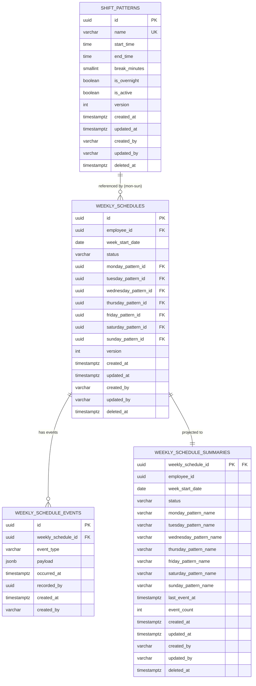

# シフト データベース設計

## 概要

シフトパターンの定義と、従業員への週次シフト割当を
管理する集約のデータベース設計。

**コンテキスト:** 勤怠管理
**構成:** イミュータブルデータモデル + Read Model（アプリケーション層同期）
**RDBMS:** PostgreSQL 16.x

---

## テーブル一覧

| # | テーブル名 | 種別 | 説明 |
|---|-----------|------|------|
| 1 | `shift_patterns` | Write Model | シフトパターン定義（標準テーブル） |
| 2 | `weekly_schedules` | Write Model | 週次スケジュール（集約ルート・不変属性） |
| 3 | `weekly_schedule_events` | Write Model | スケジュールイベント（追記のみ） |
| 4 | `weekly_schedule_summaries` | Read Model | 週次スケジュールサマリー（アプリ同期） |

---

## ER図



---

## Write Model

### shift_patterns（シフトパターン）

シフトパターンの定義テーブル。
状態遷移が単純（ACTIVE/INACTIVE の boolean トグル）なため
イベントテーブルは使用せず、標準の状態テーブルで管理する。

**テーブル名:** `shift_patterns`

| カラム | 型 | NULL | デフォルト | 説明 |
|--------|-----|------|-----------|------|
| id | UUID | NO | gen_random_uuid() | 主キー |
| name | VARCHAR(20) | NO | - | パターン名（早番、遅番等） |
| start_time | TIME | NO | - | 勤務開始時刻 |
| end_time | TIME | NO | - | 勤務終了時刻 |
| break_minutes | SMALLINT | NO | 0 | 休憩時間（分） |
| is_overnight | BOOLEAN | NO | false | 日跨ぎフラグ（夜勤対応） |
| is_active | BOOLEAN | NO | true | 有効フラグ |
| version | INTEGER | NO | 1 | 楽観的ロック用 |
| created_at | TIMESTAMPTZ | NO | CURRENT_TIMESTAMP | 作成日時 |
| updated_at | TIMESTAMPTZ | NO | CURRENT_TIMESTAMP | 更新日時 |
| created_by | VARCHAR(255) | NO | - | 作成者 |
| updated_by | VARCHAR(255) | NO | - | 更新者 |
| deleted_at | TIMESTAMPTZ | YES | NULL | 論理削除日時 |

**制約:**

| 制約名 | 種類 | カラム | 説明 |
|--------|------|--------|------|
| pk_shift_patterns | PRIMARY KEY | id | 主キー |
| uk_shift_patterns_name | UNIQUE | name | パターン名一意（INV-SH-001） |
| chk_shift_patterns_name_len | CHECK | name | LENGTH(name) BETWEEN 2 AND 20 |
| chk_shift_patterns_break | CHECK | break_minutes | BETWEEN 0 AND 120 |

**インデックス:**

| インデックス名 | カラム | 用途 |
|---------------|--------|------|
| idx_shift_patterns_active | is_active | 有効パターン一覧用 |
| idx_shift_patterns_deleted_at | deleted_at | 論理削除フィルタ |

---

### weekly_schedules（週次スケジュール）

集約ルート。不変属性と曜日別パターン割当を保持する。
状態変更は `weekly_schedule_events` への追記で表現する。
assignments は7カラム展開方式で、1日1パターンの
不変条件（INV-SH-003）をDBレベルで保証する。

**テーブル名:** `weekly_schedules`

| カラム | 型 | NULL | デフォルト | 説明 |
|--------|-----|------|-----------|------|
| id | UUID | NO | gen_random_uuid() | 主キー |
| employee_id | UUID | NO | - | 対象従業員ID |
| week_start_date | DATE | NO | - | 週の開始日（月曜日） |
| status | VARCHAR(20) | NO | 'DRAFT' | ステータス |
| monday_pattern_id | UUID | YES | NULL | 月曜のシフトパターンID |
| tuesday_pattern_id | UUID | YES | NULL | 火曜のシフトパターンID |
| wednesday_pattern_id | UUID | YES | NULL | 水曜のシフトパターンID |
| thursday_pattern_id | UUID | YES | NULL | 木曜のシフトパターンID |
| friday_pattern_id | UUID | YES | NULL | 金曜のシフトパターンID |
| saturday_pattern_id | UUID | YES | NULL | 土曜のシフトパターンID |
| sunday_pattern_id | UUID | YES | NULL | 日曜のシフトパターンID |
| version | INTEGER | NO | 1 | 楽観的ロック用 |
| created_at | TIMESTAMPTZ | NO | CURRENT_TIMESTAMP | 作成日時 |
| updated_at | TIMESTAMPTZ | NO | CURRENT_TIMESTAMP | 更新日時 |
| created_by | VARCHAR(255) | NO | - | 作成者 |
| updated_by | VARCHAR(255) | NO | - | 更新者 |
| deleted_at | TIMESTAMPTZ | YES | NULL | 論理削除日時 |

**制約:**

| 制約名 | 種類 | カラム | 説明 |
|--------|------|--------|------|
| pk_weekly_schedules | PRIMARY KEY | id | 主キー |
| uk_weekly_schedules_emp_week | UNIQUE | employee_id, week_start_date | 同一従業員・同一週の重複防止 |
| fk_weekly_schedules_mon | FOREIGN KEY | monday_pattern_id | shift_patterns.id 参照 |
| fk_weekly_schedules_tue | FOREIGN KEY | tuesday_pattern_id | shift_patterns.id 参照 |
| fk_weekly_schedules_wed | FOREIGN KEY | wednesday_pattern_id | shift_patterns.id 参照 |
| fk_weekly_schedules_thu | FOREIGN KEY | thursday_pattern_id | shift_patterns.id 参照 |
| fk_weekly_schedules_fri | FOREIGN KEY | friday_pattern_id | shift_patterns.id 参照 |
| fk_weekly_schedules_sat | FOREIGN KEY | saturday_pattern_id | shift_patterns.id 参照 |
| fk_weekly_schedules_sun | FOREIGN KEY | sunday_pattern_id | shift_patterns.id 参照 |
| chk_weekly_schedules_status | CHECK | status | IN ('DRAFT', 'PUBLISHED') |
| chk_weekly_schedules_dow | CHECK | week_start_date | EXTRACT(ISODOW FROM week_start_date) = 1（月曜日チェック） |
| chk_weekly_schedules_assigned | CHECK | - | 少なくとも1日以上割当あり（下記参照） |

**CHECK制約 chk_weekly_schedules_assigned の定義:**

```sql
CONSTRAINT chk_weekly_schedules_assigned
  CHECK (
    monday_pattern_id IS NOT NULL
    OR tuesday_pattern_id IS NOT NULL
    OR wednesday_pattern_id IS NOT NULL
    OR thursday_pattern_id IS NOT NULL
    OR friday_pattern_id IS NOT NULL
    OR saturday_pattern_id IS NOT NULL
    OR sunday_pattern_id IS NOT NULL
  )
```

> 注: PUBLISHED 時のみ1日以上必須のガード条件は
> アプリケーション層で制御する。
> DB側では「全てNULLのレコードは存在させない」
> という最低限の制約を設定する。

**インデックス:**

| インデックス名 | カラム | 用途 |
|---------------|--------|------|
| idx_weekly_schedules_emp_week | employee_id, week_start_date | シフトカレンダークエリ用 |
| idx_weekly_schedules_week_status | week_start_date, status | 期間+ステータス絞り込み用 |
| idx_weekly_schedules_deleted_at | deleted_at | 論理削除フィルタ |

---

### weekly_schedule_events（スケジュールイベント）

週次スケジュールに対する全ての状態変更をイベントとして記録する。
追記のみ（INSERT only）。UPDATE・DELETE は行わない。

**テーブル名:** `weekly_schedule_events`

| カラム | 型 | NULL | デフォルト | 説明 |
|--------|-----|------|-----------|------|
| id | UUID | NO | gen_random_uuid() | イベントID |
| weekly_schedule_id | UUID | NO | - | スケジュールID |
| event_type | VARCHAR(50) | NO | - | イベント種別 |
| payload | JSONB | NO | '{}' | イベントデータ |
| occurred_at | TIMESTAMPTZ | NO | CURRENT_TIMESTAMP | 発生日時 |
| recorded_by | UUID | YES | - | 記録者ID |
| created_at | TIMESTAMPTZ | NO | CURRENT_TIMESTAMP | 作成日時 |
| created_by | VARCHAR(255) | NO | - | 作成者 |

**event_type の値:**

| event_type | 対応イベント | payload例 |
|------------|-------------|-----------|
| ASSIGNED | シフトが割り当てられた | `{"employeeId": "...", "weekStartDate": "...", "assignments": {"MONDAY": "patternId", ...}}` |
| CHANGED | シフトが変更された | `{"dayOfWeek": "TUESDAY", "beforePatternId": "...", "afterPatternId": "..."}` |
| PUBLISHED | シフトが公開された | `{"publishedAt": "...", "assignedDays": 5}` |
| UNPUBLISHED | シフトが非公開に戻された | `{"reason": "再編集のため"}` |

**制約:**

| 制約名 | 種類 | カラム | 説明 |
|--------|------|--------|------|
| pk_weekly_schedule_events | PRIMARY KEY | id | 主キー |
| fk_ws_events_schedule | FOREIGN KEY | weekly_schedule_id | weekly_schedules.id 参照 |
| chk_ws_events_type | CHECK | event_type | IN ('ASSIGNED', 'CHANGED', 'PUBLISHED', 'UNPUBLISHED') |

**インデックス:**

| インデックス名 | カラム | 用途 |
|---------------|--------|------|
| idx_ws_events_lookup | weekly_schedule_id, occurred_at DESC | 集約別イベント取得 |
| idx_ws_events_type | event_type | イベントタイプ検索 |
| idx_ws_events_occurred_at | occurred_at | 時系列クエリ |

---

## Read Model

### weekly_schedule_summaries（週次スケジュールサマリー）

イベントから導出される週次スケジュールの現在状態を保持する。
`@TransactionalEventListener` によりアプリケーション層で同期更新する。
シフトカレンダークエリに対応するため、曜日ごとのパターン名を
非正規化して保持する。

**テーブル名:** `weekly_schedule_summaries`

| カラム | 型 | NULL | デフォルト | 説明 |
|--------|-----|------|-----------|------|
| weekly_schedule_id | UUID | NO | - | スケジュールID（主キー） |
| employee_id | UUID | NO | - | 従業員ID |
| week_start_date | DATE | NO | - | 週の開始日 |
| status | VARCHAR(20) | NO | 'DRAFT' | 現在のステータス |
| monday_pattern_id | UUID | YES | NULL | 月曜のパターンID |
| monday_pattern_name | VARCHAR(20) | YES | NULL | 月曜のパターン名（非正規化） |
| tuesday_pattern_id | UUID | YES | NULL | 火曜のパターンID |
| tuesday_pattern_name | VARCHAR(20) | YES | NULL | 火曜のパターン名（非正規化） |
| wednesday_pattern_id | UUID | YES | NULL | 水曜のパターンID |
| wednesday_pattern_name | VARCHAR(20) | YES | NULL | 水曜のパターン名（非正規化） |
| thursday_pattern_id | UUID | YES | NULL | 木曜のパターンID |
| thursday_pattern_name | VARCHAR(20) | YES | NULL | 木曜のパターン名（非正規化） |
| friday_pattern_id | UUID | YES | NULL | 金曜のパターンID |
| friday_pattern_name | VARCHAR(20) | YES | NULL | 金曜のパターン名（非正規化） |
| saturday_pattern_id | UUID | YES | NULL | 土曜のパターンID |
| saturday_pattern_name | VARCHAR(20) | YES | NULL | 土曜のパターン名（非正規化） |
| sunday_pattern_id | UUID | YES | NULL | 日曜のパターンID |
| sunday_pattern_name | VARCHAR(20) | YES | NULL | 日曜のパターン名（非正規化） |
| assigned_days | SMALLINT | NO | 0 | 割当済み日数 |
| last_event_at | TIMESTAMPTZ | YES | NULL | 最終イベント日時 |
| event_count | INTEGER | NO | 0 | イベント数 |
| created_at | TIMESTAMPTZ | NO | CURRENT_TIMESTAMP | 作成日時 |
| updated_at | TIMESTAMPTZ | NO | CURRENT_TIMESTAMP | 更新日時 |
| created_by | VARCHAR(255) | NO | - | 作成者 |
| updated_by | VARCHAR(255) | NO | - | 更新者 |
| deleted_at | TIMESTAMPTZ | YES | NULL | 論理削除日時 |

**制約:**

| 制約名 | 種類 | カラム | 説明 |
|--------|------|--------|------|
| pk_ws_summaries | PRIMARY KEY | weekly_schedule_id | 主キー |
| fk_ws_summaries_schedule | FOREIGN KEY | weekly_schedule_id | weekly_schedules.id 参照 |
| chk_ws_summaries_status | CHECK | status | IN ('DRAFT', 'PUBLISHED') |

**インデックス:**

| インデックス名 | カラム | 用途 |
|---------------|--------|------|
| idx_ws_summaries_emp_week | employee_id, week_start_date | シフトカレンダークエリ用 |
| idx_ws_summaries_week_status | week_start_date, status | 期間+ステータス絞り込み用 |
| idx_ws_summaries_deleted_at | deleted_at | 論理削除フィルタ |

**同期方式:** `@TransactionalEventListener`（アプリケーション層）

| イベント種別 | リードモデル処理 |
|-------------|------------------|
| ASSIGNED | INSERT: employee_id, week_start_date, 曜日別パターンID・名を設定 |
| CHANGED | UPDATE: 該当曜日のパターンID・名を更新、assigned_days 再計算 |
| PUBLISHED | UPDATE: status='PUBLISHED' |
| UNPUBLISHED | UPDATE: status='DRAFT' |

---

## 不変条件とDB制約の対応

| 不変条件 | 対応方法 |
|---------|---------|
| INV-SH-001: パターン名は一意 | `uk_shift_patterns_name` UNIQUE制約 |
| INV-SH-002: 割当は有効パターンのみ | アプリケーション層で検証（FK制約では is_active を検証できないため） |
| INV-SH-003: 1日に1パターン | 7カラム展開により構造的に保証（1カラムに1つのIDのみ格納可能） |

---

## クエリ要件とインデックスの対応

| クエリ要件 | 対応テーブル | 使用インデックス |
|-----------|------------|----------------|
| シフトカレンダー（employeeId, weekStartDate range, status） | weekly_schedule_summaries | idx_ws_summaries_emp_week, idx_ws_summaries_week_status |
| シフトパターン一覧（name ASC） | shift_patterns | idx_shift_patterns_active |

---

## マイグレーション

### V1: Write Model

```sql
-- V1__create_shift_patterns.sql

-- === Write Model ===

-- シフトパターン
CREATE TABLE shift_patterns (
    id UUID PRIMARY KEY DEFAULT gen_random_uuid(),
    name VARCHAR(20) NOT NULL,
    start_time TIME NOT NULL,
    end_time TIME NOT NULL,
    break_minutes SMALLINT NOT NULL DEFAULT 0,
    is_overnight BOOLEAN NOT NULL DEFAULT false,
    is_active BOOLEAN NOT NULL DEFAULT true,
    version INTEGER NOT NULL DEFAULT 1,
    created_at TIMESTAMPTZ NOT NULL DEFAULT CURRENT_TIMESTAMP,
    updated_at TIMESTAMPTZ NOT NULL DEFAULT CURRENT_TIMESTAMP,
    created_by VARCHAR(255) NOT NULL,
    updated_by VARCHAR(255) NOT NULL,
    deleted_at TIMESTAMPTZ,

    CONSTRAINT uk_shift_patterns_name
        UNIQUE (name),
    CONSTRAINT chk_shift_patterns_name_len
        CHECK (LENGTH(name) BETWEEN 2 AND 20),
    CONSTRAINT chk_shift_patterns_break
        CHECK (break_minutes BETWEEN 0 AND 120)
);

CREATE INDEX idx_shift_patterns_active
    ON shift_patterns (is_active);
CREATE INDEX idx_shift_patterns_deleted_at
    ON shift_patterns (deleted_at)
    WHERE deleted_at IS NOT NULL;

-- 週次スケジュール
CREATE TABLE weekly_schedules (
    id UUID PRIMARY KEY DEFAULT gen_random_uuid(),
    employee_id UUID NOT NULL,
    week_start_date DATE NOT NULL,
    status VARCHAR(20) NOT NULL DEFAULT 'DRAFT',
    monday_pattern_id UUID
        REFERENCES shift_patterns(id),
    tuesday_pattern_id UUID
        REFERENCES shift_patterns(id),
    wednesday_pattern_id UUID
        REFERENCES shift_patterns(id),
    thursday_pattern_id UUID
        REFERENCES shift_patterns(id),
    friday_pattern_id UUID
        REFERENCES shift_patterns(id),
    saturday_pattern_id UUID
        REFERENCES shift_patterns(id),
    sunday_pattern_id UUID
        REFERENCES shift_patterns(id),
    version INTEGER NOT NULL DEFAULT 1,
    created_at TIMESTAMPTZ NOT NULL DEFAULT CURRENT_TIMESTAMP,
    updated_at TIMESTAMPTZ NOT NULL DEFAULT CURRENT_TIMESTAMP,
    created_by VARCHAR(255) NOT NULL,
    updated_by VARCHAR(255) NOT NULL,
    deleted_at TIMESTAMPTZ,

    CONSTRAINT uk_weekly_schedules_emp_week
        UNIQUE (employee_id, week_start_date),
    CONSTRAINT chk_weekly_schedules_status
        CHECK (status IN ('DRAFT', 'PUBLISHED')),
    CONSTRAINT chk_weekly_schedules_dow
        CHECK (EXTRACT(ISODOW FROM week_start_date) = 1),
    CONSTRAINT chk_weekly_schedules_assigned
        CHECK (
            monday_pattern_id IS NOT NULL
            OR tuesday_pattern_id IS NOT NULL
            OR wednesday_pattern_id IS NOT NULL
            OR thursday_pattern_id IS NOT NULL
            OR friday_pattern_id IS NOT NULL
            OR saturday_pattern_id IS NOT NULL
            OR sunday_pattern_id IS NOT NULL
        )
);

CREATE INDEX idx_weekly_schedules_emp_week
    ON weekly_schedules (employee_id, week_start_date);
CREATE INDEX idx_weekly_schedules_week_status
    ON weekly_schedules (week_start_date, status);
CREATE INDEX idx_weekly_schedules_deleted_at
    ON weekly_schedules (deleted_at)
    WHERE deleted_at IS NOT NULL;

-- スケジュールイベント
CREATE TABLE weekly_schedule_events (
    id UUID PRIMARY KEY DEFAULT gen_random_uuid(),
    weekly_schedule_id UUID NOT NULL
        REFERENCES weekly_schedules(id),
    event_type VARCHAR(50) NOT NULL,
    payload JSONB NOT NULL DEFAULT '{}',
    occurred_at TIMESTAMPTZ NOT NULL DEFAULT CURRENT_TIMESTAMP,
    recorded_by UUID,
    created_at TIMESTAMPTZ NOT NULL DEFAULT CURRENT_TIMESTAMP,
    created_by VARCHAR(255) NOT NULL,

    CONSTRAINT chk_ws_events_type
        CHECK (event_type IN (
            'ASSIGNED', 'CHANGED',
            'PUBLISHED', 'UNPUBLISHED'
        ))
);

CREATE INDEX idx_ws_events_lookup
    ON weekly_schedule_events (weekly_schedule_id, occurred_at DESC);
CREATE INDEX idx_ws_events_type
    ON weekly_schedule_events (event_type);
CREATE INDEX idx_ws_events_occurred_at
    ON weekly_schedule_events (occurred_at);
```

### V2: Read Model

```sql
-- V2__create_shift_read_models.sql

-- === Read Model ===

-- 週次スケジュールサマリー
CREATE TABLE weekly_schedule_summaries (
    weekly_schedule_id UUID PRIMARY KEY
        REFERENCES weekly_schedules(id),
    employee_id UUID NOT NULL,
    week_start_date DATE NOT NULL,
    status VARCHAR(20) NOT NULL DEFAULT 'DRAFT',
    monday_pattern_id UUID,
    monday_pattern_name VARCHAR(20),
    tuesday_pattern_id UUID,
    tuesday_pattern_name VARCHAR(20),
    wednesday_pattern_id UUID,
    wednesday_pattern_name VARCHAR(20),
    thursday_pattern_id UUID,
    thursday_pattern_name VARCHAR(20),
    friday_pattern_id UUID,
    friday_pattern_name VARCHAR(20),
    saturday_pattern_id UUID,
    saturday_pattern_name VARCHAR(20),
    sunday_pattern_id UUID,
    sunday_pattern_name VARCHAR(20),
    assigned_days SMALLINT NOT NULL DEFAULT 0,
    last_event_at TIMESTAMPTZ,
    event_count INTEGER NOT NULL DEFAULT 0,
    created_at TIMESTAMPTZ NOT NULL DEFAULT CURRENT_TIMESTAMP,
    updated_at TIMESTAMPTZ NOT NULL DEFAULT CURRENT_TIMESTAMP,
    created_by VARCHAR(255) NOT NULL,
    updated_by VARCHAR(255) NOT NULL,
    deleted_at TIMESTAMPTZ,

    CONSTRAINT chk_ws_summaries_status
        CHECK (status IN ('DRAFT', 'PUBLISHED'))
);

CREATE INDEX idx_ws_summaries_emp_week
    ON weekly_schedule_summaries (employee_id, week_start_date);
CREATE INDEX idx_ws_summaries_week_status
    ON weekly_schedule_summaries (week_start_date, status);
CREATE INDEX idx_ws_summaries_deleted_at
    ON weekly_schedule_summaries (deleted_at)
    WHERE deleted_at IS NOT NULL;
```

### リードモデル同期方式

DBトリガーは使用しない。アプリケーション層で `@TransactionalEventListener` を使い同期更新する。

**方式:** Spring の `@TransactionalEventListener(phase = AFTER_COMMIT)` を使用し、
イベント保存と同一トランザクション完了後にリードモデルを更新する。

**実装クラス構成:**

| クラス | 責務 |
|--------|------|
| `WeeklyScheduleSummaryProjector` | weekly_schedule_events → weekly_schedule_summaries の同期 |

**利点:**
- テスト容易性: 通常の Spring Bean としてユニットテスト可能
- デバッグ容易性: アプリログで同期処理を追跡可能
- デプロイ容易性: Flyway マイグレーションにトリガー管理が不要
- ORM互換性: JPA キャッシュとの矛盾が発生しない

**リードモデル再構築:**
イベントテーブルから任意の時点で `weekly_schedule_summaries` を再構築可能。
バッチ処理として `WeeklyScheduleSummaryRebuilder` を実装する。

---

## 履歴管理方針

| 対象 | 方針 | 説明 |
|------|------|------|
| shift_patterns | ミュータブル（状態テーブル） | ACTIVE/INACTIVE のトグルは直接更新。version で楽観的ロック |
| weekly_schedule_events | イミュータブル（追記のみ） | 全操作をイベントとして記録。UPDATE/DELETE しない |
| weekly_schedules | ミュータブル（状態反映） | イベント追記と同時に status・assignments を更新。version で楽観的ロック |
| weekly_schedule_summaries | ミュータブル（上書き） | アプリ層（@TransactionalEventListener）で同期更新 |

---

## 値オブジェクトのマッピング

| 値オブジェクト | マッピング先 | 方式 |
|--------------|------------|------|
| PatternName | shift_patterns.name | VARCHAR(20) カラムに直接格納 |
| ScheduleStatus | weekly_schedules.status | VARCHAR(20) + CHECK制約 |
| assignments (Map\<DayOfWeek, ShiftPatternId\>) | weekly_schedules の7カラム | monday〜sunday_pattern_id に展開。INV-SH-003 を構造的に保証 |

---

## 実装ノート

- **楽観的ロック:** `shift_patterns.version` と
  `weekly_schedules.version` で排他制御。
  UPDATE 時に `WHERE version = :expected` で検証
- **論理削除:** `deleted_at` カラム
  （shift_patterns, weekly_schedules, weekly_schedule_summaries）。
  UNIQUE制約は deleted_at IS NULL の
  部分インデックスで対応が必要な場合は別途検討
- **イベント不変性:** `weekly_schedule_events` は INSERT のみ。
  一度保存したイベントは変更・削除しない
- **リードモデル再構築:** イベントから任意の時点で
  `weekly_schedule_summaries` を再構築可能
- **冪等性:** 同一イベントを複数回処理しても
  結果が同じになるようにイベントリスナーを実装
- **夜勤（日跨ぎ）パターン:**
  `is_overnight = true` の場合、`end_time < start_time` を許容。
  勤務時間計算: `24h - startTime + endTime - breakMinutes`。
  DBレベルでは CHECK制約を設けず、
  アプリケーション層で `is_overnight` に応じた検証を行う
- **INV-SH-002（有効パターンのみ割当可）:**
  FK制約では `is_active` を検証できないため、
  アプリケーション層で割当時に `is_active = true` を検証する。
  INACTIVE パターンの無効化時は
  「未来の割当で使用されていないこと」をガード条件とする
- **通知ポリシー:**
  PUBLISHED イベント発行時に対象従業員へ通知。
  UNPUBLISHED → 再 PUBLISHED で再通知。
  通知の実装は通知コンテキスト側で対応

---

## 品質チェック結果

- [x] 全集約属性にカラムが対応している
  - ShiftPattern: id, name, startTime, endTime, breakMinutes, isOvernight, isActive → 全て対応
  - WeeklySchedule: id, employeeId, weekStartDate, status, assignments → 全て対応（assignments は7カラム展開）
- [x] 不変条件がDB制約として表現されている
  - INV-SH-001: uk_shift_patterns_name UNIQUE制約
  - INV-SH-002: アプリケーション層（FK では is_active 検証不可）
  - INV-SH-003: 7カラム展開により構造的に保証
- [x] インデックスがクエリ要件をカバーしている
  - シフトカレンダー: idx_ws_summaries_emp_week, idx_ws_summaries_week_status
  - シフトパターン一覧: idx_shift_patterns_active
- [x] 値オブジェクトが適切にマッピングされている
  - PatternName → shift_patterns.name
  - ScheduleStatus → weekly_schedules.status (CHECK制約)
  - assignments → 7カラム展開（monday〜sunday_pattern_id）
