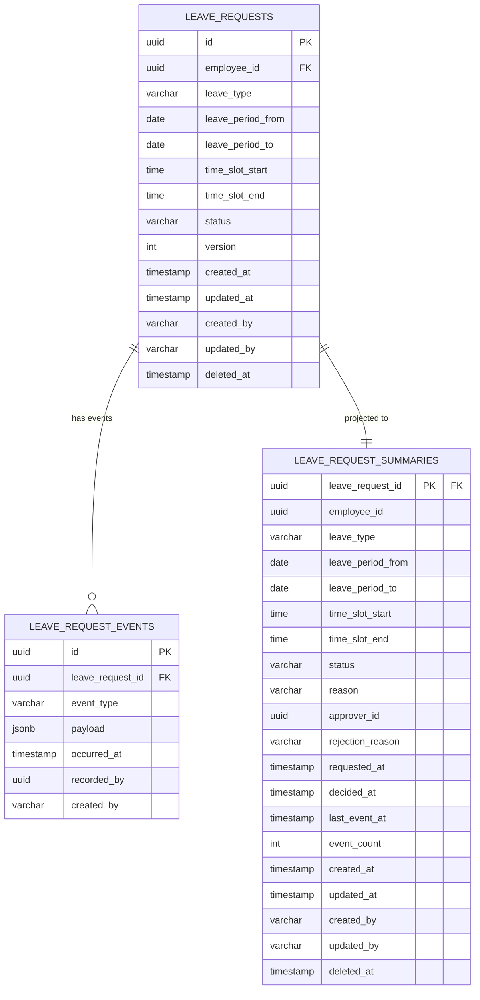

# 休暇申請 データベース設計

## 概要

従業員の休暇申請を管理し、
上長の承認ワークフローを制御する集約のデータベース設計。
有給残高チェック・Googleカレンダー同期と連動し、
休暇取得の適正管理を保証する。

**コンテキスト:** 申請承認
**構成:** イミュータブルデータモデル + Read Model（アプリケーション層同期）
**RDBMS:** PostgreSQL 16.x

---

## テーブル一覧

| # | テーブル名 | 種別 | 説明 |
|---|-----------|------|------|
| 1 | `leave_requests` | Write Model | 休暇申請（集約ルート・不変属性） |
| 2 | `leave_request_events` | Write Model | 休暇申請イベント（追記のみ） |
| 3 | `leave_request_summaries` | Read Model | 休暇申請サマリー（アプリ同期） |

---

## ER図



---

## Write Model

### leave_requests（休暇申請）

集約ルート。不変属性のみを保持する。
状態変更は `leave_request_events` への追記で表現する。

**テーブル名:** `leave_requests`

| カラム | 型 | NULL | デフォルト | 説明 |
|--------|-----|------|-----------|------|
| id | UUID | NO | gen_random_uuid() | 主キー |
| employee_id | UUID | NO | - | 申請者（従業員）ID |
| leave_type | VARCHAR(30) | NO | - | 休暇種別 |
| leave_period_from | DATE | NO | - | 休暇開始日 |
| leave_period_to | DATE | NO | - | 休暇終了日 |
| time_slot_start | TIME | YES | NULL | 時間休開始時刻（HOURLY時のみ） |
| time_slot_end | TIME | YES | NULL | 時間休終了時刻（HOURLY時のみ） |
| status | VARCHAR(20) | NO | 'SUBMITTED' | ステータス |
| version | INTEGER | NO | 1 | 楽観的ロック用 |
| created_at | TIMESTAMPTZ | NO | CURRENT_TIMESTAMP | 作成日時 |
| updated_at | TIMESTAMPTZ | NO | CURRENT_TIMESTAMP | 更新日時 |
| created_by | VARCHAR(255) | NO | - | 作成者 |
| updated_by | VARCHAR(255) | NO | - | 更新者 |
| deleted_at | TIMESTAMPTZ | YES | NULL | 論理削除日時 |

**制約:**

| 制約名 | 種類 | カラム | 説明 |
|--------|------|--------|------|
| pk_leave_requests | PRIMARY KEY | id | 主キー |
| chk_leave_requests_status | CHECK | status | IN ('SUBMITTED', 'APPROVED', 'REJECTED', 'CANCELLED') |
| chk_leave_requests_leave_type | CHECK | leave_type | IN ('ANNUAL', 'HALF_DAY_AM', 'HALF_DAY_PM', 'HOURLY', 'SPECIAL_CONDOLENCE', 'SPECIAL_REFRESH') |
| chk_leave_requests_period | CHECK | leave_period_from, leave_period_to | leave_period_from <= leave_period_to |

**インデックス:**

| インデックス名 | カラム | 用途 |
|---------------|--------|------|
| idx_lr_requests_employee_period | employee_id, leave_period_from DESC | 申請一覧クエリ |
| idx_lr_requests_status | status | ステータス絞り込み |
| idx_lr_requests_deleted_at | deleted_at | 論理削除フィルタ |

---

### leave_request_events（休暇申請イベント）

集約に対する全ての状態変更をイベントとして記録する。
追記のみ（INSERT only）。UPDATE・DELETE は行わない。

**テーブル名:** `leave_request_events`

| カラム | 型 | NULL | デフォルト | 説明 |
|--------|-----|------|-----------|------|
| id | UUID | NO | gen_random_uuid() | イベントID |
| leave_request_id | UUID | NO | - | 休暇申請ID |
| event_type | VARCHAR(50) | NO | - | イベント種別 |
| payload | JSONB | NO | '{}' | イベントデータ |
| occurred_at | TIMESTAMPTZ | NO | CURRENT_TIMESTAMP | 発生日時 |
| recorded_by | UUID | YES | - | 記録者ID |
| created_at | TIMESTAMPTZ | NO | CURRENT_TIMESTAMP | 作成日時 |
| created_by | VARCHAR(255) | NO | - | 作成者 |

**event_type の値:**

| event_type | 対応イベント | payload例 |
|------------|-------------|-----------|
| SUBMITTED | 休暇が申請された | `{"leaveType": "ANNUAL", "leavePeriodFrom": "2025-03-10", "leavePeriodTo": "2025-03-10", "reason": null}` |
| APPROVED | 休暇申請が承認された | `{"approverId": "MGR-001"}` |
| REJECTED | 休暇申請が却下された | `{"approverId": "MGR-001", "rejectionReason": "繁忙期のため日程の再検討をお願いします"}` |
| CANCELLED | 休暇申請が取り消された | `{"cancelledBy": "EMP-001"}` |

**制約:**

| 制約名 | 種類 | カラム | 説明 |
|--------|------|--------|------|
| pk_lr_request_events | PRIMARY KEY | id | 主キー |
| fk_lr_request_events_request | FOREIGN KEY | leave_request_id | leave_requests.id 参照 |
| chk_lr_request_events_type | CHECK | event_type | IN ('SUBMITTED', 'APPROVED', 'REJECTED', 'CANCELLED') |

**インデックス:**

| インデックス名 | カラム | 用途 |
|---------------|--------|------|
| idx_lr_request_events_lookup | leave_request_id, occurred_at DESC | 集約別イベント取得 |
| idx_lr_request_events_type | event_type | イベントタイプ検索 |
| idx_lr_request_events_occurred_at | occurred_at | 時系列クエリ |

---

## Read Model

### leave_request_summaries（休暇申請サマリー）

イベントから導出される休暇申請の現在状態を保持する。
`@TransactionalEventListener` によりアプリケーション層で同期更新する。
LeavePeriod・TimeSlot・LeaveReason・RejectionReason の値を非正規化して保持する。

**テーブル名:** `leave_request_summaries`

| カラム | 型 | NULL | デフォルト | 説明 |
|--------|-----|------|-----------|------|
| leave_request_id | UUID | NO | - | 休暇申請ID（主キー） |
| employee_id | UUID | NO | - | 申請者（従業員）ID |
| leave_type | VARCHAR(30) | NO | - | 休暇種別 |
| leave_period_from | DATE | NO | - | 休暇開始日 |
| leave_period_to | DATE | NO | - | 休暇終了日 |
| time_slot_start | TIME | YES | NULL | 時間休開始時刻（HOURLY時のみ） |
| time_slot_end | TIME | YES | NULL | 時間休終了時刻（HOURLY時のみ） |
| status | VARCHAR(20) | NO | 'SUBMITTED' | 現在のステータス |
| reason | VARCHAR(200) | YES | NULL | 休暇理由（特別休暇時のみ） |
| approver_id | UUID | YES | NULL | 承認者/却下者ID |
| rejection_reason | VARCHAR(500) | YES | NULL | 却下理由 |
| requested_at | TIMESTAMPTZ | NO | - | 申請日時 |
| decided_at | TIMESTAMPTZ | YES | NULL | 承認/却下日時 |
| last_event_at | TIMESTAMPTZ | YES | NULL | 最終イベント日時 |
| event_count | INTEGER | NO | 0 | イベント数 |
| created_at | TIMESTAMPTZ | NO | CURRENT_TIMESTAMP | 作成日時 |
| updated_at | TIMESTAMPTZ | NO | CURRENT_TIMESTAMP | 更新日時 |
| created_by | VARCHAR(255) | NO | - | 作成者 |
| updated_by | VARCHAR(255) | NO | - | 更新者 |
| deleted_at | TIMESTAMPTZ | YES | NULL | 論理削除日時 |

**制約:**

| 制約名 | 種類 | カラム | 説明 |
|--------|------|--------|------|
| pk_lr_request_summaries | PRIMARY KEY | leave_request_id | 主キー |
| fk_lr_request_summaries_request | FOREIGN KEY | leave_request_id | leave_requests.id 参照 |
| chk_lr_request_summaries_status | CHECK | status | IN ('SUBMITTED', 'APPROVED', 'REJECTED', 'CANCELLED') |
| chk_lr_request_summaries_leave_type | CHECK | leave_type | IN ('ANNUAL', 'HALF_DAY_AM', 'HALF_DAY_PM', 'HOURLY', 'SPECIAL_CONDOLENCE', 'SPECIAL_REFRESH') |

**インデックス:**

| インデックス名 | カラム | 用途 |
|---------------|--------|------|
| idx_lr_summaries_employee_period | employee_id, leave_period_from DESC | 休暇申請一覧クエリ |
| idx_lr_summaries_status | status | ステータス絞り込み |
| idx_lr_summaries_leave_type | leave_type | 休暇種別絞り込み |
| idx_lr_summaries_approver_status | approver_id, status | 承認待ち一覧クエリ（status='SUBMITTED'） |
| idx_lr_summaries_requested_at | requested_at | 申請日時ソート |
| idx_lr_summaries_deleted_at | deleted_at | 論理削除フィルタ |

**同期方式:** `@TransactionalEventListener`（アプリケーション層）

| イベント種別 | リードモデル処理 |
|-------------|------------------|
| SUBMITTED | INSERT: status='SUBMITTED', leave_type/leave_period_from/leave_period_to/time_slot_start/time_slot_end/reason/requested_at 設定 |
| APPROVED | UPDATE: status='APPROVED', approver_id/decided_at 設定 |
| REJECTED | UPDATE: status='REJECTED', approver_id/rejection_reason/decided_at 設定 |
| CANCELLED | UPDATE: status='CANCELLED', decided_at 設定 |

---

## 不変条件とDB制約の対応

| 不変条件 | 対応方法 |
|---------|---------|
| INV-LV-001: 承認者 ≠ 申請者（自己承認不可） | アプリケーション層で検証 |
| INV-LV-002: APPROVED/CANCELLED後は変更不可 | アプリケーション層で検証（version + status チェック） |
| INV-LV-003: 却下理由はREJECTED時必須 | アプリケーション層で検証 + イベント payload でバリデーション |
| INV-LV-004: 同一日に承認済み休暇がないこと | アプリケーション層で検証（期間重複チェッククエリ） |
| INV-LV-005: 有給残高が十分であること | アプリケーション層で検証（Saga連携・有給残高コンテキスト参照） |
| INV-LV-006: 特別休暇は理由必須 | アプリケーション層で検証（SPECIAL_* の場合 reason != null） |
| 休暇開始日 ≤ 終了日 | `chk_leave_requests_period` CHECK制約 |
| 休暇種別の列挙値 | `chk_leave_requests_leave_type` / `chk_lr_request_summaries_leave_type` CHECK制約 |

---

## クエリ要件とインデックスの対応

| クエリ要件 | 対応テーブル | 使用インデックス |
|-----------|------------|----------------|
| 休暇申請一覧（employeeId, leavePeriod BETWEEN, status, leaveType） | leave_request_summaries | idx_lr_summaries_employee_period, idx_lr_summaries_status, idx_lr_summaries_leave_type |
| 承認待ち休暇申請一覧（subordinateOf, leavePeriod BETWEEN, leaveType） | leave_request_summaries | idx_lr_summaries_approver_status, idx_lr_summaries_requested_at |
| 休暇申請詳細（id） | leave_request_summaries | pk_lr_request_summaries |

---

## マイグレーション

### V1: Write Model

```sql
-- V1__create_leave_requests.sql

-- === Write Model ===

CREATE TABLE leave_requests (
    id UUID PRIMARY KEY DEFAULT gen_random_uuid(),
    employee_id UUID NOT NULL,
    leave_type VARCHAR(30) NOT NULL,
    leave_period_from DATE NOT NULL,
    leave_period_to DATE NOT NULL,
    time_slot_start TIME,
    time_slot_end TIME,
    status VARCHAR(20) NOT NULL DEFAULT 'SUBMITTED',
    version INTEGER NOT NULL DEFAULT 1,
    created_at TIMESTAMPTZ NOT NULL DEFAULT CURRENT_TIMESTAMP,
    updated_at TIMESTAMPTZ NOT NULL DEFAULT CURRENT_TIMESTAMP,
    created_by VARCHAR(255) NOT NULL,
    updated_by VARCHAR(255) NOT NULL,
    deleted_at TIMESTAMPTZ,

    CONSTRAINT chk_leave_requests_status
        CHECK (status IN (
            'SUBMITTED', 'APPROVED',
            'REJECTED', 'CANCELLED'
        )),
    CONSTRAINT chk_leave_requests_leave_type
        CHECK (leave_type IN (
            'ANNUAL', 'HALF_DAY_AM',
            'HALF_DAY_PM', 'HOURLY',
            'SPECIAL_CONDOLENCE', 'SPECIAL_REFRESH'
        )),
    CONSTRAINT chk_leave_requests_period
        CHECK (leave_period_from <= leave_period_to)
);

CREATE INDEX idx_lr_requests_employee_period
    ON leave_requests (employee_id, leave_period_from DESC);
CREATE INDEX idx_lr_requests_status
    ON leave_requests (status);
CREATE INDEX idx_lr_requests_deleted_at
    ON leave_requests (deleted_at)
    WHERE deleted_at IS NOT NULL;

-- イベントテーブル
CREATE TABLE leave_request_events (
    id UUID PRIMARY KEY DEFAULT gen_random_uuid(),
    leave_request_id UUID NOT NULL
        REFERENCES leave_requests(id),
    event_type VARCHAR(50) NOT NULL,
    payload JSONB NOT NULL DEFAULT '{}',
    occurred_at TIMESTAMPTZ NOT NULL DEFAULT CURRENT_TIMESTAMP,
    recorded_by UUID,
    created_at TIMESTAMPTZ NOT NULL DEFAULT CURRENT_TIMESTAMP,
    created_by VARCHAR(255) NOT NULL,

    CONSTRAINT chk_lr_request_events_type
        CHECK (event_type IN (
            'SUBMITTED', 'APPROVED',
            'REJECTED', 'CANCELLED'
        ))
);

CREATE INDEX idx_lr_request_events_lookup
    ON leave_request_events (leave_request_id, occurred_at DESC);
CREATE INDEX idx_lr_request_events_type
    ON leave_request_events (event_type);
CREATE INDEX idx_lr_request_events_occurred_at
    ON leave_request_events (occurred_at);
```

### V2: Read Model

```sql
-- V2__create_leave_request_read_models.sql

-- === Read Model ===

-- 休暇申請サマリー
CREATE TABLE leave_request_summaries (
    leave_request_id UUID PRIMARY KEY
        REFERENCES leave_requests(id),
    employee_id UUID NOT NULL,
    leave_type VARCHAR(30) NOT NULL,
    leave_period_from DATE NOT NULL,
    leave_period_to DATE NOT NULL,
    time_slot_start TIME,
    time_slot_end TIME,
    status VARCHAR(20) NOT NULL DEFAULT 'SUBMITTED',
    reason VARCHAR(200),
    approver_id UUID,
    rejection_reason VARCHAR(500),
    requested_at TIMESTAMPTZ NOT NULL,
    decided_at TIMESTAMPTZ,
    last_event_at TIMESTAMPTZ,
    event_count INTEGER NOT NULL DEFAULT 0,
    created_at TIMESTAMPTZ NOT NULL DEFAULT CURRENT_TIMESTAMP,
    updated_at TIMESTAMPTZ NOT NULL DEFAULT CURRENT_TIMESTAMP,
    created_by VARCHAR(255) NOT NULL,
    updated_by VARCHAR(255) NOT NULL,
    deleted_at TIMESTAMPTZ,

    CONSTRAINT chk_lr_request_summaries_status
        CHECK (status IN (
            'SUBMITTED', 'APPROVED',
            'REJECTED', 'CANCELLED'
        )),
    CONSTRAINT chk_lr_request_summaries_leave_type
        CHECK (leave_type IN (
            'ANNUAL', 'HALF_DAY_AM',
            'HALF_DAY_PM', 'HOURLY',
            'SPECIAL_CONDOLENCE', 'SPECIAL_REFRESH'
        ))
);

CREATE INDEX idx_lr_summaries_employee_period
    ON leave_request_summaries (employee_id, leave_period_from DESC);
CREATE INDEX idx_lr_summaries_status
    ON leave_request_summaries (status);
CREATE INDEX idx_lr_summaries_leave_type
    ON leave_request_summaries (leave_type);
CREATE INDEX idx_lr_summaries_approver_status
    ON leave_request_summaries (approver_id, status)
    WHERE status = 'SUBMITTED';
CREATE INDEX idx_lr_summaries_requested_at
    ON leave_request_summaries (requested_at);
CREATE INDEX idx_lr_summaries_deleted_at
    ON leave_request_summaries (deleted_at)
    WHERE deleted_at IS NOT NULL;
```

### リードモデル同期方式

DBトリガーは使用しない。アプリケーション層で `@TransactionalEventListener` を使い同期更新する。

**方式:** Spring の `@TransactionalEventListener(phase = AFTER_COMMIT)` を使用し、
イベント保存と同一トランザクション完了後にリードモデルを更新する。

**実装クラス構成:**

| クラス | 責務 |
|--------|------|
| `LeaveRequestSummaryProjector` | leave_request_events → leave_request_summaries の同期 |

**リードモデル再構築:**
イベントテーブルから任意の時点で `leave_request_summaries` を再構築可能。
バッチ処理として `LeaveRequestSummaryRebuilder` を実装する。

---

## Saga連携

休暇申請の承認時に、以下の処理を Saga パターンで連携する。

| ステップ | 対象コンテキスト | 処理 | 補償トランザクション |
|---------|----------------|------|-------------------|
| 1 | 有給残高 | 有給残高消化（ANNUAL/HOURLY の場合） | 有給残高復元 |
| 2 | 勤怠記録 | 勤怠ステータスを「休暇」に更新 | 勤怠ステータス復元 |
| 3 | 外部連携 | Googleカレンダーに休暇予定を同期 | カレンダー予定削除 |

**トリガー:** APPROVED イベント発行時に Saga を開始
**失敗時:** 補償トランザクションで各ステップをロールバック

---

## 履歴管理方針

| 対象 | 方針 | 説明 |
|------|------|------|
| leave_request_events | イミュータブル（追記のみ） | 全操作をイベントとして記録。UPDATE/DELETE しない |
| leave_request_summaries | ミュータブル（上書き） | アプリ層（@TransactionalEventListener）で同期更新 |
| 操作ログ | leave_request_events で兼用 | 全操作がイミュータブルに記録される |
| 取り消し履歴 | イベント payload で保持 | CANCELLED イベントに取り消し者の情報を記録 |

---

## 値オブジェクトのマッピング

| 値オブジェクト | マッピング先 | 方式 |
|--------------|------------|------|
| LeavePeriod | leave_requests.leave_period_from / leave_period_to | DATE カラム2つに展開。CHECK制約で from ≤ to を保証 |
| TimeSlot | leave_requests.time_slot_start / time_slot_end | TIME カラム2つに展開。HOURLY時のみ使用（それ以外は NULL） |
| LeaveReason | leave_request_summaries.reason | VARCHAR(200) カラムに格納 |
| RejectionReason | leave_request_summaries.rejection_reason | VARCHAR(500) カラムに格納 |
| LeaveType | leave_requests.leave_type / summaries.leave_type | VARCHAR(30) + CHECK制約で列挙値を保証 |
| RequestStatus | leave_requests.status / summaries.status | VARCHAR(20) + CHECK制約で列挙値を保証 |

---

## 実装ノート

- **楽観的ロック:** `leave_requests.version` で排他制御。
  UPDATE 時に `WHERE version = :expected` で検証
- **論理削除:** `deleted_at` カラム（leave_requests, leave_request_summaries）。
  クエリ時は `WHERE deleted_at IS NULL` で絞り込み
- **イベント不変性:** `leave_request_events` は INSERT のみ。
  一度保存したイベントは変更・削除しない
- **リードモデル再構築:** イベントから任意の時点で
  `leave_request_summaries` を再構築可能
- **冪等性:** 同一イベントを複数回処理しても
  結果が同じになるようにイベントリスナーを実装
- **有給残高チェック:** 承認処理時に有給残高コンテキストの
  残日数/残時間を参照する。Saga パターンで連携
- **重複取得防止:** 承認時に同一期間内の承認済み休暇がないことを
  アプリケーション層で検証（期間重複チェッククエリ）
- **承認待ち一覧の最適化:** `idx_lr_summaries_approver_status` に
  部分インデックス（`WHERE status = 'SUBMITTED'`）を設定し、
  承認待ち一覧クエリのパフォーマンスを確保
- **DRAFT なし:** 休暇申請は申請=即提出。`status` のデフォルトは
  'SUBMITTED' であり、DRAFT 状態を経由しない
- **取り消しフロー:** 編集不可。取り消し（CANCELLED）→ 再申請の運用

---

## 品質チェック結果

- [x] 全集約属性にカラムが対応している
  - LeaveRequestId → id
  - EmployeeId → employee_id
  - LeaveType → leave_type
  - LeavePeriod → leave_period_from, leave_period_to
  - TimeSlot → time_slot_start, time_slot_end
  - LeaveReason → reason
  - RequestStatus → status
  - ApproverId → approver_id
  - RejectionReason → rejection_reason
  - requestedAt → requested_at
  - decidedAt → decided_at
  - version → version
- [x] 不変条件がDB制約またはアプリ層で表現されている
  - INV-LV-001: アプリケーション層
  - INV-LV-002: アプリケーション層（version + status）
  - INV-LV-003: アプリケーション層
  - INV-LV-004: アプリケーション層（期間重複チェック）
  - INV-LV-005: アプリケーション層（Saga連携）
  - INV-LV-006: アプリケーション層
  - 期間制約: CHECK制約（from ≤ to）
  - 列挙値制約: CHECK制約（leave_type, status）
- [x] インデックスがクエリ要件をカバーしている
  - 休暇申請一覧: idx_lr_summaries_employee_period
  - 承認待ち一覧: idx_lr_summaries_approver_status
  - 申請詳細: pk_lr_request_summaries
- [x] 値オブジェクトが適切にマッピングされている
  - LeavePeriod → DATE × 2 (from/to)
  - TimeSlot → TIME × 2 (start/end)
  - LeaveReason → VARCHAR(200)
  - RejectionReason → VARCHAR(500)
  - LeaveType → VARCHAR(30) + CHECK
  - RequestStatus → VARCHAR(20) + CHECK
- [x] イベントタイプがドメインイベントと対応している
  - 休暇が申請された → SUBMITTED
  - 休暇申請が承認された → APPROVED
  - 休暇申請が却下された → REJECTED
  - 休暇申請が取り消された → CANCELLED
