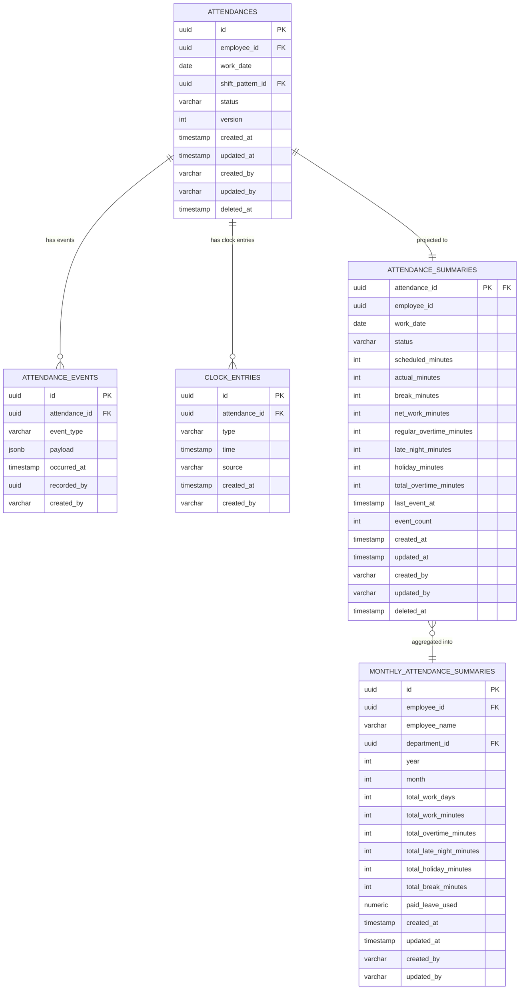

# 勤怠記録 データベース設計

## 概要

従業員の日次勤怠（出退勤・休憩・勤務時間）を
記録・集計する集約のデータベース設計。

**コンテキスト:** 勤怠管理
**構成:** イミュータブルデータモデル + Read Model（アプリケーション層同期）
**RDBMS:** PostgreSQL 16.x

---

## テーブル一覧

| # | テーブル名 | 種別 | 説明 |
|---|-----------|------|------|
| 1 | `attendances` | Write Model | 勤怠記録（集約ルート・不変属性） |
| 2 | `attendance_events` | Write Model | 勤怠イベント（追記のみ） |
| 3 | `clock_entries` | Write Model | 打刻ログ（1打刻=1行、追記のみ） |
| 4 | `attendance_summaries` | Read Model | 日次勤怠サマリー（アプリ同期） |
| 5 | `monthly_attendance_summaries` | Read Model | 月次勤怠サマリー |
| 6 | `department_attendance_stats` | Read Model | 部門別勤怠ダッシュボード（MV） |

---

## ER図



---

## Write Model

### attendances（勤怠記録）

集約ルート。不変属性のみを保持する。
状態変更は `attendance_events` への追記で表現する。

**テーブル名:** `attendances`

| カラム | 型 | NULL | デフォルト | 説明 |
|--------|-----|------|-----------|------|
| id | UUID | NO | gen_random_uuid() | 主キー |
| employee_id | UUID | NO | - | 従業員ID |
| work_date | DATE | NO | - | 勤務日 |
| shift_pattern_id | UUID | YES | - | シフトパターンID |
| status | VARCHAR(20) | NO | 'NOT_CLOCKED' | ステータス |
| version | INTEGER | NO | 1 | 楽観的ロック用 |
| created_at | TIMESTAMPTZ | NO | CURRENT_TIMESTAMP | 作成日時 |
| updated_at | TIMESTAMPTZ | NO | CURRENT_TIMESTAMP | 更新日時 |
| created_by | VARCHAR(255) | NO | - | 作成者 |
| updated_by | VARCHAR(255) | NO | - | 更新者 |
| deleted_at | TIMESTAMPTZ | YES | NULL | 論理削除日時 |

**制約:**

| 制約名 | 種類 | カラム | 説明 |
|--------|------|--------|------|
| pk_attendances | PRIMARY KEY | id | 主キー |
| uk_attendances_employee_date | UNIQUE | employee_id, work_date | 1勤務日1レコード（INV-ATT-004） |
| chk_attendances_status | CHECK | status | IN ('NOT_CLOCKED', 'CLOCKED_IN', 'CLOCKED_OUT', 'FINALIZED') |

**インデックス:**

| インデックス名 | カラム | 用途 |
|---------------|--------|------|
| idx_attendances_employee_date | employee_id, work_date DESC | 日次勤怠一覧クエリ |
| idx_attendances_status | status | ステータス絞り込み |
| idx_attendances_deleted_at | deleted_at | 論理削除フィルタ |

---

### attendance_events（勤怠イベント）

集約に対する全ての状態変更をイベントとして記録する。
追記のみ（INSERT only）。UPDATE・DELETE は行わない。

**テーブル名:** `attendance_events`

| カラム | 型 | NULL | デフォルト | 説明 |
|--------|-----|------|-----------|------|
| id | UUID | NO | gen_random_uuid() | イベントID |
| attendance_id | UUID | NO | - | 勤怠記録ID |
| event_type | VARCHAR(50) | NO | - | イベント種別 |
| payload | JSONB | NO | '{}' | イベントデータ |
| occurred_at | TIMESTAMPTZ | NO | CURRENT_TIMESTAMP | 発生日時 |
| recorded_by | UUID | YES | - | 記録者ID |
| created_at | TIMESTAMPTZ | NO | CURRENT_TIMESTAMP | 作成日時 |
| created_by | VARCHAR(255) | NO | - | 作成者 |

**event_type の値:**

| event_type | 対応イベント | payload例 |
|------------|-------------|-----------|
| CLOCKED_IN | 出勤が打刻された | `{"clockTime": "...", "source": "WEB"}` |
| CLOCKED_OUT | 退勤が打刻された | `{"clockTime": "...", "source": "MOBILE"}` |
| BREAK_STARTED | 休憩が開始された | `{"clockTime": "..."}` |
| BREAK_ENDED | 休憩が終了された | `{"clockTime": "...", "breakMinutes": 60}` |
| DURATION_CALCULATED | 勤務時間が計算された | `{"workDuration": {...}, "overtimeDuration": {...}}` |
| CLOCK_CORRECTED | 打刻が修正された | `{"targetType": "...", "beforeTime": "...", "afterTime": "...", "approvalId": "..."}` |
| MANUAL_REGISTERED | 勤務実績が登録された | `{"startTime": "...", "endTime": "...", "type": "...", "approvalId": "..."}` |
| FINALIZED | 勤怠記録が確定された | `{"monthlyClosingId": "..."}` |

**制約:**

| 制約名 | 種類 | カラム | 説明 |
|--------|------|--------|------|
| pk_attendance_events | PRIMARY KEY | id | 主キー |
| fk_attendance_events_attendance | FOREIGN KEY | attendance_id | attendances.id 参照 |
| chk_attendance_events_type | CHECK | event_type | IN ('CLOCKED_IN', 'CLOCKED_OUT', 'BREAK_STARTED', 'BREAK_ENDED', 'DURATION_CALCULATED', 'CLOCK_CORRECTED', 'MANUAL_REGISTERED', 'FINALIZED') |

**インデックス:**

| インデックス名 | カラム | 用途 |
|---------------|--------|------|
| idx_att_events_lookup | attendance_id, occurred_at DESC | 集約別イベント取得 |
| idx_att_events_type | event_type | イベントタイプ検索 |
| idx_att_events_occurred_at | occurred_at | 時系列クエリ |

---

### clock_entries（打刻ログ）

打刻ログ専用テーブル。1打刻=1行で記録する。
イミュータブル（追記のみ）。修正時は source=CORRECTION の
新しい行を追加し、元の打刻は保持する。

**テーブル名:** `clock_entries`

| カラム | 型 | NULL | デフォルト | 説明 |
|--------|-----|------|-----------|------|
| id | UUID | NO | gen_random_uuid() | 打刻エントリID |
| attendance_id | UUID | NO | - | 勤怠記録ID |
| type | VARCHAR(20) | NO | - | 打刻種別 |
| time | TIMESTAMPTZ | NO | - | 打刻時刻 |
| source | VARCHAR(20) | NO | - | 打刻元 |
| correction_id | UUID | YES | NULL | 修正元の打刻ID（修正時のみ） |
| created_at | TIMESTAMPTZ | NO | CURRENT_TIMESTAMP | 作成日時 |
| created_by | VARCHAR(255) | NO | - | 作成者 |

**type の値:** `CLOCK_IN`, `CLOCK_OUT`, `BREAK_START`, `BREAK_END`
**source の値:** `WEB`, `MOBILE`, `MANUAL`, `CORRECTION`

**制約:**

| 制約名 | 種類 | カラム | 説明 |
|--------|------|--------|------|
| pk_clock_entries | PRIMARY KEY | id | 主キー |
| fk_clock_entries_attendance | FOREIGN KEY | attendance_id | attendances.id 参照 |
| fk_clock_entries_correction | FOREIGN KEY | correction_id | clock_entries.id 参照（自己参照） |
| chk_clock_entries_type | CHECK | type | IN ('CLOCK_IN', 'CLOCK_OUT', 'BREAK_START', 'BREAK_END') |
| chk_clock_entries_source | CHECK | source | IN ('WEB', 'MOBILE', 'MANUAL', 'CORRECTION') |

**インデックス:**

| インデックス名 | カラム | 用途 |
|---------------|--------|------|
| idx_clock_entries_attendance | attendance_id, time ASC | 勤怠別打刻取得（時系列順） |
| idx_clock_entries_type | type | 打刻種別検索 |

---

## Read Model

### attendance_summaries（日次勤怠サマリー）

イベントから導出される日次の勤怠状態を保持する。
`@TransactionalEventListener` によりアプリケーション層で同期更新する。
WorkDuration・OvertimeDuration の値を非正規化して保持する。

**テーブル名:** `attendance_summaries`

| カラム | 型 | NULL | デフォルト | 説明 |
|--------|-----|------|-----------|------|
| attendance_id | UUID | NO | - | 勤怠記録ID（主キー） |
| employee_id | UUID | NO | - | 従業員ID |
| work_date | DATE | NO | - | 勤務日 |
| status | VARCHAR(20) | NO | 'NOT_CLOCKED' | 現在のステータス |
| clock_in_time | TIMESTAMPTZ | YES | NULL | 出勤時刻 |
| clock_out_time | TIMESTAMPTZ | YES | NULL | 退勤時刻 |
| scheduled_minutes | INTEGER | NO | 0 | 所定労働時間（分） |
| actual_minutes | INTEGER | NO | 0 | 実労働時間（分） |
| break_minutes | INTEGER | NO | 0 | 休憩時間（分） |
| net_work_minutes | INTEGER | NO | 0 | 正味労働時間（分） |
| regular_overtime_minutes | INTEGER | NO | 0 | 普通残業時間（分） |
| late_night_minutes | INTEGER | NO | 0 | 深夜勤務時間（分） |
| holiday_minutes | INTEGER | NO | 0 | 休日勤務時間（分） |
| total_overtime_minutes | INTEGER | NO | 0 | 残業合計時間（分） |
| last_event_at | TIMESTAMPTZ | YES | NULL | 最終イベント日時 |
| event_count | INTEGER | NO | 0 | イベント数 |
| created_at | TIMESTAMPTZ | NO | CURRENT_TIMESTAMP | 作成日時 |
| updated_at | TIMESTAMPTZ | NO | CURRENT_TIMESTAMP | 更新日時 |
| created_by | VARCHAR(255) | NO | - | 作成者 |
| updated_by | VARCHAR(255) | NO | - | 更新者 |
| deleted_at | TIMESTAMPTZ | YES | NULL | 論理削除日時 |

**制約:**

| 制約名 | 種類 | カラム | 説明 |
|--------|------|--------|------|
| pk_attendance_summaries | PRIMARY KEY | attendance_id | 主キー |
| fk_att_summaries_attendance | FOREIGN KEY | attendance_id | attendances.id 参照 |
| chk_att_summaries_clock | CHECK | clock_in_time, clock_out_time | clock_in_time < clock_out_time（INV-ATT-001） |
| chk_att_summaries_status | CHECK | status | IN ('NOT_CLOCKED', 'CLOCKED_IN', 'CLOCKED_OUT', 'FINALIZED') |

**CHECK制約 INV-ATT-001 の定義:**

```sql
CONSTRAINT chk_att_summaries_clock
  CHECK (clock_out_time IS NULL
    OR clock_in_time IS NULL
    OR clock_in_time < clock_out_time)
```

**インデックス:**

| インデックス名 | カラム | 用途 |
|---------------|--------|------|
| idx_att_summaries_employee_date | employee_id, work_date DESC | 日次勤怠一覧クエリ |
| idx_att_summaries_status | status | ステータス絞り込み |
| idx_att_summaries_overtime | total_overtime_minutes DESC | 残業時間ソート |
| idx_att_summaries_deleted_at | deleted_at | 論理削除フィルタ |

**同期方式:** `@TransactionalEventListener`（アプリケーション層）

| イベント種別 | リードモデル処理 |
|-------------|------------------|
| CLOCKED_IN | UPSERT: status='CLOCKED_IN', clock_in_time 設定 |
| CLOCKED_OUT | UPDATE: status='CLOCKED_OUT', clock_out_time 設定 |
| BREAK_STARTED | UPDATE: event_count++ |
| BREAK_ENDED | UPDATE: break_minutes 更新, event_count++ |
| DURATION_CALCULATED | UPDATE: WorkDuration/OvertimeDuration 全フィールド更新 |
| CLOCK_CORRECTED | UPDATE: 該当の clock_in/out_time 修正 |
| MANUAL_REGISTERED | UPSERT: clock_in/out_time, status 設定 |
| FINALIZED | UPDATE: status='FINALIZED' |

---

### monthly_attendance_summaries（月次勤怠サマリー）

月次の勤怠集計データ。クエリ要件「月次勤怠サマリー」に対応。
`attendance_summaries` の更新に連動してアプリケーション層で同期更新する。

**テーブル名:** `monthly_attendance_summaries`

| カラム | 型 | NULL | デフォルト | 説明 |
|--------|-----|------|-----------|------|
| id | UUID | NO | gen_random_uuid() | 主キー |
| employee_id | UUID | NO | - | 従業員ID |
| employee_name | VARCHAR(255) | NO | - | 従業員名（非正規化） |
| department_id | UUID | NO | - | 部門ID |
| year | SMALLINT | NO | - | 年 |
| month | SMALLINT | NO | - | 月（1-12） |
| total_work_days | INTEGER | NO | 0 | 出勤日数 |
| total_work_minutes | INTEGER | NO | 0 | 総勤務時間（分） |
| total_overtime_minutes | INTEGER | NO | 0 | 総残業時間（分） |
| total_late_night_minutes | INTEGER | NO | 0 | 総深夜勤務時間（分） |
| total_holiday_minutes | INTEGER | NO | 0 | 総休日勤務時間（分） |
| total_break_minutes | INTEGER | NO | 0 | 総休憩時間（分） |
| paid_leave_used | NUMERIC(5,1) | NO | 0 | 有給使用日数 |
| created_at | TIMESTAMPTZ | NO | CURRENT_TIMESTAMP | 作成日時 |
| updated_at | TIMESTAMPTZ | NO | CURRENT_TIMESTAMP | 更新日時 |
| created_by | VARCHAR(255) | NO | - | 作成者 |
| updated_by | VARCHAR(255) | NO | - | 更新者 |

**制約:**

| 制約名 | 種類 | カラム | 説明 |
|--------|------|--------|------|
| pk_monthly_att_summaries | PRIMARY KEY | id | 主キー |
| uk_monthly_att_summaries | UNIQUE | employee_id, year, month | 従業員×年月で一意 |
| chk_monthly_att_month | CHECK | month | BETWEEN 1 AND 12 |

**インデックス:**

| インデックス名 | カラム | 用途 |
|---------------|--------|------|
| idx_monthly_att_dept_month | department_id, year, month | 部門×月の絞り込み |
| idx_monthly_att_employee | employee_name | 従業員名ソート |
| idx_monthly_att_overtime | total_overtime_minutes DESC | 残業時間ソート |

---

### department_attendance_stats（部門別勤怠ダッシュボード）

クエリ要件「部門別勤怠ダッシュボード」に対応する
マテリアライズドビュー。

**マテリアライズドビュー名:** `department_attendance_stats`

| カラム | 型 | NULL | 説明 |
|--------|-----|------|------|
| department_id | UUID | NO | 部門ID |
| department_name | VARCHAR(255) | NO | 部門名（非正規化） |
| year | SMALLINT | NO | 年 |
| month | SMALLINT | NO | 月 |
| total_employees | INTEGER | NO | 対象従業員数 |
| avg_work_minutes | NUMERIC(10,2) | NO | 平均勤務時間（分） |
| avg_overtime_minutes | NUMERIC(10,2) | NO | 平均残業時間（分） |
| max_overtime_minutes | INTEGER | NO | 最大残業時間（分） |
| total_overtime_minutes | INTEGER | NO | 部門合計残業時間（分） |
| avg_late_night_minutes | NUMERIC(10,2) | NO | 平均深夜勤務時間（分） |
| overtime_alert_count | INTEGER | NO | 36協定超過アラート件数 |
| missing_clock_count | INTEGER | NO | 未打刻件数 |
| attendance_rate | NUMERIC(5,2) | YES | 出勤率（%） |

**定義:**

```sql
CREATE MATERIALIZED VIEW department_attendance_stats AS
WITH dept_monthly AS (
    SELECT
        m.department_id,
        d.name AS department_name,
        m.year,
        m.month,
        COUNT(DISTINCT m.employee_id) AS total_employees,
        AVG(m.total_work_minutes)::NUMERIC(10,2) AS avg_work_minutes,
        AVG(m.total_overtime_minutes)::NUMERIC(10,2) AS avg_overtime_minutes,
        MAX(m.total_overtime_minutes) AS max_overtime_minutes,
        SUM(m.total_overtime_minutes) AS total_overtime_minutes,
        AVG(m.total_late_night_minutes)::NUMERIC(10,2) AS avg_late_night_minutes,
        COUNT(CASE WHEN m.total_overtime_minutes > 2700 THEN 1 END) AS overtime_alert_count
    FROM monthly_attendance_summaries m
        JOIN departments d ON d.id = m.department_id
    GROUP BY m.department_id, d.name, m.year, m.month
),
dept_daily_stats AS (
    SELECT
        m.department_id,
        m.year,
        m.month,
        COUNT(CASE WHEN s.status = 'NOT_CLOCKED'
                    AND s.work_date < CURRENT_DATE
              THEN 1 END) AS missing_clock_count,
        COUNT(CASE WHEN s.status IN ('CLOCKED_IN', 'CLOCKED_OUT', 'FINALIZED')
              THEN 1 END) * 100.0
            / NULLIF(COUNT(*), 0) AS attendance_rate
    FROM monthly_attendance_summaries m
        JOIN attendance_summaries s
          ON s.employee_id = m.employee_id
         AND EXTRACT(YEAR FROM s.work_date) = m.year
         AND EXTRACT(MONTH FROM s.work_date) = m.month
    GROUP BY m.department_id, m.year, m.month
)
SELECT
    dm.department_id,
    dm.department_name,
    dm.year,
    dm.month,
    dm.total_employees,
    dm.avg_work_minutes,
    dm.avg_overtime_minutes,
    dm.max_overtime_minutes,
    dm.total_overtime_minutes,
    dm.avg_late_night_minutes,
    dm.overtime_alert_count::INTEGER,
    COALESCE(ds.missing_clock_count, 0)::INTEGER AS missing_clock_count,
    ds.attendance_rate::NUMERIC(5,2) AS attendance_rate
FROM dept_monthly dm
    LEFT JOIN dept_daily_stats ds
      ON ds.department_id = dm.department_id
     AND ds.year = dm.year
     AND ds.month = dm.month
WITH NO DATA;
```

**インデックス:**

| インデックス名 | カラム | 用途 |
|---------------|--------|------|
| idx_dept_att_stats_dept | department_id, year, month | 部門×月検索 |
| idx_dept_att_stats_overtime | avg_overtime_minutes DESC | 残業時間ソート |

**リフレッシュ:**

```sql
REFRESH MATERIALIZED VIEW CONCURRENTLY
  department_attendance_stats;
```

> 月次サマリー更新後、またはバッチ処理で定期実行する。

---

## 不変条件とDB制約の対応

| 不変条件 | 対応方法 |
|---------|---------|
| INV-ATT-001: 出勤時刻 < 退勤時刻 | `chk_att_summaries_clock` CHECK制約 |
| INV-ATT-002: 休憩は出勤-退勤の間 | アプリケーション層で検証 |
| INV-ATT-003: FINALIZED後は変更不可 | アプリケーション層で検証（version + status チェック） |
| INV-ATT-004: 1勤務日1レコード | `uk_attendances_employee_date` UNIQUE制約 |
| INV-ATT-005: 休憩は開始→終了の対 | アプリケーション層で検証 |

---

## クエリ要件とインデックスの対応

| クエリ要件 | 対応テーブル | 使用インデックス |
|-----------|------------|----------------|
| 日次勤怠一覧（employeeId, workDate BETWEEN, status） | attendance_summaries | idx_att_summaries_employee_date, idx_att_summaries_status |
| 月次勤怠サマリー（departmentId, month） | monthly_attendance_summaries | idx_monthly_att_dept_month, idx_monthly_att_employee |
| 部門別勤怠ダッシュボード（departmentId, month） | department_attendance_stats | idx_dept_att_stats_dept, idx_dept_att_stats_overtime |

---

## マイグレーション

### V1: Write Model

```sql
-- V1__create_attendances.sql

-- === Write Model ===

CREATE TABLE attendances (
    id UUID PRIMARY KEY DEFAULT gen_random_uuid(),
    employee_id UUID NOT NULL,
    work_date DATE NOT NULL,
    shift_pattern_id UUID,
    status VARCHAR(20) NOT NULL DEFAULT 'NOT_CLOCKED',
    version INTEGER NOT NULL DEFAULT 1,
    created_at TIMESTAMPTZ NOT NULL DEFAULT CURRENT_TIMESTAMP,
    updated_at TIMESTAMPTZ NOT NULL DEFAULT CURRENT_TIMESTAMP,
    created_by VARCHAR(255) NOT NULL,
    updated_by VARCHAR(255) NOT NULL,
    deleted_at TIMESTAMPTZ,

    CONSTRAINT uk_attendances_employee_date
        UNIQUE (employee_id, work_date),
    CONSTRAINT chk_attendances_status
        CHECK (status IN (
            'NOT_CLOCKED', 'CLOCKED_IN',
            'CLOCKED_OUT', 'FINALIZED'
        ))
);

CREATE INDEX idx_attendances_employee_date
    ON attendances (employee_id, work_date DESC);
CREATE INDEX idx_attendances_status
    ON attendances (status);
CREATE INDEX idx_attendances_deleted_at
    ON attendances (deleted_at)
    WHERE deleted_at IS NOT NULL;

-- イベントテーブル
CREATE TABLE attendance_events (
    id UUID PRIMARY KEY DEFAULT gen_random_uuid(),
    attendance_id UUID NOT NULL
        REFERENCES attendances(id),
    event_type VARCHAR(50) NOT NULL,
    payload JSONB NOT NULL DEFAULT '{}',
    occurred_at TIMESTAMPTZ NOT NULL DEFAULT CURRENT_TIMESTAMP,
    recorded_by UUID,
    created_at TIMESTAMPTZ NOT NULL DEFAULT CURRENT_TIMESTAMP,
    created_by VARCHAR(255) NOT NULL,

    CONSTRAINT chk_attendance_events_type
        CHECK (event_type IN (
            'CLOCKED_IN', 'CLOCKED_OUT',
            'BREAK_STARTED', 'BREAK_ENDED',
            'DURATION_CALCULATED', 'CLOCK_CORRECTED',
            'MANUAL_REGISTERED', 'FINALIZED'
        ))
);

CREATE INDEX idx_att_events_lookup
    ON attendance_events (attendance_id, occurred_at DESC);
CREATE INDEX idx_att_events_type
    ON attendance_events (event_type);
CREATE INDEX idx_att_events_occurred_at
    ON attendance_events (occurred_at);

-- 打刻ログテーブル
CREATE TABLE clock_entries (
    id UUID PRIMARY KEY DEFAULT gen_random_uuid(),
    attendance_id UUID NOT NULL
        REFERENCES attendances(id),
    type VARCHAR(20) NOT NULL,
    time TIMESTAMPTZ NOT NULL,
    source VARCHAR(20) NOT NULL,
    correction_id UUID
        REFERENCES clock_entries(id),
    created_at TIMESTAMPTZ NOT NULL DEFAULT CURRENT_TIMESTAMP,
    created_by VARCHAR(255) NOT NULL,

    CONSTRAINT chk_clock_entries_type
        CHECK (type IN (
            'CLOCK_IN', 'CLOCK_OUT',
            'BREAK_START', 'BREAK_END'
        )),
    CONSTRAINT chk_clock_entries_source
        CHECK (source IN (
            'WEB', 'MOBILE', 'MANUAL', 'CORRECTION'
        ))
);

CREATE INDEX idx_clock_entries_attendance
    ON clock_entries (attendance_id, time ASC);
CREATE INDEX idx_clock_entries_type
    ON clock_entries (type);
```

### V2: Read Model

```sql
-- V2__create_attendance_read_models.sql

-- === Read Model ===

-- 日次勤怠サマリー
CREATE TABLE attendance_summaries (
    attendance_id UUID PRIMARY KEY
        REFERENCES attendances(id),
    employee_id UUID NOT NULL,
    work_date DATE NOT NULL,
    status VARCHAR(20) NOT NULL DEFAULT 'NOT_CLOCKED',
    clock_in_time TIMESTAMPTZ,
    clock_out_time TIMESTAMPTZ,
    scheduled_minutes INTEGER NOT NULL DEFAULT 0,
    actual_minutes INTEGER NOT NULL DEFAULT 0,
    break_minutes INTEGER NOT NULL DEFAULT 0,
    net_work_minutes INTEGER NOT NULL DEFAULT 0,
    regular_overtime_minutes INTEGER NOT NULL DEFAULT 0,
    late_night_minutes INTEGER NOT NULL DEFAULT 0,
    holiday_minutes INTEGER NOT NULL DEFAULT 0,
    total_overtime_minutes INTEGER NOT NULL DEFAULT 0,
    last_event_at TIMESTAMPTZ,
    event_count INTEGER NOT NULL DEFAULT 0,
    created_at TIMESTAMPTZ NOT NULL DEFAULT CURRENT_TIMESTAMP,
    updated_at TIMESTAMPTZ NOT NULL DEFAULT CURRENT_TIMESTAMP,
    created_by VARCHAR(255) NOT NULL,
    updated_by VARCHAR(255) NOT NULL,
    deleted_at TIMESTAMPTZ,

    CONSTRAINT chk_att_summaries_clock
        CHECK (clock_out_time IS NULL
            OR clock_in_time IS NULL
            OR clock_in_time < clock_out_time),
    CONSTRAINT chk_att_summaries_status
        CHECK (status IN (
            'NOT_CLOCKED', 'CLOCKED_IN',
            'CLOCKED_OUT', 'FINALIZED'
        ))
);

CREATE INDEX idx_att_summaries_employee_date
    ON attendance_summaries (employee_id, work_date DESC);
CREATE INDEX idx_att_summaries_status
    ON attendance_summaries (status);
CREATE INDEX idx_att_summaries_overtime
    ON attendance_summaries (total_overtime_minutes DESC);
CREATE INDEX idx_att_summaries_deleted_at
    ON attendance_summaries (deleted_at)
    WHERE deleted_at IS NOT NULL;

-- 月次勤怠サマリー
CREATE TABLE monthly_attendance_summaries (
    id UUID PRIMARY KEY DEFAULT gen_random_uuid(),
    employee_id UUID NOT NULL,
    employee_name VARCHAR(255) NOT NULL,
    department_id UUID NOT NULL,
    year SMALLINT NOT NULL,
    month SMALLINT NOT NULL,
    total_work_days INTEGER NOT NULL DEFAULT 0,
    total_work_minutes INTEGER NOT NULL DEFAULT 0,
    total_overtime_minutes INTEGER NOT NULL DEFAULT 0,
    total_late_night_minutes INTEGER NOT NULL DEFAULT 0,
    total_holiday_minutes INTEGER NOT NULL DEFAULT 0,
    total_break_minutes INTEGER NOT NULL DEFAULT 0,
    paid_leave_used NUMERIC(5,1) NOT NULL DEFAULT 0,
    created_at TIMESTAMPTZ NOT NULL DEFAULT CURRENT_TIMESTAMP,
    updated_at TIMESTAMPTZ NOT NULL DEFAULT CURRENT_TIMESTAMP,
    created_by VARCHAR(255) NOT NULL,
    updated_by VARCHAR(255) NOT NULL,

    CONSTRAINT uk_monthly_att_summaries
        UNIQUE (employee_id, year, month),
    CONSTRAINT chk_monthly_att_month
        CHECK (month BETWEEN 1 AND 12)
);

CREATE INDEX idx_monthly_att_dept_month
    ON monthly_attendance_summaries (department_id, year, month);
CREATE INDEX idx_monthly_att_employee
    ON monthly_attendance_summaries (employee_name);
CREATE INDEX idx_monthly_att_overtime
    ON monthly_attendance_summaries (total_overtime_minutes DESC);

-- 部門別勤怠ダッシュボード（マテリアライズドビュー）
CREATE MATERIALIZED VIEW department_attendance_stats AS
WITH dept_monthly AS (
    SELECT
        m.department_id,
        d.name AS department_name,
        m.year,
        m.month,
        COUNT(DISTINCT m.employee_id) AS total_employees,
        AVG(m.total_work_minutes)::NUMERIC(10,2) AS avg_work_minutes,
        AVG(m.total_overtime_minutes)::NUMERIC(10,2) AS avg_overtime_minutes,
        MAX(m.total_overtime_minutes) AS max_overtime_minutes,
        SUM(m.total_overtime_minutes) AS total_overtime_minutes,
        AVG(m.total_late_night_minutes)::NUMERIC(10,2) AS avg_late_night_minutes,
        COUNT(CASE WHEN m.total_overtime_minutes > 2700 THEN 1 END) AS overtime_alert_count
    FROM monthly_attendance_summaries m
        JOIN departments d ON d.id = m.department_id
    GROUP BY m.department_id, d.name, m.year, m.month
),
dept_daily_stats AS (
    SELECT
        m.department_id,
        m.year,
        m.month,
        COUNT(CASE WHEN s.status = 'NOT_CLOCKED'
                    AND s.work_date < CURRENT_DATE
              THEN 1 END) AS missing_clock_count,
        COUNT(CASE WHEN s.status IN ('CLOCKED_IN', 'CLOCKED_OUT', 'FINALIZED')
              THEN 1 END) * 100.0
            / NULLIF(COUNT(*), 0) AS attendance_rate
    FROM monthly_attendance_summaries m
        JOIN attendance_summaries s
          ON s.employee_id = m.employee_id
         AND EXTRACT(YEAR FROM s.work_date) = m.year
         AND EXTRACT(MONTH FROM s.work_date) = m.month
    GROUP BY m.department_id, m.year, m.month
)
SELECT
    dm.department_id,
    dm.department_name,
    dm.year,
    dm.month,
    dm.total_employees,
    dm.avg_work_minutes,
    dm.avg_overtime_minutes,
    dm.max_overtime_minutes,
    dm.total_overtime_minutes,
    dm.avg_late_night_minutes,
    dm.overtime_alert_count::INTEGER,
    COALESCE(ds.missing_clock_count, 0)::INTEGER AS missing_clock_count,
    ds.attendance_rate::NUMERIC(5,2) AS attendance_rate
FROM dept_monthly dm
    LEFT JOIN dept_daily_stats ds
      ON ds.department_id = dm.department_id
     AND ds.year = dm.year
     AND ds.month = dm.month
WITH NO DATA;

CREATE UNIQUE INDEX idx_dept_att_stats_pk
    ON department_attendance_stats (department_id, year, month);
CREATE INDEX idx_dept_att_stats_overtime
    ON department_attendance_stats (avg_overtime_minutes DESC);
```

### リードモデル同期方式

DBトリガーは使用しない。アプリケーション層で `@TransactionalEventListener` を使い同期更新する。

**方式:** Spring の `@TransactionalEventListener(phase = AFTER_COMMIT)` を使用し、
イベント保存と同一トランザクション完了後にリードモデルを更新する。

**実装クラス構成:**

| クラス | 責務 |
|--------|------|
| `AttendanceSummaryProjector` | attendance_events → attendance_summaries の同期 |
| `MonthlySummaryProjector` | attendance_summaries → monthly_attendance_summaries の同期 |

**利点:**
- テスト容易性: 通常の Spring Bean としてユニットテスト可能
- デバッグ容易性: アプリログで同期処理を追跡可能
- デプロイ容易性: Flyway マイグレーションにトリガー管理が不要
- ORM互換性: JPA キャッシュとの矛盾が発生しない

**リードモデル再構築:**
イベントテーブルから任意の時点で `attendance_summaries` を再構築可能。
バッチ処理として `AttendanceSummaryRebuilder` を実装する。

---

## 履歴管理方針

| 対象 | 方針 | 説明 |
|------|------|------|
| clock_entries | イミュータブル（追記のみ） | 修正時は source=CORRECTION の新行追加。元の打刻は保持 |
| attendance_events | イミュータブル（追記のみ） | 全操作をイベントとして記録。UPDATE/DELETE しない |
| attendance_summaries | ミュータブル（上書き） | アプリ層（@TransactionalEventListener）で同期更新。WorkDuration/OvertimeDuration を上書き |
| 操作ログ | attendance_events で兼用 | 全操作がイミュータブルに記録される |

---

## 値オブジェクトのマッピング

| 値オブジェクト | マッピング先 | 方式 |
|--------------|------------|------|
| ClockEntry | clock_entries テーブル | 1行=1打刻。専用テーブルに展開 |
| WorkDuration | attendance_summaries の4カラム | scheduled/actual/break/net_work_minutes に非正規化 |
| OvertimeDuration | attendance_summaries の4カラム | regular/late_night/holiday/total_overtime_minutes に非正規化 |
| ClockCorrection | attendance_events.payload（JSONB） | CLOCK_CORRECTED イベントの payload に格納 |
| ManualAttendance | attendance_events.payload（JSONB） | MANUAL_REGISTERED イベントの payload に格納 |

---

## 実装ノート

- **楽観的ロック:** `attendances.version` で排他制御。
  UPDATE 時に `WHERE version = :expected` で検証
- **論理削除:** `deleted_at` カラム（attendances, attendance_summaries）。
  UNIQUE制約は deleted_at IS NULL の部分インデックスで対応が必要な場合は別途検討
- **イベント不変性:** `attendance_events` は INSERT のみ。
  一度保存したイベントは変更・削除しない
- **リードモデル再構築:** イベントから任意の時点で
  `attendance_summaries` を再構築可能
- **冪等性:** 同一イベントを複数回処理しても
  結果が同じになるようにイベントリスナーを実装
- **マテリアライズドビューのリフレッシュ:**
  `REFRESH MATERIALIZED VIEW CONCURRENTLY` で
  無停止更新。UNIQUE INDEX が必要（定義済み）

---

## 品質チェック結果

- [x] 全集約属性にカラムが対応している
- [x] 不変条件がDB制約として表現されている
  - INV-ATT-001: CHECK制約
  - INV-ATT-004: UNIQUE制約
  - INV-ATT-002/003/005: アプリケーション層
- [x] インデックスがクエリ要件をカバーしている
  - 日次勤怠一覧: idx_att_summaries_employee_date
  - 月次勤怠サマリー: idx_monthly_att_dept_month
  - 部門別ダッシュボード: idx_dept_att_stats_dept
- [x] 値オブジェクトが適切にマッピングされている
  - ClockEntry → clock_entries テーブル
  - WorkDuration/OvertimeDuration → attendance_summaries カラム
  - ClockCorrection/ManualAttendance → JSONB payload
