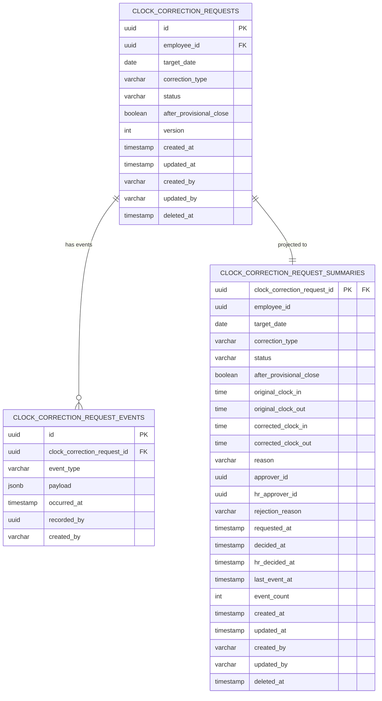

# 打刻修正申請 データベース設計

## 概要

従業員の打刻修正申請を管理し、
上長承認＋条件付き人事承認の2段階ワークフローを制御する集約のデータベース設計。
仮締め後の修正は人事承認エスカレーションが発動し、
承認後に勤怠記録の打刻データが修正される。

**コンテキスト:** 申請承認
**構成:** イミュータブルデータモデル + Read Model（アプリケーション層同期）
**RDBMS:** PostgreSQL 16.x

---

## テーブル一覧

| # | テーブル名 | 種別 | 説明 |
|---|-----------|------|------|
| 1 | `clock_correction_requests` | Write Model | 打刻修正申請（集約ルート・不変属性） |
| 2 | `clock_correction_request_events` | Write Model | 打刻修正申請イベント（追記のみ） |
| 3 | `clock_correction_request_summaries` | Read Model | 打刻修正申請サマリー（アプリ同期） |

---

## ER図



---

## Write Model

### clock_correction_requests（打刻修正申請）

集約ルート。不変属性のみを保持する。
状態変更は `clock_correction_request_events` への追記で表現する。

**テーブル名:** `clock_correction_requests`

| カラム | 型 | NULL | デフォルト | 説明 |
|--------|-----|------|-----------|------|
| id | UUID | NO | gen_random_uuid() | 主キー |
| employee_id | UUID | NO | - | 申請者（従業員）ID |
| target_date | DATE | NO | - | 修正対象日 |
| correction_type | VARCHAR(20) | NO | - | 修正種別（CLOCK_IN/CLOCK_OUT/BOTH） |
| status | VARCHAR(20) | NO | 'SUBMITTED' | ステータス |
| after_provisional_close | BOOLEAN | NO | false | 仮締め後フラグ |
| version | INTEGER | NO | 1 | 楽観的ロック用 |
| created_at | TIMESTAMPTZ | NO | CURRENT_TIMESTAMP | 作成日時 |
| updated_at | TIMESTAMPTZ | NO | CURRENT_TIMESTAMP | 更新日時 |
| created_by | VARCHAR(255) | NO | - | 作成者 |
| updated_by | VARCHAR(255) | NO | - | 更新者 |
| deleted_at | TIMESTAMPTZ | YES | NULL | 論理削除日時 |

**制約:**

| 制約名 | 種類 | カラム | 説明 |
|--------|------|--------|------|
| pk_clock_correction_requests | PRIMARY KEY | id | 主キー |
| uk_ccr_employee_date_type | UNIQUE | employee_id, target_date, correction_type, deleted_at | 同一日同一種別に1申請（論理削除考慮） |
| chk_ccr_status | CHECK | status | IN ('SUBMITTED', 'MGR_APPROVED', 'PENDING_HR', 'COMPLETED', 'REJECTED') |
| chk_ccr_correction_type | CHECK | correction_type | IN ('CLOCK_IN', 'CLOCK_OUT', 'BOTH') |

**インデックス:**

| インデックス名 | カラム | 用途 |
|---------------|--------|------|
| idx_ccr_employee_date | employee_id, target_date DESC | 申請一覧クエリ |
| idx_ccr_status | status | ステータス絞り込み |
| idx_ccr_deleted_at | deleted_at | 論理削除フィルタ |

---

### clock_correction_request_events（打刻修正申請イベント）

集約に対する全ての状態変更をイベントとして記録する。
追記のみ（INSERT only）。UPDATE・DELETE は行わない。

**テーブル名:** `clock_correction_request_events`

| カラム | 型 | NULL | デフォルト | 説明 |
|--------|-----|------|-----------|------|
| id | UUID | NO | gen_random_uuid() | イベントID |
| clock_correction_request_id | UUID | NO | - | 打刻修正申請ID |
| event_type | VARCHAR(50) | NO | - | イベント種別 |
| payload | JSONB | NO | '{}' | イベントデータ |
| occurred_at | TIMESTAMPTZ | NO | CURRENT_TIMESTAMP | 発生日時 |
| recorded_by | UUID | YES | - | 記録者ID |
| created_at | TIMESTAMPTZ | NO | CURRENT_TIMESTAMP | 作成日時 |
| created_by | VARCHAR(255) | NO | - | 作成者 |

**event_type の値:**

| event_type | 対応イベント | payload例 |
|------------|-------------|-----------|
| SUBMITTED | 打刻修正が申請された | `{"originalClockIn": "09:00", "originalClockOut": "17:00", "correctedClockIn": null, "correctedClockOut": "18:30", "reason": "退勤打刻を忘れたため..."}` |
| MGR_APPROVED | 打刻修正が承認された | `{"approverId": "MGR-001"}` |
| REJECTED | 打刻修正が却下された | `{"approverId": "MGR-001", "rejectionReason": "勤怠記録を確認したところ..."}` |
| RESUBMITTED | 打刻修正が再申請された | `{"correctedClockIn": null, "correctedClockOut": "18:00", "reason": "セキュリティカメラの記録を確認し..."}` |
| HR_APPROVED | 打刻修正が人事承認された | `{"hrApproverId": "HR-001"}` |

**制約:**

| 制約名 | 種類 | カラム | 説明 |
|--------|------|--------|------|
| pk_ccr_events | PRIMARY KEY | id | 主キー |
| fk_ccr_events_request | FOREIGN KEY | clock_correction_request_id | clock_correction_requests.id 参照 |
| chk_ccr_events_type | CHECK | event_type | IN ('SUBMITTED', 'MGR_APPROVED', 'REJECTED', 'RESUBMITTED', 'HR_APPROVED') |

**インデックス:**

| インデックス名 | カラム | 用途 |
|---------------|--------|------|
| idx_ccr_events_lookup | clock_correction_request_id, occurred_at DESC | 集約別イベント取得 |
| idx_ccr_events_type | event_type | イベントタイプ検索 |
| idx_ccr_events_occurred_at | occurred_at | 時系列クエリ |

---

## Read Model

### clock_correction_request_summaries（打刻修正申請サマリー）

イベントから導出される打刻修正申請の現在状態を保持する。
`@TransactionalEventListener` によりアプリケーション層で同期更新する。
ClockTime・CorrectionReason・RejectionReason の値を非正規化して保持する。

**テーブル名:** `clock_correction_request_summaries`

| カラム | 型 | NULL | デフォルト | 説明 |
|--------|-----|------|-----------|------|
| clock_correction_request_id | UUID | NO | - | 打刻修正申請ID（主キー） |
| employee_id | UUID | NO | - | 申請者（従業員）ID |
| target_date | DATE | NO | - | 修正対象日 |
| correction_type | VARCHAR(20) | NO | - | 修正種別 |
| status | VARCHAR(20) | NO | 'SUBMITTED' | 現在のステータス |
| after_provisional_close | BOOLEAN | NO | false | 仮締め後フラグ |
| original_clock_in | TIME | YES | NULL | 修正前出勤時刻 |
| original_clock_out | TIME | YES | NULL | 修正前退勤時刻 |
| corrected_clock_in | TIME | YES | NULL | 修正後出勤時刻 |
| corrected_clock_out | TIME | YES | NULL | 修正後退勤時刻 |
| reason | VARCHAR(200) | YES | NULL | 修正理由 |
| approver_id | UUID | YES | NULL | 上長承認者/却下者ID |
| hr_approver_id | UUID | YES | NULL | 人事承認者ID |
| rejection_reason | VARCHAR(200) | YES | NULL | 却下理由 |
| requested_at | TIMESTAMPTZ | YES | NULL | 申請日時 |
| decided_at | TIMESTAMPTZ | YES | NULL | 上長承認/却下日時 |
| hr_decided_at | TIMESTAMPTZ | YES | NULL | 人事承認日時 |
| last_event_at | TIMESTAMPTZ | YES | NULL | 最終イベント日時 |
| event_count | INTEGER | NO | 0 | イベント数 |
| created_at | TIMESTAMPTZ | NO | CURRENT_TIMESTAMP | 作成日時 |
| updated_at | TIMESTAMPTZ | NO | CURRENT_TIMESTAMP | 更新日時 |
| created_by | VARCHAR(255) | NO | - | 作成者 |
| updated_by | VARCHAR(255) | NO | - | 更新者 |
| deleted_at | TIMESTAMPTZ | YES | NULL | 論理削除日時 |

**制約:**

| 制約名 | 種類 | カラム | 説明 |
|--------|------|--------|------|
| pk_ccr_summaries | PRIMARY KEY | clock_correction_request_id | 主キー |
| fk_ccr_summaries_request | FOREIGN KEY | clock_correction_request_id | clock_correction_requests.id 参照 |
| chk_ccr_summaries_status | CHECK | status | IN ('SUBMITTED', 'MGR_APPROVED', 'PENDING_HR', 'COMPLETED', 'REJECTED') |
| chk_ccr_summaries_correction_type | CHECK | correction_type | IN ('CLOCK_IN', 'CLOCK_OUT', 'BOTH') |
| chk_ccr_summaries_reason | CHECK | reason | reason IS NULL OR (char_length(reason) BETWEEN 10 AND 200) |
| chk_ccr_summaries_rejection_reason | CHECK | rejection_reason | rejection_reason IS NULL OR (char_length(rejection_reason) BETWEEN 10 AND 200) |

**インデックス:**

| インデックス名 | カラム | 用途 |
|---------------|--------|------|
| idx_ccr_summaries_employee_date | employee_id, target_date DESC | 打刻修正申請一覧クエリ |
| idx_ccr_summaries_status | status | ステータス絞り込み |
| idx_ccr_summaries_approver_status | approver_id, status | 承認待ち一覧クエリ（status='SUBMITTED'） |
| idx_ccr_summaries_hr_status | status | 人事承認待ち一覧クエリ（status='PENDING_HR'） |
| idx_ccr_summaries_requested_at | requested_at | 申請日時ソート |
| idx_ccr_summaries_deleted_at | deleted_at | 論理削除フィルタ |

**同期方式:** `@TransactionalEventListener`（アプリケーション層）

| イベント種別 | リードモデル処理 |
|-------------|------------------|
| SUBMITTED | UPSERT: status='SUBMITTED', original_clock_in/original_clock_out/corrected_clock_in/corrected_clock_out/reason/requested_at/after_provisional_close 設定 |
| MGR_APPROVED | UPDATE: status='COMPLETED' or 'PENDING_HR'（after_provisional_close による分岐）, approver_id/decided_at 設定 |
| REJECTED | UPDATE: status='REJECTED', approver_id/rejection_reason/decided_at 設定 |
| RESUBMITTED | UPDATE: status='SUBMITTED', corrected_clock_in/corrected_clock_out/reason 更新, approver_id/rejection_reason/decided_at クリア |
| HR_APPROVED | UPDATE: status='COMPLETED', hr_approver_id/hr_decided_at 設定 |

---

## 不変条件とDB制約の対応

| 不変条件 | 対応方法 |
|---------|---------|
| INV-FX-001: 承認者 ≠ 申請者（自己承認不可） | アプリケーション層で検証 |
| INV-FX-002: COMPLETED後は変更不可 | アプリケーション層で検証（version + status チェック） |
| INV-FX-003: 却下理由はREJECTED時必須 | アプリケーション層で検証 + イベント payload でバリデーション |
| INV-FX-004: 修正後時刻 ≠ 修正前時刻 | アプリケーション層で検証 |
| INV-FX-005: 人事承認はPENDING_HR状態のみ | アプリケーション層で検証（status チェック） |
| INV-FX-006: 同一日同一種別の未確定申請がないこと | `uk_ccr_employee_date_type` UNIQUE制約 + アプリケーション層で未確定ステータスチェック |
| 修正理由は10-200文字 | `chk_ccr_summaries_reason` CHECK制約 |
| 却下理由は10-200文字 | `chk_ccr_summaries_rejection_reason` CHECK制約 |

---

## クエリ要件とインデックスの対応

| クエリ要件 | 対応テーブル | 使用インデックス |
|-----------|------------|----------------|
| 打刻修正申請一覧（employeeId, targetDate BETWEEN, status） | clock_correction_request_summaries | idx_ccr_summaries_employee_date, idx_ccr_summaries_status |
| 承認待ち打刻修正一覧（subordinateOf, targetDate BETWEEN） | clock_correction_request_summaries | idx_ccr_summaries_approver_status, idx_ccr_summaries_requested_at |
| 人事承認待ち一覧（status='PENDING_HR', targetDate BETWEEN） | clock_correction_request_summaries | idx_ccr_summaries_hr_status |
| 打刻修正申請詳細（id） | clock_correction_request_summaries | pk_ccr_summaries |

---

## マイグレーション

### V1: Write Model

```sql
-- V1__create_clock_correction_requests.sql

-- === Write Model ===

CREATE TABLE clock_correction_requests (
    id UUID PRIMARY KEY DEFAULT gen_random_uuid(),
    employee_id UUID NOT NULL,
    target_date DATE NOT NULL,
    correction_type VARCHAR(20) NOT NULL,
    status VARCHAR(20) NOT NULL DEFAULT 'SUBMITTED',
    after_provisional_close BOOLEAN NOT NULL DEFAULT false,
    version INTEGER NOT NULL DEFAULT 1,
    created_at TIMESTAMPTZ NOT NULL DEFAULT CURRENT_TIMESTAMP,
    updated_at TIMESTAMPTZ NOT NULL DEFAULT CURRENT_TIMESTAMP,
    created_by VARCHAR(255) NOT NULL,
    updated_by VARCHAR(255) NOT NULL,
    deleted_at TIMESTAMPTZ,

    CONSTRAINT uk_ccr_employee_date_type
        UNIQUE (employee_id, target_date, correction_type, deleted_at),
    CONSTRAINT chk_ccr_status
        CHECK (status IN (
            'SUBMITTED', 'MGR_APPROVED',
            'PENDING_HR', 'COMPLETED', 'REJECTED'
        )),
    CONSTRAINT chk_ccr_correction_type
        CHECK (correction_type IN (
            'CLOCK_IN', 'CLOCK_OUT', 'BOTH'
        ))
);

CREATE INDEX idx_ccr_employee_date
    ON clock_correction_requests (employee_id, target_date DESC);
CREATE INDEX idx_ccr_status
    ON clock_correction_requests (status);
CREATE INDEX idx_ccr_deleted_at
    ON clock_correction_requests (deleted_at)
    WHERE deleted_at IS NOT NULL;

-- イベントテーブル
CREATE TABLE clock_correction_request_events (
    id UUID PRIMARY KEY DEFAULT gen_random_uuid(),
    clock_correction_request_id UUID NOT NULL
        REFERENCES clock_correction_requests(id),
    event_type VARCHAR(50) NOT NULL,
    payload JSONB NOT NULL DEFAULT '{}',
    occurred_at TIMESTAMPTZ NOT NULL DEFAULT CURRENT_TIMESTAMP,
    recorded_by UUID,
    created_at TIMESTAMPTZ NOT NULL DEFAULT CURRENT_TIMESTAMP,
    created_by VARCHAR(255) NOT NULL,

    CONSTRAINT chk_ccr_events_type
        CHECK (event_type IN (
            'SUBMITTED', 'MGR_APPROVED',
            'REJECTED', 'RESUBMITTED', 'HR_APPROVED'
        ))
);

CREATE INDEX idx_ccr_events_lookup
    ON clock_correction_request_events (clock_correction_request_id, occurred_at DESC);
CREATE INDEX idx_ccr_events_type
    ON clock_correction_request_events (event_type);
CREATE INDEX idx_ccr_events_occurred_at
    ON clock_correction_request_events (occurred_at);
```

### V2: Read Model

```sql
-- V2__create_clock_correction_request_read_models.sql

-- === Read Model ===

-- 打刻修正申請サマリー
CREATE TABLE clock_correction_request_summaries (
    clock_correction_request_id UUID PRIMARY KEY
        REFERENCES clock_correction_requests(id),
    employee_id UUID NOT NULL,
    target_date DATE NOT NULL,
    correction_type VARCHAR(20) NOT NULL,
    status VARCHAR(20) NOT NULL DEFAULT 'SUBMITTED',
    after_provisional_close BOOLEAN NOT NULL DEFAULT false,
    original_clock_in TIME,
    original_clock_out TIME,
    corrected_clock_in TIME,
    corrected_clock_out TIME,
    reason VARCHAR(200),
    approver_id UUID,
    hr_approver_id UUID,
    rejection_reason VARCHAR(200),
    requested_at TIMESTAMPTZ,
    decided_at TIMESTAMPTZ,
    hr_decided_at TIMESTAMPTZ,
    last_event_at TIMESTAMPTZ,
    event_count INTEGER NOT NULL DEFAULT 0,
    created_at TIMESTAMPTZ NOT NULL DEFAULT CURRENT_TIMESTAMP,
    updated_at TIMESTAMPTZ NOT NULL DEFAULT CURRENT_TIMESTAMP,
    created_by VARCHAR(255) NOT NULL,
    updated_by VARCHAR(255) NOT NULL,
    deleted_at TIMESTAMPTZ,

    CONSTRAINT chk_ccr_summaries_status
        CHECK (status IN (
            'SUBMITTED', 'MGR_APPROVED',
            'PENDING_HR', 'COMPLETED', 'REJECTED'
        )),
    CONSTRAINT chk_ccr_summaries_correction_type
        CHECK (correction_type IN (
            'CLOCK_IN', 'CLOCK_OUT', 'BOTH'
        )),
    CONSTRAINT chk_ccr_summaries_reason
        CHECK (reason IS NULL
            OR char_length(reason) BETWEEN 10 AND 200),
    CONSTRAINT chk_ccr_summaries_rejection_reason
        CHECK (rejection_reason IS NULL
            OR char_length(rejection_reason) BETWEEN 10 AND 200)
);

CREATE INDEX idx_ccr_summaries_employee_date
    ON clock_correction_request_summaries (employee_id, target_date DESC);
CREATE INDEX idx_ccr_summaries_status
    ON clock_correction_request_summaries (status);
CREATE INDEX idx_ccr_summaries_approver_status
    ON clock_correction_request_summaries (approver_id, status)
    WHERE status = 'SUBMITTED';
CREATE INDEX idx_ccr_summaries_hr_status
    ON clock_correction_request_summaries (status)
    WHERE status = 'PENDING_HR';
CREATE INDEX idx_ccr_summaries_requested_at
    ON clock_correction_request_summaries (requested_at);
CREATE INDEX idx_ccr_summaries_deleted_at
    ON clock_correction_request_summaries (deleted_at)
    WHERE deleted_at IS NOT NULL;
```

### リードモデル同期方式

DBトリガーは使用しない。アプリケーション層で `@TransactionalEventListener` を使い同期更新する。

**方式:** Spring の `@TransactionalEventListener(phase = AFTER_COMMIT)` を使用し、
イベント保存と同一トランザクション完了後にリードモデルを更新する。

**実装クラス構成:**

| クラス | 責務 |
|--------|------|
| `ClockCorrectionRequestSummaryProjector` | clock_correction_request_events → clock_correction_request_summaries の同期 |

**リードモデル再構築:**
イベントテーブルから任意の時点で `clock_correction_request_summaries` を再構築可能。
バッチ処理として `ClockCorrectionRequestSummaryRebuilder` を実装する。

---

## 履歴管理方針

| 対象 | 方針 | 説明 |
|------|------|------|
| clock_correction_request_events | イミュータブル（追記のみ） | 全操作をイベントとして記録。UPDATE/DELETE しない |
| clock_correction_request_summaries | ミュータブル（上書き） | アプリ層（@TransactionalEventListener）で同期更新 |
| 操作ログ | clock_correction_request_events で兼用 | 全操作がイミュータブルに記録される |
| 再申請時の差分 | イベント payload で保持 | RESUBMITTED イベントに修正後の値を記録。修正前の値は直前の SUBMITTED/RESUBMITTED イベントから追跡可能 |

---

## 値オブジェクトのマッピング

| 値オブジェクト | マッピング先 | 方式 |
|--------------|------------|------|
| ClockTime（修正前出勤） | summaries.original_clock_in | TIME カラムに格納 |
| ClockTime（修正前退勤） | summaries.original_clock_out | TIME カラムに格納 |
| ClockTime（修正後出勤） | summaries.corrected_clock_in | TIME カラムに格納 |
| ClockTime（修正後退勤） | summaries.corrected_clock_out | TIME カラムに格納 |
| CorrectionReason | summaries.reason | VARCHAR(200) カラムに格納。CHECK制約で10-200文字を保証 |
| RejectionReason | summaries.rejection_reason | VARCHAR(200) カラムに格納。CHECK制約で10-200文字を保証 |
| CorrectionType | requests.correction_type / summaries.correction_type | VARCHAR(20) + CHECK制約で列挙値を保証 |
| CorrectionStatus | requests.status / summaries.status | VARCHAR(20) + CHECK制約で列挙値を保証 |

---

## 実装ノート

- **楽観的ロック:** `clock_correction_requests.version` で排他制御。
  UPDATE 時に `WHERE version = :expected` で検証
- **論理削除:** `deleted_at` カラム（clock_correction_requests, clock_correction_request_summaries）。
  UNIQUE制約は論理削除を考慮して設計
- **イベント不変性:** `clock_correction_request_events` は INSERT のみ。
  一度保存したイベントは変更・削除しない
- **リードモデル再構築:** イベントから任意の時点で
  `clock_correction_request_summaries` を再構築可能
- **冪等性:** 同一イベントを複数回処理しても
  結果が同じになるようにイベントリスナーを実装
- **2段階承認:** MGR_APPROVED イベント処理時に
  `after_provisional_close` フラグで COMPLETED/PENDING_HR を分岐。
  ドメインイベントハンドラで自動遷移を実装
- **仮締め後判定:** 申請時（SUBMITTED）に対象月の仮締め状態を
  月次締めコンテキストへコンテキスト間クエリで確認
- **Saga連携:** COMPLETED到達後、打刻修正承認Sagaが
  勤怠記録コンテキストの打刻データを修正。
  コンテキスト間コマンドとして実装
- **承認待ち一覧の最適化:** `idx_ccr_summaries_approver_status` に
  部分インデックス（`WHERE status = 'SUBMITTED'`）を設定し、
  承認待ち一覧クエリのパフォーマンスを確保
- **人事承認待ち一覧の最適化:** `idx_ccr_summaries_hr_status` に
  部分インデックス（`WHERE status = 'PENDING_HR'`）を設定し、
  人事承認待ち一覧クエリのパフォーマンスを確保

---

## 品質チェック結果

- [x] 全集約属性にカラムが対応している
  - ClockCorrectionRequestId → id
  - EmployeeId → employee_id
  - WorkDate → target_date
  - CorrectionType → correction_type
  - ClockTime（修正前出勤） → original_clock_in
  - ClockTime（修正前退勤） → original_clock_out
  - ClockTime（修正後出勤） → corrected_clock_in
  - ClockTime（修正後退勤） → corrected_clock_out
  - CorrectionReason → reason
  - CorrectionStatus → status
  - ApproverId → approver_id
  - ApproverId（人事） → hr_approver_id
  - RejectionReason → rejection_reason
  - afterProvisionalClose → after_provisional_close
  - requestedAt → requested_at
  - decidedAt → decided_at
  - hrDecidedAt → hr_decided_at
  - version → version
- [x] 不変条件がDB制約またはアプリ層で表現されている
  - INV-FX-001: アプリケーション層
  - INV-FX-002: アプリケーション層（version + status）
  - INV-FX-003: アプリケーション層
  - INV-FX-004: アプリケーション層
  - INV-FX-005: アプリケーション層（status チェック）
  - INV-FX-006: UNIQUE制約 + アプリケーション層
  - 文字数制約: CHECK制約
- [x] インデックスがクエリ要件をカバーしている
  - 打刻修正申請一覧: idx_ccr_summaries_employee_date
  - 承認待ち一覧: idx_ccr_summaries_approver_status
  - 人事承認待ち一覧: idx_ccr_summaries_hr_status
  - 申請詳細: pk_ccr_summaries
- [x] 値オブジェクトが適切にマッピングされている
  - ClockTime → TIME（出勤/退勤それぞれ独立カラム）
  - CorrectionReason → VARCHAR(200)
  - RejectionReason → VARCHAR(200)
  - CorrectionType → VARCHAR(20) + CHECK
  - CorrectionStatus → VARCHAR(20) + CHECK
- [x] イベントタイプがドメインイベントと対応している
  - 打刻修正が申請された → SUBMITTED
  - 打刻修正が承認された → MGR_APPROVED
  - 打刻修正が却下された → REJECTED
  - 打刻修正が再申請された → RESUBMITTED
  - 打刻修正が人事承認された → HR_APPROVED
