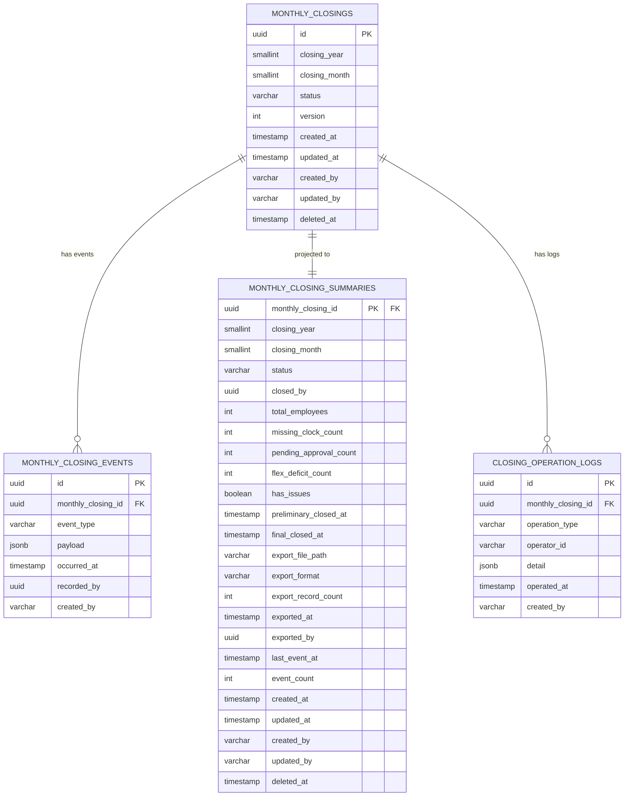

# 月次締め データベース設計

## 概要

月次の勤怠締め処理（仮締め・本締め）を管理し、
給与データのCSVエクスポートを制御する集約のデータベース設計。
仮締めは再実行可能、本締め後は不可逆。

**コンテキスト:** 月次処理
**構成:** イミュータブルデータモデル + Read Model（アプリケーション層同期）
**RDBMS:** PostgreSQL 16.x

---

## テーブル一覧

| # | テーブル名 | 種別 | 説明 |
|---|-----------|------|------|
| 1 | `monthly_closings` | Write Model | 月次締め（集約ルート・不変属性） |
| 2 | `monthly_closing_events` | Write Model | 月次締めイベント（追記のみ） |
| 3 | `monthly_closing_summaries` | Read Model | 月次締めサマリー（アプリ同期） |
| 4 | `closing_operation_logs` | 監査証跡 | 締め操作の監査ログ（削除不可） |

---

## ER図



---

## Write Model

### monthly_closings（月次締め）

集約ルート。不変属性のみを保持する。
状態変更は `monthly_closing_events` への追記で表現する。
ClosingMonth は closing_year / closing_month にフラット展開する。

**テーブル名:** `monthly_closings`

| カラム | 型 | NULL | デフォルト | 説明 |
|--------|-----|------|-----------|------|
| id | UUID | NO | gen_random_uuid() | 主キー |
| closing_year | SMALLINT | NO | - | 締め対象年 |
| closing_month | SMALLINT | NO | - | 締め対象月（1-12） |
| status | VARCHAR(30) | NO | 'NOT_STARTED' | ステータス |
| version | INTEGER | NO | 1 | 楽観的ロック用 |
| created_at | TIMESTAMPTZ | NO | CURRENT_TIMESTAMP | 作成日時 |
| updated_at | TIMESTAMPTZ | NO | CURRENT_TIMESTAMP | 更新日時 |
| created_by | VARCHAR(255) | NO | - | 作成者 |
| updated_by | VARCHAR(255) | NO | - | 更新者 |
| is_deleted | BOOLEAN | NO | FALSE | 論理削除フラグ |
| deleted_at | TIMESTAMPTZ | YES | NULL | 論理削除日時 |

**制約:**

| 制約名 | 種類 | カラム | 説明 |
|--------|------|--------|------|
| pk_monthly_closings | PRIMARY KEY | id | 主キー |
| uk_monthly_closings_year_month | UNIQUE | closing_year, closing_month | 年月で一意（INV-MC-003: 月次1回のみ） |
| chk_monthly_closings_status | CHECK | status | IN ('NOT_STARTED', 'PRELIMINARY_CLOSED', 'FINALIZED') |
| chk_monthly_closings_month | CHECK | closing_month | BETWEEN 1 AND 12 |
| chk_monthly_closings_year | CHECK | closing_year | BETWEEN 2000 AND 2100 |

**インデックス:**

| インデックス名 | カラム | 用途 |
|---------------|--------|------|
| idx_mc_year_month | closing_year DESC, closing_month DESC | 年月降順の一覧クエリ |
| idx_mc_status | status | ステータス絞り込み |
| idx_mc_deleted_at | deleted_at | 論理削除フィルタ |

---

### monthly_closing_events（月次締めイベント）

集約に対する全ての状態変更をイベントとして記録する。
追記のみ（INSERT only）。UPDATE・DELETE は行わない。
PreliminaryClosingResult はスナップショットとして payload に含める。
ExportResult もエクスポートイベントの payload に含める。

**テーブル名:** `monthly_closing_events`

| カラム | 型 | NULL | デフォルト | 説明 |
|--------|-----|------|-----------|------|
| id | UUID | NO | gen_random_uuid() | イベントID |
| monthly_closing_id | UUID | NO | - | 月次締めID |
| event_type | VARCHAR(50) | NO | - | イベント種別 |
| payload | JSONB | NO | '{}' | イベントデータ |
| occurred_at | TIMESTAMPTZ | NO | CURRENT_TIMESTAMP | 発生日時 |
| recorded_by | UUID | YES | - | 記録者ID |
| created_at | TIMESTAMPTZ | NO | CURRENT_TIMESTAMP | 作成日時 |
| created_by | VARCHAR(255) | NO | - | 作成者 |

**event_type の値:**

| event_type | 対応イベント | payload例 |
|------------|-------------|-----------|
| PRELIMINARY_CLOSED | 月次が仮締めされた | `{"closedBy": "HR-001", "totalEmployees": 150, "missingClockCount": 3, "pendingApprovalCount": 2, "flexDeficitCount": 1, "hasIssues": true}` |
| FINALIZED | 月次が本締めされた | `{"closedBy": "HR-001"}` |
| PAYROLL_EXPORTED | 給与データがエクスポートされた | `{"filePath": "s3://bucket/2024/01/payroll.csv", "format": "CSV", "recordCount": 150, "exportedBy": "HR-001"}` |

**制約:**

| 制約名 | 種類 | カラム | 説明 |
|--------|------|--------|------|
| pk_mc_events | PRIMARY KEY | id | 主キー |
| fk_mc_events_closing | FOREIGN KEY | monthly_closing_id | monthly_closings.id 参照 |
| chk_mc_events_type | CHECK | event_type | IN ('PRELIMINARY_CLOSED', 'FINALIZED', 'PAYROLL_EXPORTED') |

**インデックス:**

| インデックス名 | カラム | 用途 |
|---------------|--------|------|
| idx_mc_events_lookup | monthly_closing_id, occurred_at DESC | 集約別イベント取得 |
| idx_mc_events_type | event_type | イベントタイプ検索 |
| idx_mc_events_occurred_at | occurred_at | 時系列クエリ |

---

## Read Model

### monthly_closing_summaries（月次締めサマリー）

イベントから導出される月次締めの現在状態を保持する。
`@TransactionalEventListener` によりアプリケーション層で同期更新する。
PreliminaryClosingResult・ExportResult の値を非正規化して保持する。

**テーブル名:** `monthly_closing_summaries`

| カラム | 型 | NULL | デフォルト | 説明 |
|--------|-----|------|-----------|------|
| monthly_closing_id | UUID | NO | - | 月次締めID（主キー） |
| closing_year | SMALLINT | NO | - | 締め対象年 |
| closing_month | SMALLINT | NO | - | 締め対象月（1-12） |
| status | VARCHAR(30) | NO | 'NOT_STARTED' | 現在のステータス |
| closed_by | UUID | YES | NULL | 締め実行者ID |
| total_employees | INTEGER | YES | NULL | 仮締め時の対象従業員数 |
| missing_clock_count | INTEGER | YES | NULL | 未打刻件数 |
| pending_approval_count | INTEGER | YES | NULL | 未承認件数 |
| flex_deficit_count | INTEGER | YES | NULL | フレックス不足件数 |
| has_issues | BOOLEAN | YES | NULL | 問題ありフラグ |
| preliminary_closed_at | TIMESTAMPTZ | YES | NULL | 仮締め日時 |
| final_closed_at | TIMESTAMPTZ | YES | NULL | 本締め日時 |
| export_file_path | VARCHAR(500) | YES | NULL | エクスポートファイルパス |
| export_format | VARCHAR(10) | YES | NULL | エクスポート形式 |
| export_record_count | INTEGER | YES | NULL | エクスポートレコード数 |
| exported_at | TIMESTAMPTZ | YES | NULL | エクスポート日時 |
| exported_by | UUID | YES | NULL | エクスポート実行者ID |
| last_event_at | TIMESTAMPTZ | YES | NULL | 最終イベント日時 |
| event_count | INTEGER | NO | 0 | イベント数 |
| created_at | TIMESTAMPTZ | NO | CURRENT_TIMESTAMP | 作成日時 |
| updated_at | TIMESTAMPTZ | NO | CURRENT_TIMESTAMP | 更新日時 |
| created_by | VARCHAR(255) | NO | - | 作成者 |
| updated_by | VARCHAR(255) | NO | - | 更新者 |
| is_deleted | BOOLEAN | NO | FALSE | 論理削除フラグ |
| deleted_at | TIMESTAMPTZ | YES | NULL | 論理削除日時 |

**制約:**

| 制約名 | 種類 | カラム | 説明 |
|--------|------|--------|------|
| pk_mc_summaries | PRIMARY KEY | monthly_closing_id | 主キー |
| fk_mc_summaries_closing | FOREIGN KEY | monthly_closing_id | monthly_closings.id 参照 |
| chk_mc_summaries_status | CHECK | status | IN ('NOT_STARTED', 'PRELIMINARY_CLOSED', 'FINALIZED') |
| chk_mc_summaries_export_format | CHECK | export_format | export_format IS NULL OR export_format IN ('CSV') |

**インデックス:**

| インデックス名 | カラム | 用途 |
|---------------|--------|------|
| idx_mc_summaries_year_month | closing_year DESC, closing_month DESC | ダッシュボード: 年月降順の一覧 |
| idx_mc_summaries_status | status | ダッシュボード: ステータス絞り込み |
| idx_mc_summaries_missing_clock | missing_clock_count DESC | ダッシュボード: 未打刻件数ソート |
| idx_mc_summaries_pending | pending_approval_count DESC | ダッシュボード: 未承認件数ソート |
| idx_mc_summaries_final_closed | final_closed_at | ダッシュボード: 本締め日時ソート |
| idx_mc_summaries_deleted_at | deleted_at | 論理削除フィルタ |

**同期方式:** `@TransactionalEventListener`（アプリケーション層）

| イベント種別 | リードモデル処理 |
|-------------|------------------|
| PRELIMINARY_CLOSED | UPSERT: status='PRELIMINARY_CLOSED', closed_by/totalEmployees/missingClockCount/pendingApprovalCount/flexDeficitCount/hasIssues/preliminary_closed_at 設定 |
| FINALIZED | UPDATE: status='FINALIZED', final_closed_at 設定 |
| PAYROLL_EXPORTED | UPDATE: export_file_path/export_format/export_record_count/exported_at/exported_by 設定 |

---

## 監査証跡

### closing_operation_logs（締め操作ログ）

月次締め処理の監査証跡を記録する専用テーブル。
削除不可（DELETE 権限を付与しない運用）。
イミュータブル（追記のみ）。

**テーブル名:** `closing_operation_logs`

| カラム | 型 | NULL | デフォルト | 説明 |
|--------|-----|------|-----------|------|
| id | UUID | NO | gen_random_uuid() | ログID |
| monthly_closing_id | UUID | NO | - | 月次締めID |
| operation_type | VARCHAR(50) | NO | - | 操作種別 |
| operator_id | VARCHAR(255) | NO | - | 操作者ID |
| detail | JSONB | NO | '{}' | 操作詳細 |
| operated_at | TIMESTAMPTZ | NO | CURRENT_TIMESTAMP | 操作日時 |
| created_at | TIMESTAMPTZ | NO | CURRENT_TIMESTAMP | 作成日時 |
| created_by | VARCHAR(255) | NO | - | 作成者 |

**operation_type の値:**

| operation_type | 説明 | detail例 |
|---------------|------|----------|
| PRELIMINARY_CLOSE | 仮締め実行 | `{"totalEmployees": 150, "missingClockCount": 3, "pendingApprovalCount": 2}` |
| PRELIMINARY_RECLOSE | 仮締め再実行 | `{"totalEmployees": 150, "missingClockCount": 1, "pendingApprovalCount": 0}` |
| FINALIZE | 本締め実行 | `{"missingClockCount": 0, "pendingApprovalCount": 0}` |
| EXPORT_STARTED | エクスポート開始 | `{"format": "CSV"}` |
| EXPORT_COMPLETED | エクスポート完了 | `{"filePath": "s3://...", "recordCount": 150}` |
| EXPORT_FAILED | エクスポート失敗 | `{"error": "S3 upload timeout", "retryCount": 2}` |

**制約:**

| 制約名 | 種類 | カラム | 説明 |
|--------|------|--------|------|
| pk_closing_op_logs | PRIMARY KEY | id | 主キー |
| fk_closing_op_logs_closing | FOREIGN KEY | monthly_closing_id | monthly_closings.id 参照 |
| chk_closing_op_logs_type | CHECK | operation_type | IN ('PRELIMINARY_CLOSE', 'PRELIMINARY_RECLOSE', 'FINALIZE', 'EXPORT_STARTED', 'EXPORT_COMPLETED', 'EXPORT_FAILED') |

**インデックス:**

| インデックス名 | カラム | 用途 |
|---------------|--------|------|
| idx_closing_op_logs_closing | monthly_closing_id, operated_at DESC | 月次締め別ログ取得 |
| idx_closing_op_logs_type | operation_type | 操作種別検索 |
| idx_closing_op_logs_operator | operator_id | 操作者別検索 |
| idx_closing_op_logs_operated_at | operated_at | 時系列クエリ |

---

## 不変条件とDB制約の対応

| 不変条件 | 対応方法 |
|---------|---------|
| INV-MC-001: FINALIZED後は再実行不可 | アプリケーション層で検証（version + status チェック） |
| INV-MC-002: 本締めは未打刻/未承認=0 | アプリケーション層で検証（仮締めスナップショットの missingClockCount=0 かつ pendingApprovalCount=0 を確認） |
| INV-MC-003: 月次1回のみFINALIZE | `uk_monthly_closings_year_month` UNIQUE制約 + アプリケーション層で status チェック |
| ClosingMonth は1-12の範囲 | `chk_monthly_closings_month` CHECK制約 |
| ExportFormat は定義された値のみ | `chk_mc_summaries_export_format` CHECK制約 |

---

## クエリ要件とインデックスの対応

| クエリ要件 | 対応テーブル | 使用インデックス |
|-----------|------------|----------------|
| 月次締め状況ダッシュボード（month BETWEEN 直近12ヶ月） | monthly_closing_summaries | idx_mc_summaries_year_month |
| ダッシュボード: status 絞り込み | monthly_closing_summaries | idx_mc_summaries_status |
| ダッシュボード: missingClockCount ソート | monthly_closing_summaries | idx_mc_summaries_missing_clock |
| ダッシュボード: pendingApprovalCount ソート | monthly_closing_summaries | idx_mc_summaries_pending |
| ダッシュボード: finalClosedAt ソート | monthly_closing_summaries | idx_mc_summaries_final_closed |

---

## マイグレーション

### V1: Write Model

```sql
-- V1__create_monthly_closings.sql

-- === Write Model ===

CREATE TABLE monthly_closings (
    id UUID PRIMARY KEY DEFAULT gen_random_uuid(),
    closing_year SMALLINT NOT NULL,
    closing_month SMALLINT NOT NULL,
    status VARCHAR(30) NOT NULL DEFAULT 'NOT_STARTED',
    version INTEGER NOT NULL DEFAULT 1,
    created_at TIMESTAMPTZ NOT NULL DEFAULT CURRENT_TIMESTAMP,
    updated_at TIMESTAMPTZ NOT NULL DEFAULT CURRENT_TIMESTAMP,
    created_by VARCHAR(255) NOT NULL,
    updated_by VARCHAR(255) NOT NULL,
    is_deleted BOOLEAN NOT NULL DEFAULT FALSE,
    deleted_at TIMESTAMPTZ,

    CONSTRAINT uk_monthly_closings_year_month
        UNIQUE (closing_year, closing_month),
    CONSTRAINT chk_monthly_closings_status
        CHECK (status IN (
            'NOT_STARTED', 'PRELIMINARY_CLOSED',
            'FINALIZED'
        )),
    CONSTRAINT chk_monthly_closings_month
        CHECK (closing_month BETWEEN 1 AND 12),
    CONSTRAINT chk_monthly_closings_year
        CHECK (closing_year BETWEEN 2000 AND 2100)
);

CREATE INDEX idx_mc_year_month
    ON monthly_closings (closing_year DESC, closing_month DESC);
CREATE INDEX idx_mc_status
    ON monthly_closings (status);
CREATE INDEX idx_mc_deleted_at
    ON monthly_closings (deleted_at)
    WHERE deleted_at IS NOT NULL;

-- イベントテーブル
CREATE TABLE monthly_closing_events (
    id UUID PRIMARY KEY DEFAULT gen_random_uuid(),
    monthly_closing_id UUID NOT NULL
        REFERENCES monthly_closings(id),
    event_type VARCHAR(50) NOT NULL,
    payload JSONB NOT NULL DEFAULT '{}',
    occurred_at TIMESTAMPTZ NOT NULL DEFAULT CURRENT_TIMESTAMP,
    recorded_by UUID,
    created_at TIMESTAMPTZ NOT NULL DEFAULT CURRENT_TIMESTAMP,
    created_by VARCHAR(255) NOT NULL,

    CONSTRAINT chk_mc_events_type
        CHECK (event_type IN (
            'PRELIMINARY_CLOSED', 'FINALIZED',
            'PAYROLL_EXPORTED'
        ))
);

CREATE INDEX idx_mc_events_lookup
    ON monthly_closing_events (monthly_closing_id, occurred_at DESC);
CREATE INDEX idx_mc_events_type
    ON monthly_closing_events (event_type);
CREATE INDEX idx_mc_events_occurred_at
    ON monthly_closing_events (occurred_at);

-- 監査証跡テーブル
CREATE TABLE closing_operation_logs (
    id UUID PRIMARY KEY DEFAULT gen_random_uuid(),
    monthly_closing_id UUID NOT NULL
        REFERENCES monthly_closings(id),
    operation_type VARCHAR(50) NOT NULL,
    operator_id VARCHAR(255) NOT NULL,
    detail JSONB NOT NULL DEFAULT '{}',
    operated_at TIMESTAMPTZ NOT NULL DEFAULT CURRENT_TIMESTAMP,
    created_at TIMESTAMPTZ NOT NULL DEFAULT CURRENT_TIMESTAMP,
    created_by VARCHAR(255) NOT NULL,

    CONSTRAINT chk_closing_op_logs_type
        CHECK (operation_type IN (
            'PRELIMINARY_CLOSE', 'PRELIMINARY_RECLOSE',
            'FINALIZE', 'EXPORT_STARTED',
            'EXPORT_COMPLETED', 'EXPORT_FAILED'
        ))
);

CREATE INDEX idx_closing_op_logs_closing
    ON closing_operation_logs (monthly_closing_id, operated_at DESC);
CREATE INDEX idx_closing_op_logs_type
    ON closing_operation_logs (operation_type);
CREATE INDEX idx_closing_op_logs_operator
    ON closing_operation_logs (operator_id);
CREATE INDEX idx_closing_op_logs_operated_at
    ON closing_operation_logs (operated_at);
```

### V2: Read Model

```sql
-- V2__create_monthly_closing_read_models.sql

-- === Read Model ===

-- 月次締めサマリー
CREATE TABLE monthly_closing_summaries (
    monthly_closing_id UUID PRIMARY KEY
        REFERENCES monthly_closings(id),
    closing_year SMALLINT NOT NULL,
    closing_month SMALLINT NOT NULL,
    status VARCHAR(30) NOT NULL DEFAULT 'NOT_STARTED',
    closed_by UUID,
    total_employees INTEGER,
    missing_clock_count INTEGER,
    pending_approval_count INTEGER,
    flex_deficit_count INTEGER,
    has_issues BOOLEAN,
    preliminary_closed_at TIMESTAMPTZ,
    final_closed_at TIMESTAMPTZ,
    export_file_path VARCHAR(500),
    export_format VARCHAR(10),
    export_record_count INTEGER,
    exported_at TIMESTAMPTZ,
    exported_by UUID,
    last_event_at TIMESTAMPTZ,
    event_count INTEGER NOT NULL DEFAULT 0,
    created_at TIMESTAMPTZ NOT NULL DEFAULT CURRENT_TIMESTAMP,
    updated_at TIMESTAMPTZ NOT NULL DEFAULT CURRENT_TIMESTAMP,
    created_by VARCHAR(255) NOT NULL,
    updated_by VARCHAR(255) NOT NULL,
    is_deleted BOOLEAN NOT NULL DEFAULT FALSE,
    deleted_at TIMESTAMPTZ,

    CONSTRAINT chk_mc_summaries_status
        CHECK (status IN (
            'NOT_STARTED', 'PRELIMINARY_CLOSED',
            'FINALIZED'
        )),
    CONSTRAINT chk_mc_summaries_export_format
        CHECK (export_format IS NULL
            OR export_format IN ('CSV'))
);

CREATE INDEX idx_mc_summaries_year_month
    ON monthly_closing_summaries (closing_year DESC, closing_month DESC);
CREATE INDEX idx_mc_summaries_status
    ON monthly_closing_summaries (status);
CREATE INDEX idx_mc_summaries_missing_clock
    ON monthly_closing_summaries (missing_clock_count DESC)
    WHERE missing_clock_count IS NOT NULL;
CREATE INDEX idx_mc_summaries_pending
    ON monthly_closing_summaries (pending_approval_count DESC)
    WHERE pending_approval_count IS NOT NULL;
CREATE INDEX idx_mc_summaries_final_closed
    ON monthly_closing_summaries (final_closed_at)
    WHERE final_closed_at IS NOT NULL;
CREATE INDEX idx_mc_summaries_deleted_at
    ON monthly_closing_summaries (deleted_at)
    WHERE deleted_at IS NOT NULL;
```

### リードモデル同期方式

DBトリガーは使用しない。アプリケーション層で `@TransactionalEventListener` を使い同期更新する。

**方式:** Spring の `@TransactionalEventListener(phase = AFTER_COMMIT)` を使用し、
イベント保存と同一トランザクション完了後にリードモデルを更新する。

**実装クラス構成:**

| クラス | 責務 |
|--------|------|
| `MonthlyClosingSummaryProjector` | monthly_closing_events → monthly_closing_summaries の同期 |

**リードモデル再構築:**
イベントテーブルから任意の時点で `monthly_closing_summaries` を再構築可能。
バッチ処理として `MonthlyClosingSummaryRebuilder` を実装する。

---

## 履歴管理方針

| 対象 | 方針 | 説明 |
|------|------|------|
| monthly_closing_events | イミュータブル（追記のみ） | 全操作をイベントとして記録。UPDATE/DELETE しない |
| monthly_closing_summaries | ミュータブル（上書き） | アプリ層（@TransactionalEventListener）で同期更新 |
| closing_operation_logs | イミュータブル（追記のみ） | 監査証跡用。DELETE 権限を付与しない運用。events とは別に操作粒度で記録 |
| 仮締め結果の変遷 | イベント payload で保持 | PRELIMINARY_CLOSED イベントが再実行のたびに追記され、各時点のスナップショットを保持 |

---

## 値オブジェクトのマッピング

| 値オブジェクト | マッピング先 | 方式 |
|--------------|------------|------|
| ClosingMonth | monthly_closings.closing_year / closing_month | SMALLINT 2カラムにフラット展開 |
| ClosingStatus | monthly_closings.status / summaries.status | VARCHAR(30) + CHECK制約で列挙値を保証 |
| ClosedBy | monthly_closing_summaries.closed_by | UUID カラムに格納 |
| PreliminaryClosingResult | monthly_closing_events.payload + summaries の5カラム | イベントは JSONB payload にスナップショット保存。サマリーには total_employees/missing_clock_count/pending_approval_count/flex_deficit_count/has_issues に非正規化 |
| ExportResult | monthly_closing_events.payload + summaries の5カラム | PAYROLL_EXPORTED イベントの payload に格納。サマリーには export_file_path/export_format/export_record_count/exported_at/exported_by に非正規化 |
| ExportFormat | monthly_closing_summaries.export_format | VARCHAR(10) + CHECK制約で列挙値を保証 |

---

## Saga パターン（本締め→FINALIZE→CSVエクスポート）

本締めからCSVエクスポートまでの一連の処理は Saga パターンで実装する。

| ステップ | 処理 | 補償処理 |
|---------|------|---------|
| 1. 本締め | monthly_closings を FINALIZED に更新、FINALIZED イベント記録 | - （開始点のため補償なし） |
| 2. 勤怠記録FINALIZE | 対象月の全 attendances を FINALIZED に更新 | monthly_closings を PRELIMINARY_CLOSED に戻す |
| 3. CSVエクスポート | 非同期ジョブで CSV 生成、S3 保存、PAYROLL_EXPORTED イベント記録 | エクスポート結果をクリア（再実行可能） |

> CSVエクスポートは非同期ジョブ（S3保存）として実装する。
> 全ステップが冪等に設計されるため、失敗時はリトライで対応可能。

---

## 実装ノート

- **楽観的ロック:** `monthly_closings.version` で排他制御。
  UPDATE 時に `WHERE version = :expected` で検証
- **論理削除:** `is_deleted` + `deleted_at` カラム（monthly_closings, monthly_closing_summaries）
- **イベント不変性:** `monthly_closing_events` は INSERT のみ。
  一度保存したイベントは変更・削除しない
- **監査証跡:** `closing_operation_logs` は INSERT のみ。
  DELETE 権限を DB ユーザーに付与しない運用で削除不可を保証
- **仮締めスナップショット:** `preliminaryResultIsSnapshot: true` により、
  仮締め再実行時は新しい PRELIMINARY_CLOSED イベントが追記される。
  サマリーは最新のスナップショットで上書きされるが、
  過去のスナップショットはイベントテーブルに保持される
- **リードモデル再構築:** イベントから任意の時点で
  `monthly_closing_summaries` を再構築可能
- **冪等性:** 仮締め・本締め・エクスポートすべて冪等に設計。
  同一イベントを複数回処理しても結果が同じになるようにイベントリスナーを実装
- **非同期エクスポート:** CSVエクスポートは非同期ジョブ。
  S3 に保存し、完了時に PAYROLL_EXPORTED イベントを記録

---

## 品質チェック結果

- [x] 全集約属性にカラムが対応している
  - MonthlyClosingId → id
  - ClosingMonth → closing_year / closing_month
  - ClosingStatus → status
  - ClosedBy → closed_by（サマリー）
  - PreliminaryClosingResult → events payload + summaries 5カラム
  - preliminaryClosedAt → preliminary_closed_at（サマリー）
  - finalClosedAt → final_closed_at（サマリー）
  - ExportResult → events payload + summaries 5カラム
  - version → version
- [x] イミュータブルデータモデリング原則に準拠している
  - Write Model: monthly_closings（存在の定義・不変属性）
  - Write Model: monthly_closing_events（状態変更の記録・追記のみ）
  - Read Model: monthly_closing_summaries（現在状態の非正規化）
- [x] 不変条件がDB制約またはアプリ層で表現されている
  - INV-MC-001: アプリケーション層（version + status チェック）
  - INV-MC-002: アプリケーション層（スナップショット値の検証）
  - INV-MC-003: UNIQUE制約 + アプリケーション層
  - ClosingMonth 範囲: CHECK制約
  - ExportFormat 列挙: CHECK制約
- [x] インデックスがクエリ要件をカバーしている
  - ダッシュボード month BETWEEN: idx_mc_summaries_year_month
  - ダッシュボード status 絞り込み: idx_mc_summaries_status
  - ダッシュボード missingClockCount ソート: idx_mc_summaries_missing_clock
  - ダッシュボード pendingApprovalCount ソート: idx_mc_summaries_pending
  - ダッシュボード finalClosedAt ソート: idx_mc_summaries_final_closed
- [x] 状態遷移がイベントテーブルで追跡可能
  - NOT_STARTED → PRELIMINARY_CLOSED: PRELIMINARY_CLOSED イベント
  - PRELIMINARY_CLOSED → PRELIMINARY_CLOSED（再実行）: PRELIMINARY_CLOSED イベント再追記
  - PRELIMINARY_CLOSED → FINALIZED: FINALIZED イベント
  - エクスポート: PAYROLL_EXPORTED イベント
- [x] 値オブジェクトが適切にマッピングされている
  - ClosingMonth → SMALLINT 2カラム
  - PreliminaryClosingResult → JSONB payload + サマリー5カラム
  - ExportResult → JSONB payload + サマリー5カラム
  - ExportFormat → VARCHAR + CHECK
- [x] 監査証跡が closing_operation_logs で管理されている
  - 仮締め/本締め/エクスポート全操作を記録
  - 削除不可（運用で保証）
