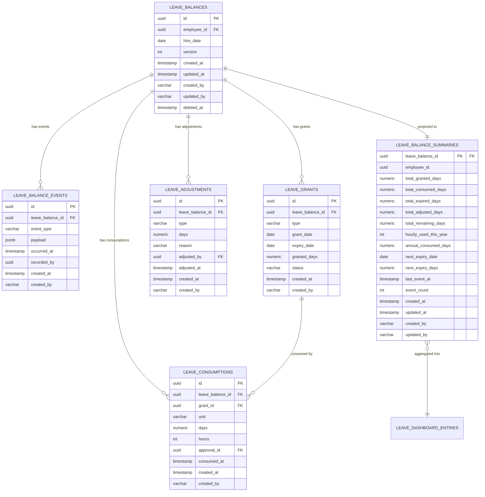

# 有給残高 データベース設計

## 概要

従業員の有給休暇（年次有給・特別休暇）の付与・消化・時効・
調整を記録し、残日数を管理する集約のデータベース設計。

**コンテキスト:** 休暇管理
**構成:** イミュータブルデータモデル + Read Model（アプリケーション層同期）
**RDBMS:** PostgreSQL 16.x

---

## テーブル一覧

| # | テーブル名 | 種別 | 説明 |
|---|-----------|------|------|
| 1 | `leave_balances` | Write Model | 有給残高（集約ルート・不変属性） |
| 2 | `leave_balance_events` | Write Model | 有給残高イベント（追記のみ） |
| 3 | `leave_grants` | Write Model | 付与記録（イミュータブル、追記のみ） |
| 4 | `leave_consumptions` | Write Model | 消化記録（イミュータブル、追記のみ） |
| 5 | `leave_adjustments` | Write Model | 調整記録（イミュータブル、追記のみ） |
| 6 | `leave_balance_summaries` | Read Model | 有給残高サマリー（アプリ同期） |
| 7 | `leave_dashboard_entries` | Read Model | 有給取得状況ダッシュボード（MV） |

---

## ER図



---

## Write Model

### leave_balances（有給残高）

集約ルート。不変属性のみを保持する。
状態変更は `leave_balance_events` への追記で表現する。

**テーブル名:** `leave_balances`

| カラム | 型 | NULL | デフォルト | 説明 |
|--------|-----|------|-----------|------|
| id | UUID | NO | gen_random_uuid() | 主キー |
| employee_id | UUID | NO | - | 従業員ID |
| hire_date | DATE | NO | - | 入社日（付与基準日の起算） |
| version | INTEGER | NO | 1 | 楽観的ロック用 |
| created_at | TIMESTAMPTZ | NO | CURRENT_TIMESTAMP | 作成日時 |
| updated_at | TIMESTAMPTZ | NO | CURRENT_TIMESTAMP | 更新日時 |
| created_by | VARCHAR(255) | NO | - | 作成者 |
| updated_by | VARCHAR(255) | NO | - | 更新者 |
| deleted_at | TIMESTAMPTZ | YES | NULL | 論理削除日時 |

**制約:**

| 制約名 | 種類 | カラム | 説明 |
|--------|------|--------|------|
| pk_leave_balances | PRIMARY KEY | id | 主キー |
| uk_leave_balances_employee | UNIQUE | employee_id | 1従業員1残高レコード |

**インデックス:**

| インデックス名 | カラム | 用途 |
|---------------|--------|------|
| idx_leave_balances_employee | employee_id | 従業員検索 |
| idx_leave_balances_deleted_at | deleted_at | 論理削除フィルタ |

---

### leave_balance_events（有給残高イベント）

集約に対する全ての状態変更をイベントとして記録する。
追記のみ（INSERT only）。UPDATE・DELETE は行わない。

**テーブル名:** `leave_balance_events`

| カラム | 型 | NULL | デフォルト | 説明 |
|--------|-----|------|-----------|------|
| id | UUID | NO | gen_random_uuid() | イベントID |
| leave_balance_id | UUID | NO | - | 有給残高ID |
| event_type | VARCHAR(50) | NO | - | イベント種別 |
| payload | JSONB | NO | '{}' | イベントデータ |
| occurred_at | TIMESTAMPTZ | NO | CURRENT_TIMESTAMP | 発生日時 |
| recorded_by | UUID | YES | - | 記録者ID |
| created_at | TIMESTAMPTZ | NO | CURRENT_TIMESTAMP | 作成日時 |
| created_by | VARCHAR(255) | NO | - | 作成者 |

**event_type の値:**

| event_type | 対応イベント | payload例 |
|------------|-------------|-----------|
| GRANTED | 有給が付与された | `{"grantId": "...", "type": "ANNUAL", "grantedDays": 10.0, "expiryDate": "2027-04-01"}` |
| CONSUMED | 有給が消化された | `{"consumptionId": "...", "grantId": "...", "unit": "FULL_DAY", "days": 1.0, "approvalId": "..."}` |
| EXPIRED | 有給が時効消滅した | `{"grantId": "...", "expiredDays": 3.0, "expiryDate": "2026-04-01"}` |
| SPECIAL_GRANTED | 特別休暇が付与された | `{"grantId": "...", "type": "SPECIAL_BEREAVEMENT", "grantedDays": 5.0}` |
| SPECIAL_CONSUMED | 特別休暇が消化された | `{"consumptionId": "...", "grantId": "...", "type": "SPECIAL_BEREAVEMENT", "days": 1.0}` |
| MANUALLY_ADJUSTED | 有給残高が手動調整された | `{"adjustmentType": "CORRECTION", "days": 2.0, "reason": "...", "adjustedBy": "..."}` |

**制約:**

| 制約名 | 種類 | カラム | 説明 |
|--------|------|--------|------|
| pk_leave_balance_events | PRIMARY KEY | id | 主キー |
| fk_lb_events_balance | FOREIGN KEY | leave_balance_id | leave_balances.id 参照 |
| chk_lb_events_type | CHECK | event_type | IN ('GRANTED', 'CONSUMED', 'EXPIRED', 'SPECIAL_GRANTED', 'SPECIAL_CONSUMED', 'MANUALLY_ADJUSTED') |

**インデックス:**

| インデックス名 | カラム | 用途 |
|---------------|--------|------|
| idx_lb_events_lookup | leave_balance_id, occurred_at DESC | 集約別イベント取得 |
| idx_lb_events_type | event_type | イベントタイプ検索 |
| idx_lb_events_occurred_at | occurred_at | 時系列クエリ |

---

### leave_grants（付与記録）

有給付与記録専用テーブル。付与単位で1レコード。
イミュータブル（追記のみ）。UPDATE・DELETE は行わない。
FIFO消化のため `expiry_date` でのソートが必要。

**テーブル名:** `leave_grants`

| カラム | 型 | NULL | デフォルト | 説明 |
|--------|-----|------|-----------|------|
| id | UUID | NO | gen_random_uuid() | 付与記録ID |
| leave_balance_id | UUID | NO | - | 有給残高ID |
| type | VARCHAR(30) | NO | - | 休暇種別 |
| grant_date | DATE | NO | - | 付与日 |
| expiry_date | DATE | NO | - | 時効日 |
| granted_days | NUMERIC(5,1) | NO | - | 付与日数 |
| status | VARCHAR(20) | NO | 'ACTIVE' | ステータス |
| created_at | TIMESTAMPTZ | NO | CURRENT_TIMESTAMP | 作成日時 |
| created_by | VARCHAR(255) | NO | - | 作成者 |

**type の値:** `ANNUAL`, `HALF_DAY_AM`, `HALF_DAY_PM`, `HOURLY`, `SPECIAL_BEREAVEMENT`, `SPECIAL_REFRESH`

**status の値:** `ACTIVE`（有効）, `CONSUMED`（消化済み）, `EXPIRED`（時効消滅）

**制約:**

| 制約名 | 種類 | カラム | 説明 |
|--------|------|--------|------|
| pk_leave_grants | PRIMARY KEY | id | 主キー |
| fk_leave_grants_balance | FOREIGN KEY | leave_balance_id | leave_balances.id 参照 |
| chk_leave_grants_type | CHECK | type | IN ('ANNUAL', 'HALF_DAY_AM', 'HALF_DAY_PM', 'HOURLY', 'SPECIAL_BEREAVEMENT', 'SPECIAL_REFRESH') |
| chk_leave_grants_status | CHECK | status | IN ('ACTIVE', 'CONSUMED', 'EXPIRED') |
| chk_leave_grants_days | CHECK | granted_days | granted_days > 0 |
| chk_leave_grants_expiry | CHECK | grant_date, expiry_date | grant_date < expiry_date |

**インデックス:**

| インデックス名 | カラム | 用途 |
|---------------|--------|------|
| idx_leave_grants_balance | leave_balance_id, expiry_date ASC | FIFO消化順（時効日昇順） |
| idx_leave_grants_status | leave_balance_id, status | ステータス別検索 |
| idx_leave_grants_type | type | 休暇種別検索 |
| idx_leave_grants_expiry | expiry_date | 時効バッチ用（日次） |

---

### leave_consumptions（消化記録）

有給消化記録専用テーブル。消化単位で1レコード。
イミュータブル（追記のみ）。承認済み申請と1:1で対応。

**テーブル名:** `leave_consumptions`

| カラム | 型 | NULL | デフォルト | 説明 |
|--------|-----|------|-----------|------|
| id | UUID | NO | gen_random_uuid() | 消化記録ID |
| leave_balance_id | UUID | NO | - | 有給残高ID |
| grant_id | UUID | NO | - | 消化元の付与記録ID |
| unit | VARCHAR(20) | NO | - | 消化単位 |
| days | NUMERIC(5,1) | YES | NULL | 消化日数（日単位の場合） |
| hours | INTEGER | YES | NULL | 消化時間（時間単位の場合） |
| approval_id | UUID | NO | - | 承認ID |
| consumed_at | TIMESTAMPTZ | NO | - | 消化日時 |
| created_at | TIMESTAMPTZ | NO | CURRENT_TIMESTAMP | 作成日時 |
| created_by | VARCHAR(255) | NO | - | 作成者 |

**unit の値:** `FULL_DAY`, `HALF_DAY`, `HOURLY`

**制約:**

| 制約名 | 種類 | カラム | 説明 |
|--------|------|--------|------|
| pk_leave_consumptions | PRIMARY KEY | id | 主キー |
| fk_leave_consumptions_balance | FOREIGN KEY | leave_balance_id | leave_balances.id 参照 |
| fk_leave_consumptions_grant | FOREIGN KEY | grant_id | leave_grants.id 参照 |
| chk_leave_consumptions_unit | CHECK | unit | IN ('FULL_DAY', 'HALF_DAY', 'HOURLY') |
| chk_leave_consumptions_value | CHECK | days, hours | days > 0 OR hours > 0（いずれか必須） |

**CHECK制約 chk_leave_consumptions_value の定義:**

```sql
CONSTRAINT chk_leave_consumptions_value
  CHECK (
    (unit IN ('FULL_DAY', 'HALF_DAY') AND days > 0 AND hours IS NULL)
    OR
    (unit = 'HOURLY' AND hours > 0 AND days IS NULL)
  )
```

**インデックス:**

| インデックス名 | カラム | 用途 |
|---------------|--------|------|
| idx_leave_consumptions_balance | leave_balance_id, consumed_at DESC | 残高別消化履歴 |
| idx_leave_consumptions_grant | grant_id | 付与別消化集計 |
| idx_leave_consumptions_approval | approval_id | 承認ID検索 |
| idx_leave_consumptions_unit | unit, consumed_at | 時間単位上限チェック用 |

---

### leave_adjustments（調整記録）

有給残高調整記録テーブル。調整単位で1レコード。
イミュータブル（追記のみ）。全調整の監査証跡を保持する。

**テーブル名:** `leave_adjustments`

| カラム | 型 | NULL | デフォルト | 説明 |
|--------|-----|------|-----------|------|
| id | UUID | NO | gen_random_uuid() | 調整記録ID |
| leave_balance_id | UUID | NO | - | 有給残高ID |
| type | VARCHAR(20) | NO | - | 調整種別 |
| days | NUMERIC(5,1) | NO | - | 調整日数（正=加算、負=減算） |
| reason | VARCHAR(500) | NO | - | 調整理由 |
| adjusted_by | UUID | NO | - | 調整実施者ID |
| adjusted_at | TIMESTAMPTZ | NO | - | 調整日時 |
| created_at | TIMESTAMPTZ | NO | CURRENT_TIMESTAMP | 作成日時 |
| created_by | VARCHAR(255) | NO | - | 作成者 |

**type の値:** `TRANSFER_IN`（転入引継）, `CORRECTION`（訂正）, `MANUAL_GRANT`（手動付与）

**制約:**

| 制約名 | 種類 | カラム | 説明 |
|--------|------|--------|------|
| pk_leave_adjustments | PRIMARY KEY | id | 主キー |
| fk_leave_adjustments_balance | FOREIGN KEY | leave_balance_id | leave_balances.id 参照 |
| chk_leave_adjustments_type | CHECK | type | IN ('TRANSFER_IN', 'CORRECTION', 'MANUAL_GRANT') |
| chk_leave_adjustments_reason | CHECK | reason | LENGTH(reason) >= 10（INV-LB-006） |

**CHECK制約 chk_leave_adjustments_reason の定義:**

```sql
CONSTRAINT chk_leave_adjustments_reason
  CHECK (LENGTH(reason) >= 10 AND LENGTH(reason) <= 500)
```

**インデックス:**

| インデックス名 | カラム | 用途 |
|---------------|--------|------|
| idx_leave_adjustments_balance | leave_balance_id, adjusted_at DESC | 残高別調整履歴 |
| idx_leave_adjustments_type | type | 調整種別検索 |

---

## Read Model

### leave_balance_summaries（有給残高サマリー）

イベントから導出される有給残高の現在状態を保持する。
`@TransactionalEventListener` によりアプリケーション層で同期更新する。
クエリ要件「有給残日数照会」「特別休暇残日数照会」に対応。

**テーブル名:** `leave_balance_summaries`

| カラム | 型 | NULL | デフォルト | 説明 |
|--------|-----|------|-----------|------|
| leave_balance_id | UUID | NO | - | 有給残高ID（主キー） |
| employee_id | UUID | NO | - | 従業員ID |
| fiscal_year | SMALLINT | NO | - | 年度 |
| total_granted_days | NUMERIC(5,1) | NO | 0 | 総付与日数 |
| total_consumed_days | NUMERIC(5,1) | NO | 0 | 総消化日数 |
| total_expired_days | NUMERIC(5,1) | NO | 0 | 総時効消滅日数 |
| total_adjusted_days | NUMERIC(5,1) | NO | 0 | 総調整日数 |
| total_remaining_days | NUMERIC(5,1) | NO | 0 | 残日数（計算値） |
| total_remaining_hours | INTEGER | NO | 0 | 残時間（時間単位枠） |
| hourly_used_this_year | INTEGER | NO | 0 | 当年度時間単位消化時間 |
| annual_consumed_days | NUMERIC(5,1) | NO | 0 | 当年度年次有給消化日数 |
| next_expiry_date | DATE | YES | NULL | 次回時効日 |
| next_expiry_days | NUMERIC(5,1) | YES | NULL | 次回時効対象日数 |
| obligation_met | BOOLEAN | NO | false | 年5日取得義務充足 |
| last_event_at | TIMESTAMPTZ | YES | NULL | 最終イベント日時 |
| event_count | INTEGER | NO | 0 | イベント数 |
| created_at | TIMESTAMPTZ | NO | CURRENT_TIMESTAMP | 作成日時 |
| updated_at | TIMESTAMPTZ | NO | CURRENT_TIMESTAMP | 更新日時 |
| created_by | VARCHAR(255) | NO | - | 作成者 |
| updated_by | VARCHAR(255) | NO | - | 更新者 |

**制約:**

| 制約名 | 種類 | カラム | 説明 |
|--------|------|--------|------|
| pk_lb_summaries | PRIMARY KEY | leave_balance_id, fiscal_year | 複合主キー |
| fk_lb_summaries_balance | FOREIGN KEY | leave_balance_id | leave_balances.id 参照 |
| chk_lb_summaries_remaining | CHECK | total_remaining_days | total_remaining_days >= 0（INV-LB-001） |
| chk_lb_summaries_hourly | CHECK | hourly_used_this_year | hourly_used_this_year <= 40（INV-LB-002） |

**CHECK制約 chk_lb_summaries_remaining の定義:**

```sql
CONSTRAINT chk_lb_summaries_remaining
  CHECK (total_remaining_days >= 0)
```

**CHECK制約 chk_lb_summaries_hourly の定義:**

```sql
CONSTRAINT chk_lb_summaries_hourly
  CHECK (hourly_used_this_year <= 40)
```

**インデックス:**

| インデックス名 | カラム | 用途 |
|---------------|--------|------|
| idx_lb_summaries_employee | employee_id, fiscal_year | 従業員×年度検索（有給残日数照会） |
| idx_lb_summaries_remaining | total_remaining_days | 残日数ソート |
| idx_lb_summaries_expiry | next_expiry_date | 次回時効日検索 |
| idx_lb_summaries_obligation | obligation_met | 取得義務充足フィルタ |

**同期方式:** `@TransactionalEventListener`（アプリケーション層）

| イベント種別 | リードモデル処理 |
|-------------|------------------|
| GRANTED | UPSERT: total_granted_days 加算, next_expiry_date/next_expiry_days 再計算 |
| CONSUMED | UPDATE: total_consumed_days 加算, total_remaining_days 再計算, annual_consumed_days 更新, obligation_met 再判定 |
| EXPIRED | UPDATE: total_expired_days 加算, total_remaining_days 再計算, next_expiry_date/next_expiry_days 再計算 |
| SPECIAL_GRANTED | UPSERT: total_granted_days 加算 |
| SPECIAL_CONSUMED | UPDATE: total_consumed_days 加算, total_remaining_days 再計算 |
| MANUALLY_ADJUSTED | UPDATE: total_adjusted_days 更新, total_remaining_days 再計算 |

**残日数の計算式:**

```
total_remaining_days = total_granted_days
                     - total_consumed_days
                     - total_expired_days
                     + total_adjusted_days
```

---

### leave_dashboard_entries（有給取得状況ダッシュボード）

クエリ要件「有給取得状況ダッシュボード」に対応する
マテリアライズドビュー。部署別の有給取得状況を集約表示。

**マテリアライズドビュー名:** `leave_dashboard_entries`

| カラム | 型 | NULL | 説明 |
|--------|-----|------|------|
| employee_id | UUID | NO | 従業員ID |
| employee_name | VARCHAR(255) | NO | 従業員名（非正規化） |
| department_id | UUID | NO | 部門ID |
| fiscal_year | SMALLINT | NO | 年度 |
| granted_days | NUMERIC(5,1) | NO | 付与日数 |
| consumed_days | NUMERIC(5,1) | NO | 消化日数 |
| remaining_days | NUMERIC(5,1) | NO | 残日数 |
| obligation_met | BOOLEAN | NO | 年5日取得義務充足 |
| next_expiry_date | DATE | YES | 次回時効日 |
| next_expiry_days | NUMERIC(5,1) | YES | 次回時効対象日数 |

**定義:**

```sql
CREATE MATERIALIZED VIEW leave_dashboard_entries AS
SELECT
    e.id AS employee_id,
    e.name AS employee_name,
    e.department_id,
    s.fiscal_year,
    s.total_granted_days AS granted_days,
    s.total_consumed_days AS consumed_days,
    s.total_remaining_days AS remaining_days,
    s.obligation_met,
    s.next_expiry_date,
    s.next_expiry_days
FROM leave_balance_summaries s
    JOIN leave_balances lb ON lb.id = s.leave_balance_id
    JOIN employees e ON e.id = lb.employee_id
WHERE lb.deleted_at IS NULL
WITH NO DATA;
```

**インデックス:**

| インデックス名 | カラム | 用途 |
|---------------|--------|------|
| idx_leave_dashboard_pk | employee_id, fiscal_year | 一意検索（CONCURRENTLY更新用） |
| idx_leave_dashboard_dept | department_id, fiscal_year | 部署×年度検索 |
| idx_leave_dashboard_obligation | obligation_met | 取得義務フィルタ |
| idx_leave_dashboard_remaining | remaining_days | 残日数ソート |
| idx_leave_dashboard_expiry | next_expiry_date | 時効日ソート |
| idx_leave_dashboard_name | employee_name | 従業員名ソート |

**リフレッシュ:**

```sql
REFRESH MATERIALIZED VIEW CONCURRENTLY
  leave_dashboard_entries;
```

> leave_balance_summaries の更新後、またはバッチ処理で定期実行する。

---

## 不変条件とDB制約の対応

| 不変条件 | 対応方法 |
|---------|---------|
| INV-LB-001: 残日数 >= 0 | `chk_lb_summaries_remaining` CHECK制約（Read Model） |
| INV-LB-002: 時間単位有給 <= 40h/年 | `chk_lb_summaries_hourly` CHECK制約（Read Model）+ アプリケーション層で検証 |
| INV-LB-003: 有給消化はFIFO順 | アプリケーション層で検証（expiry_date ASC でソートして消化） |
| INV-LB-004: 時効後の消化不可 | アプリケーション層で検証（leave_grants.status != 'EXPIRED' チェック） |
| INV-LB-005: 特別休暇は種別内で消化 | アプリケーション層で検証（leave_grants.type と消化対象の type 一致チェック） |
| INV-LB-006: 手動調整は理由必須 | `chk_leave_adjustments_reason` CHECK制約（LENGTH >= 10） |

---

## クエリ要件とインデックスの対応

| クエリ要件 | 対応テーブル | 使用インデックス |
|-----------|------------|----------------|
| 有給残日数照会（employeeId, fiscalYear） | leave_balance_summaries | idx_lb_summaries_employee |
| 有給取得状況ダッシュボード（departmentId, fiscalYear, obligationMet） | leave_dashboard_entries | idx_leave_dashboard_dept, idx_leave_dashboard_obligation |
| 特別休暇残日数照会（employeeId, type） | leave_grants + leave_balance_summaries | idx_leave_grants_balance, idx_leave_grants_type |

---

## マイグレーション

### V1: Write Model

```sql
-- V1__create_leave_balances.sql

-- === Write Model ===

-- 有給残高（集約ルート）
CREATE TABLE leave_balances (
    id UUID PRIMARY KEY DEFAULT gen_random_uuid(),
    employee_id UUID NOT NULL,
    hire_date DATE NOT NULL,
    version INTEGER NOT NULL DEFAULT 1,
    created_at TIMESTAMPTZ NOT NULL DEFAULT CURRENT_TIMESTAMP,
    updated_at TIMESTAMPTZ NOT NULL DEFAULT CURRENT_TIMESTAMP,
    created_by VARCHAR(255) NOT NULL,
    updated_by VARCHAR(255) NOT NULL,
    deleted_at TIMESTAMPTZ,

    CONSTRAINT uk_leave_balances_employee
        UNIQUE (employee_id)
);

CREATE INDEX idx_leave_balances_employee
    ON leave_balances (employee_id);
CREATE INDEX idx_leave_balances_deleted_at
    ON leave_balances (deleted_at)
    WHERE deleted_at IS NOT NULL;

-- イベントテーブル
CREATE TABLE leave_balance_events (
    id UUID PRIMARY KEY DEFAULT gen_random_uuid(),
    leave_balance_id UUID NOT NULL
        REFERENCES leave_balances(id),
    event_type VARCHAR(50) NOT NULL,
    payload JSONB NOT NULL DEFAULT '{}',
    occurred_at TIMESTAMPTZ NOT NULL DEFAULT CURRENT_TIMESTAMP,
    recorded_by UUID,
    created_at TIMESTAMPTZ NOT NULL DEFAULT CURRENT_TIMESTAMP,
    created_by VARCHAR(255) NOT NULL,

    CONSTRAINT chk_lb_events_type
        CHECK (event_type IN (
            'GRANTED', 'CONSUMED', 'EXPIRED',
            'SPECIAL_GRANTED', 'SPECIAL_CONSUMED',
            'MANUALLY_ADJUSTED'
        ))
);

CREATE INDEX idx_lb_events_lookup
    ON leave_balance_events (leave_balance_id, occurred_at DESC);
CREATE INDEX idx_lb_events_type
    ON leave_balance_events (event_type);
CREATE INDEX idx_lb_events_occurred_at
    ON leave_balance_events (occurred_at);

-- 付与記録テーブル
CREATE TABLE leave_grants (
    id UUID PRIMARY KEY DEFAULT gen_random_uuid(),
    leave_balance_id UUID NOT NULL
        REFERENCES leave_balances(id),
    type VARCHAR(30) NOT NULL,
    grant_date DATE NOT NULL,
    expiry_date DATE NOT NULL,
    granted_days NUMERIC(5,1) NOT NULL,
    status VARCHAR(20) NOT NULL DEFAULT 'ACTIVE',
    created_at TIMESTAMPTZ NOT NULL DEFAULT CURRENT_TIMESTAMP,
    created_by VARCHAR(255) NOT NULL,

    CONSTRAINT chk_leave_grants_type
        CHECK (type IN (
            'ANNUAL', 'HALF_DAY_AM', 'HALF_DAY_PM',
            'HOURLY', 'SPECIAL_BEREAVEMENT',
            'SPECIAL_REFRESH'
        )),
    CONSTRAINT chk_leave_grants_status
        CHECK (status IN ('ACTIVE', 'CONSUMED', 'EXPIRED')),
    CONSTRAINT chk_leave_grants_days
        CHECK (granted_days > 0),
    CONSTRAINT chk_leave_grants_expiry
        CHECK (grant_date < expiry_date)
);

CREATE INDEX idx_leave_grants_balance
    ON leave_grants (leave_balance_id, expiry_date ASC);
CREATE INDEX idx_leave_grants_status
    ON leave_grants (leave_balance_id, status);
CREATE INDEX idx_leave_grants_type
    ON leave_grants (type);
CREATE INDEX idx_leave_grants_expiry
    ON leave_grants (expiry_date);

-- 消化記録テーブル
CREATE TABLE leave_consumptions (
    id UUID PRIMARY KEY DEFAULT gen_random_uuid(),
    leave_balance_id UUID NOT NULL
        REFERENCES leave_balances(id),
    grant_id UUID NOT NULL
        REFERENCES leave_grants(id),
    unit VARCHAR(20) NOT NULL,
    days NUMERIC(5,1),
    hours INTEGER,
    approval_id UUID NOT NULL,
    consumed_at TIMESTAMPTZ NOT NULL,
    created_at TIMESTAMPTZ NOT NULL DEFAULT CURRENT_TIMESTAMP,
    created_by VARCHAR(255) NOT NULL,

    CONSTRAINT chk_leave_consumptions_unit
        CHECK (unit IN ('FULL_DAY', 'HALF_DAY', 'HOURLY')),
    CONSTRAINT chk_leave_consumptions_value
        CHECK (
            (unit IN ('FULL_DAY', 'HALF_DAY')
                AND days > 0 AND hours IS NULL)
            OR
            (unit = 'HOURLY'
                AND hours > 0 AND days IS NULL)
        )
);

CREATE INDEX idx_leave_consumptions_balance
    ON leave_consumptions (leave_balance_id, consumed_at DESC);
CREATE INDEX idx_leave_consumptions_grant
    ON leave_consumptions (grant_id);
CREATE INDEX idx_leave_consumptions_approval
    ON leave_consumptions (approval_id);
CREATE INDEX idx_leave_consumptions_unit
    ON leave_consumptions (unit, consumed_at);

-- 調整記録テーブル
CREATE TABLE leave_adjustments (
    id UUID PRIMARY KEY DEFAULT gen_random_uuid(),
    leave_balance_id UUID NOT NULL
        REFERENCES leave_balances(id),
    type VARCHAR(20) NOT NULL,
    days NUMERIC(5,1) NOT NULL,
    reason VARCHAR(500) NOT NULL,
    adjusted_by UUID NOT NULL,
    adjusted_at TIMESTAMPTZ NOT NULL,
    created_at TIMESTAMPTZ NOT NULL DEFAULT CURRENT_TIMESTAMP,
    created_by VARCHAR(255) NOT NULL,

    CONSTRAINT chk_leave_adjustments_type
        CHECK (type IN (
            'TRANSFER_IN', 'CORRECTION', 'MANUAL_GRANT'
        )),
    CONSTRAINT chk_leave_adjustments_reason
        CHECK (LENGTH(reason) >= 10
            AND LENGTH(reason) <= 500)
);

CREATE INDEX idx_leave_adjustments_balance
    ON leave_adjustments (leave_balance_id, adjusted_at DESC);
CREATE INDEX idx_leave_adjustments_type
    ON leave_adjustments (type);
```

### V2: Read Model

```sql
-- V2__create_leave_balance_read_models.sql

-- === Read Model ===

-- 有給残高サマリー
CREATE TABLE leave_balance_summaries (
    leave_balance_id UUID NOT NULL
        REFERENCES leave_balances(id),
    employee_id UUID NOT NULL,
    fiscal_year SMALLINT NOT NULL,
    total_granted_days NUMERIC(5,1) NOT NULL DEFAULT 0,
    total_consumed_days NUMERIC(5,1) NOT NULL DEFAULT 0,
    total_expired_days NUMERIC(5,1) NOT NULL DEFAULT 0,
    total_adjusted_days NUMERIC(5,1) NOT NULL DEFAULT 0,
    total_remaining_days NUMERIC(5,1) NOT NULL DEFAULT 0,
    total_remaining_hours INTEGER NOT NULL DEFAULT 0,
    hourly_used_this_year INTEGER NOT NULL DEFAULT 0,
    annual_consumed_days NUMERIC(5,1) NOT NULL DEFAULT 0,
    next_expiry_date DATE,
    next_expiry_days NUMERIC(5,1),
    obligation_met BOOLEAN NOT NULL DEFAULT false,
    last_event_at TIMESTAMPTZ,
    event_count INTEGER NOT NULL DEFAULT 0,
    created_at TIMESTAMPTZ NOT NULL DEFAULT CURRENT_TIMESTAMP,
    updated_at TIMESTAMPTZ NOT NULL DEFAULT CURRENT_TIMESTAMP,
    created_by VARCHAR(255) NOT NULL,
    updated_by VARCHAR(255) NOT NULL,

    CONSTRAINT pk_lb_summaries
        PRIMARY KEY (leave_balance_id, fiscal_year),
    CONSTRAINT fk_lb_summaries_balance
        FOREIGN KEY (leave_balance_id)
        REFERENCES leave_balances(id),
    CONSTRAINT chk_lb_summaries_remaining
        CHECK (total_remaining_days >= 0),
    CONSTRAINT chk_lb_summaries_hourly
        CHECK (hourly_used_this_year <= 40)
);

CREATE INDEX idx_lb_summaries_employee
    ON leave_balance_summaries (employee_id, fiscal_year);
CREATE INDEX idx_lb_summaries_remaining
    ON leave_balance_summaries (total_remaining_days);
CREATE INDEX idx_lb_summaries_expiry
    ON leave_balance_summaries (next_expiry_date);
CREATE INDEX idx_lb_summaries_obligation
    ON leave_balance_summaries (obligation_met);

-- 有給取得状況ダッシュボード（マテリアライズドビュー）
CREATE MATERIALIZED VIEW leave_dashboard_entries AS
SELECT
    e.id AS employee_id,
    e.name AS employee_name,
    e.department_id,
    s.fiscal_year,
    s.total_granted_days AS granted_days,
    s.total_consumed_days AS consumed_days,
    s.total_remaining_days AS remaining_days,
    s.obligation_met,
    s.next_expiry_date,
    s.next_expiry_days
FROM leave_balance_summaries s
    JOIN leave_balances lb ON lb.id = s.leave_balance_id
    JOIN employees e ON e.id = lb.employee_id
WHERE lb.deleted_at IS NULL
WITH NO DATA;

CREATE UNIQUE INDEX idx_leave_dashboard_pk
    ON leave_dashboard_entries (employee_id, fiscal_year);
CREATE INDEX idx_leave_dashboard_dept
    ON leave_dashboard_entries (department_id, fiscal_year);
CREATE INDEX idx_leave_dashboard_obligation
    ON leave_dashboard_entries (obligation_met);
CREATE INDEX idx_leave_dashboard_remaining
    ON leave_dashboard_entries (remaining_days);
CREATE INDEX idx_leave_dashboard_expiry
    ON leave_dashboard_entries (next_expiry_date);
CREATE INDEX idx_leave_dashboard_name
    ON leave_dashboard_entries (employee_name);
```

---

## リードモデル同期方式

DBトリガーは使用しない。アプリケーション層で `@TransactionalEventListener` を使い同期更新する。

**方式:** Spring の `@TransactionalEventListener(phase = AFTER_COMMIT)` を使用し、
イベント保存と同一トランザクション完了後にリードモデルを更新する。

**実装クラス構成:**

| クラス | 責務 |
|--------|------|
| `LeaveBalanceSummaryProjector` | leave_balance_events → leave_balance_summaries の同期 |
| `LeaveBalanceRemainingCalculator` | 残日数の再計算ロジック（付与合計 - 消化合計 - 時効合計 + 調整合計） |

**利点:**
- テスト容易性: 通常の Spring Bean としてユニットテスト可能
- デバッグ容易性: アプリログで同期処理を追跡可能
- デプロイ容易性: Flyway マイグレーションにトリガー管理が不要
- ORM互換性: JPA キャッシュとの矛盾が発生しない

**リードモデル再構築:**
イベントテーブルと各記録テーブルから任意の時点で `leave_balance_summaries` を再構築可能。
バッチ処理として `LeaveBalanceSummaryRebuilder` を実装する。

---

## 履歴管理方針

| 対象 | 方針 | 説明 |
|------|------|------|
| leave_grants | イミュータブル（追記のみ） | 付与単位で1行。status は ACTIVE → CONSUMED/EXPIRED への遷移のみ許可（例外的UPDATE） |
| leave_consumptions | イミュータブル（追記のみ） | 消化単位で1行。承認済み申請と1:1。UPDATE/DELETE しない |
| leave_adjustments | イミュータブル（追記のみ） | 調整単位で1行。全調整の監査証跡。UPDATE/DELETE しない |
| leave_balance_events | イミュータブル（追記のみ） | 全操作をイベントとして記録。UPDATE/DELETE しない |
| leave_balance_summaries | ミュータブル（上書き） | アプリ層（@TransactionalEventListener）で同期更新。残日数等を上書き |
| 操作ログ | leave_balance_events で兼用 | 全操作がイミュータブルに記録される |

> **leave_grants.status の更新について:**
> 基本的にイミュータブルだが、status のみ例外的にUPDATEする。
> 時効バッチで ACTIVE → EXPIRED、全日数消化時に ACTIVE → CONSUMED への遷移。
> consumed_days はUPDATEせず leave_consumptions のSUMで算出する。

---

## 値オブジェクトのマッピング

| 値オブジェクト | マッピング先 | 方式 |
|--------------|------------|------|
| LeaveDays | NUMERIC(5,1) カラム | 各テーブルの granted_days, days 等にフラット展開 |
| LeaveHours | INTEGER カラム | leave_consumptions.hours にフラット展開 |
| GrantDate | DATE カラム | leave_grants.grant_date にフラット展開 |
| ExpiryDate | DATE カラム | leave_grants.expiry_date にフラット展開 |
| HireDate | DATE カラム | leave_balances.hire_date にフラット展開 |
| AdjustmentReason | VARCHAR(500) カラム | leave_adjustments.reason にフラット展開（10-500文字制約） |
| LeaveGrant | leave_grants テーブル | 1行=1付与。専用テーブルに展開 |
| LeaveConsumption | leave_consumptions テーブル | 1行=1消化。専用テーブルに展開 |
| AdjustmentRecord | leave_adjustments テーブル | 1行=1調整。専用テーブルに展開 |

---

## バッチ処理

| バッチ | 頻度 | 処理内容 |
|--------|------|---------|
| 付与バッチ | 日次 | 入社日起算の基準日到達チェック。到達時に GRANTED イベント発行 + leave_grants INSERT |
| 時効バッチ | 日次 | expiry_date 到達チェック。到達時に EXPIRED イベント発行 + leave_grants.status を EXPIRED に更新 |
| ダッシュボードMVリフレッシュ | 日次 or リアルタイム | `REFRESH MATERIALIZED VIEW CONCURRENTLY leave_dashboard_entries` |

---

## 実装ノート

- **楽観的ロック:** `leave_balances.version` で排他制御。
  UPDATE 時に `WHERE version = :expected` で検証
- **論理削除:** `deleted_at` カラム（leave_balances のみ）。
  イミュータブルなサブテーブルには不要
- **イベント不変性:** `leave_balance_events` は INSERT のみ。
  一度保存したイベントは変更・削除しない
- **FIFO消化:** `leave_grants` を `expiry_date ASC` でソートし、
  時効が近い付与分から優先的に消化する実装が必要
- **時間単位有給上限:** 年度内の HOURLY 消化の合計で
  40h 上限を判定。`leave_balance_summaries.hourly_used_this_year`
  で非正規化して保持し、CHECK制約でも保護
- **リードモデル再構築:** イベントテーブルと各記録テーブルから
  任意の時点で `leave_balance_summaries` を再構築可能
- **冪等性:** 同一イベントを複数回処理しても
  結果が同じになるようにイベントリスナーを実装
- **マテリアライズドビューのリフレッシュ:**
  `REFRESH MATERIALIZED VIEW CONCURRENTLY` で
  無停止更新。UNIQUE INDEX が必要（定義済み）
- **特別休暇の種別分離:** SPECIAL_BEREAVEMENT / SPECIAL_REFRESH は
  各種別の leave_grants 内で消化。種別をまたいだ消化は不可（INV-LB-005）

---

## 品質チェック結果

- [x] 全集約属性にカラムが対応している
  - LeaveBalance → leave_balances（id, employeeId, hireDate, version）
  - LeaveGrant → leave_grants（全8属性。remainingDays は算出値のため非保持、isExpired は status で表現）
  - LeaveConsumption → leave_consumptions（全7属性）
  - AdjustmentRecord → leave_adjustments（全5属性）
- [x] 不変条件がDB制約として表現されている
  - INV-LB-001: CHECK制約（total_remaining_days >= 0）
  - INV-LB-002: CHECK制約（hourly_used_this_year <= 40）
  - INV-LB-006: CHECK制約（LENGTH(reason) >= 10）
  - INV-LB-003/004/005: アプリケーション層
- [x] インデックスがクエリ要件をカバーしている
  - 有給残日数照会: idx_lb_summaries_employee
  - 有給取得状況ダッシュボード: idx_leave_dashboard_dept, idx_leave_dashboard_obligation
  - 特別休暇残日数照会: idx_leave_grants_balance, idx_leave_grants_type
- [x] 値オブジェクトが適切にマッピングされている
  - LeaveDays/LeaveHours → NUMERIC/INTEGER カラムにフラット展開
  - GrantDate/ExpiryDate/HireDate → DATE カラムにフラット展開
  - AdjustmentReason → VARCHAR(500) + CHECK制約
  - LeaveGrant/LeaveConsumption/AdjustmentRecord → 専用テーブル
