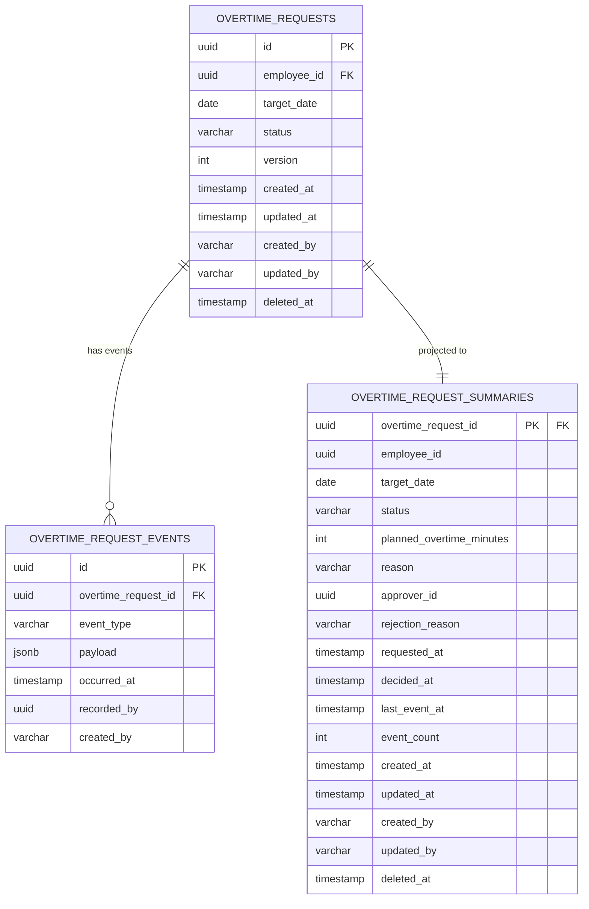

# 残業申請 データベース設計

## 概要

従業員の残業申請を管理し、
上長の承認ワークフローを制御する集約のデータベース設計。
36協定の上限チェックと連動し、法令遵守を保証する。

**コンテキスト:** 申請承認
**構成:** イミュータブルデータモデル + Read Model（アプリケーション層同期）
**RDBMS:** PostgreSQL 16.x

---

## テーブル一覧

| # | テーブル名 | 種別 | 説明 |
|---|-----------|------|------|
| 1 | `overtime_requests` | Write Model | 残業申請（集約ルート・不変属性） |
| 2 | `overtime_request_events` | Write Model | 残業申請イベント（追記のみ） |
| 3 | `overtime_request_summaries` | Read Model | 残業申請サマリー（アプリ同期） |

---

## ER図



---

## Write Model

### overtime_requests（残業申請）

集約ルート。不変属性のみを保持する。
状態変更は `overtime_request_events` への追記で表現する。

**テーブル名:** `overtime_requests`

| カラム | 型 | NULL | デフォルト | 説明 |
|--------|-----|------|-----------|------|
| id | UUID | NO | gen_random_uuid() | 主キー |
| employee_id | UUID | NO | - | 申請者（従業員）ID |
| target_date | DATE | NO | - | 残業対象日 |
| status | VARCHAR(20) | NO | 'DRAFT' | ステータス |
| version | INTEGER | NO | 1 | 楽観的ロック用 |
| created_at | TIMESTAMPTZ | NO | CURRENT_TIMESTAMP | 作成日時 |
| updated_at | TIMESTAMPTZ | NO | CURRENT_TIMESTAMP | 更新日時 |
| created_by | VARCHAR(255) | NO | - | 作成者 |
| updated_by | VARCHAR(255) | NO | - | 更新者 |
| deleted_at | TIMESTAMPTZ | YES | NULL | 論理削除日時 |

**制約:**

| 制約名 | 種類 | カラム | 説明 |
|--------|------|--------|------|
| pk_overtime_requests | PRIMARY KEY | id | 主キー |
| uk_overtime_requests_employee_date | UNIQUE | employee_id, target_date, deleted_at | 同一勤務日に1申請（論理削除考慮） |
| chk_overtime_requests_status | CHECK | status | IN ('DRAFT', 'SUBMITTED', 'APPROVED', 'REJECTED') |

**インデックス:**

| インデックス名 | カラム | 用途 |
|---------------|--------|------|
| idx_ot_requests_employee_date | employee_id, target_date DESC | 申請一覧クエリ |
| idx_ot_requests_status | status | ステータス絞り込み |
| idx_ot_requests_deleted_at | deleted_at | 論理削除フィルタ |

---

### overtime_request_events（残業申請イベント）

集約に対する全ての状態変更をイベントとして記録する。
追記のみ（INSERT only）。UPDATE・DELETE は行わない。

**テーブル名:** `overtime_request_events`

| カラム | 型 | NULL | デフォルト | 説明 |
|--------|-----|------|-----------|------|
| id | UUID | NO | gen_random_uuid() | イベントID |
| overtime_request_id | UUID | NO | - | 残業申請ID |
| event_type | VARCHAR(50) | NO | - | イベント種別 |
| payload | JSONB | NO | '{}' | イベントデータ |
| occurred_at | TIMESTAMPTZ | NO | CURRENT_TIMESTAMP | 発生日時 |
| recorded_by | UUID | YES | - | 記録者ID |
| created_at | TIMESTAMPTZ | NO | CURRENT_TIMESTAMP | 作成日時 |
| created_by | VARCHAR(255) | NO | - | 作成者 |

**event_type の値:**

| event_type | 対応イベント | payload例 |
|------------|-------------|-----------|
| SUBMITTED | 残業が申請された | `{"plannedOvertimeMinutes": 60, "reason": "月末レポート作成のため..."}` |
| APPROVED | 残業申請が承認された | `{"approverId": "MGR-001"}` |
| REJECTED | 残業申請が却下された | `{"approverId": "MGR-001", "rejectionReason": "翌日の通常勤務時間内で..."}` |
| RESUBMITTED | 残業申請が再申請された | `{"plannedOvertimeMinutes": 45, "reason": "業務範囲を見直し..."}` |

**制約:**

| 制約名 | 種類 | カラム | 説明 |
|--------|------|--------|------|
| pk_ot_request_events | PRIMARY KEY | id | 主キー |
| fk_ot_request_events_request | FOREIGN KEY | overtime_request_id | overtime_requests.id 参照 |
| chk_ot_request_events_type | CHECK | event_type | IN ('SUBMITTED', 'APPROVED', 'REJECTED', 'RESUBMITTED') |

**インデックス:**

| インデックス名 | カラム | 用途 |
|---------------|--------|------|
| idx_ot_request_events_lookup | overtime_request_id, occurred_at DESC | 集約別イベント取得 |
| idx_ot_request_events_type | event_type | イベントタイプ検索 |
| idx_ot_request_events_occurred_at | occurred_at | 時系列クエリ |

---

## Read Model

### overtime_request_summaries（残業申請サマリー）

イベントから導出される残業申請の現在状態を保持する。
`@TransactionalEventListener` によりアプリケーション層で同期更新する。
PlannedOvertime・OvertimeReason・RejectionReason の値を非正規化して保持する。

**テーブル名:** `overtime_request_summaries`

| カラム | 型 | NULL | デフォルト | 説明 |
|--------|-----|------|-----------|------|
| overtime_request_id | UUID | NO | - | 残業申請ID（主キー） |
| employee_id | UUID | NO | - | 申請者（従業員）ID |
| target_date | DATE | NO | - | 残業対象日 |
| status | VARCHAR(20) | NO | 'DRAFT' | 現在のステータス |
| planned_overtime_minutes | INTEGER | YES | NULL | 予定残業時間（分） |
| reason | VARCHAR(200) | YES | NULL | 残業理由 |
| approver_id | UUID | YES | NULL | 承認者/却下者ID |
| rejection_reason | VARCHAR(500) | YES | NULL | 却下理由 |
| requested_at | TIMESTAMPTZ | YES | NULL | 申請日時 |
| decided_at | TIMESTAMPTZ | YES | NULL | 承認/却下日時 |
| last_event_at | TIMESTAMPTZ | YES | NULL | 最終イベント日時 |
| event_count | INTEGER | NO | 0 | イベント数 |
| created_at | TIMESTAMPTZ | NO | CURRENT_TIMESTAMP | 作成日時 |
| updated_at | TIMESTAMPTZ | NO | CURRENT_TIMESTAMP | 更新日時 |
| created_by | VARCHAR(255) | NO | - | 作成者 |
| updated_by | VARCHAR(255) | NO | - | 更新者 |
| deleted_at | TIMESTAMPTZ | YES | NULL | 論理削除日時 |

**制約:**

| 制約名 | 種類 | カラム | 説明 |
|--------|------|--------|------|
| pk_ot_request_summaries | PRIMARY KEY | overtime_request_id | 主キー |
| fk_ot_request_summaries_request | FOREIGN KEY | overtime_request_id | overtime_requests.id 参照 |
| chk_ot_request_summaries_status | CHECK | status | IN ('DRAFT', 'SUBMITTED', 'APPROVED', 'REJECTED') |
| chk_ot_request_summaries_overtime | CHECK | planned_overtime_minutes | planned_overtime_minutes IS NULL OR (planned_overtime_minutes BETWEEN 1 AND 240 AND planned_overtime_minutes % 15 = 0) |

**インデックス:**

| インデックス名 | カラム | 用途 |
|---------------|--------|------|
| idx_ot_summaries_employee_date | employee_id, target_date DESC | 残業申請一覧クエリ |
| idx_ot_summaries_status | status | ステータス絞り込み |
| idx_ot_summaries_approver_status | approver_id, status | 承認待ち一覧クエリ（status='SUBMITTED'） |
| idx_ot_summaries_requested_at | requested_at | 申請日時ソート |
| idx_ot_summaries_deleted_at | deleted_at | 論理削除フィルタ |

**同期方式:** `@TransactionalEventListener`（アプリケーション層）

| イベント種別 | リードモデル処理 |
|-------------|------------------|
| SUBMITTED | UPSERT: status='SUBMITTED', planned_overtime_minutes/reason/requested_at 設定 |
| APPROVED | UPDATE: status='APPROVED', approver_id/decided_at 設定 |
| REJECTED | UPDATE: status='REJECTED', approver_id/rejection_reason/decided_at 設定 |
| RESUBMITTED | UPDATE: status='SUBMITTED', planned_overtime_minutes/reason 更新, approver_id/rejection_reason/decided_at クリア |

---

## 不変条件とDB制約の対応

| 不変条件 | 対応方法 |
|---------|---------|
| INV-OT-001: 承認者 ≠ 申請者（自己承認不可） | アプリケーション層で検証 |
| INV-OT-002: APPROVED後は変更不可 | アプリケーション層で検証（version + status チェック） |
| INV-OT-003: 却下理由は必須（REJECTED時） | アプリケーション層で検証 + イベント payload でバリデーション |
| 予定残業時間は15分単位、1-240分 | `chk_ot_request_summaries_overtime` CHECK制約 |

---

## クエリ要件とインデックスの対応

| クエリ要件 | 対応テーブル | 使用インデックス |
|-----------|------------|----------------|
| 残業申請一覧（employeeId, targetDate BETWEEN, status） | overtime_request_summaries | idx_ot_summaries_employee_date, idx_ot_summaries_status |
| 承認待ち残業申請一覧（subordinateOf, targetDate BETWEEN） | overtime_request_summaries | idx_ot_summaries_approver_status, idx_ot_summaries_requested_at |
| 残業申請詳細（id） | overtime_request_summaries | pk_ot_request_summaries |

---

## マイグレーション

### V1: Write Model

```sql
-- V1__create_overtime_requests.sql

-- === Write Model ===

CREATE TABLE overtime_requests (
    id UUID PRIMARY KEY DEFAULT gen_random_uuid(),
    employee_id UUID NOT NULL,
    target_date DATE NOT NULL,
    status VARCHAR(20) NOT NULL DEFAULT 'DRAFT',
    version INTEGER NOT NULL DEFAULT 1,
    created_at TIMESTAMPTZ NOT NULL DEFAULT CURRENT_TIMESTAMP,
    updated_at TIMESTAMPTZ NOT NULL DEFAULT CURRENT_TIMESTAMP,
    created_by VARCHAR(255) NOT NULL,
    updated_by VARCHAR(255) NOT NULL,
    deleted_at TIMESTAMPTZ,

    CONSTRAINT uk_overtime_requests_employee_date
        UNIQUE (employee_id, target_date),
    CONSTRAINT chk_overtime_requests_status
        CHECK (status IN (
            'DRAFT', 'SUBMITTED',
            'APPROVED', 'REJECTED'
        ))
);

CREATE INDEX idx_ot_requests_employee_date
    ON overtime_requests (employee_id, target_date DESC);
CREATE INDEX idx_ot_requests_status
    ON overtime_requests (status);
CREATE INDEX idx_ot_requests_deleted_at
    ON overtime_requests (deleted_at)
    WHERE deleted_at IS NOT NULL;

-- イベントテーブル
CREATE TABLE overtime_request_events (
    id UUID PRIMARY KEY DEFAULT gen_random_uuid(),
    overtime_request_id UUID NOT NULL
        REFERENCES overtime_requests(id),
    event_type VARCHAR(50) NOT NULL,
    payload JSONB NOT NULL DEFAULT '{}',
    occurred_at TIMESTAMPTZ NOT NULL DEFAULT CURRENT_TIMESTAMP,
    recorded_by UUID,
    created_at TIMESTAMPTZ NOT NULL DEFAULT CURRENT_TIMESTAMP,
    created_by VARCHAR(255) NOT NULL,

    CONSTRAINT chk_ot_request_events_type
        CHECK (event_type IN (
            'SUBMITTED', 'APPROVED',
            'REJECTED', 'RESUBMITTED'
        ))
);

CREATE INDEX idx_ot_request_events_lookup
    ON overtime_request_events (overtime_request_id, occurred_at DESC);
CREATE INDEX idx_ot_request_events_type
    ON overtime_request_events (event_type);
CREATE INDEX idx_ot_request_events_occurred_at
    ON overtime_request_events (occurred_at);
```

### V2: Read Model

```sql
-- V2__create_overtime_request_read_models.sql

-- === Read Model ===

-- 残業申請サマリー
CREATE TABLE overtime_request_summaries (
    overtime_request_id UUID PRIMARY KEY
        REFERENCES overtime_requests(id),
    employee_id UUID NOT NULL,
    target_date DATE NOT NULL,
    status VARCHAR(20) NOT NULL DEFAULT 'DRAFT',
    planned_overtime_minutes INTEGER,
    reason VARCHAR(200),
    approver_id UUID,
    rejection_reason VARCHAR(500),
    requested_at TIMESTAMPTZ,
    decided_at TIMESTAMPTZ,
    last_event_at TIMESTAMPTZ,
    event_count INTEGER NOT NULL DEFAULT 0,
    created_at TIMESTAMPTZ NOT NULL DEFAULT CURRENT_TIMESTAMP,
    updated_at TIMESTAMPTZ NOT NULL DEFAULT CURRENT_TIMESTAMP,
    created_by VARCHAR(255) NOT NULL,
    updated_by VARCHAR(255) NOT NULL,
    deleted_at TIMESTAMPTZ,

    CONSTRAINT chk_ot_request_summaries_status
        CHECK (status IN (
            'DRAFT', 'SUBMITTED',
            'APPROVED', 'REJECTED'
        )),
    CONSTRAINT chk_ot_request_summaries_overtime
        CHECK (planned_overtime_minutes IS NULL
            OR (planned_overtime_minutes BETWEEN 1 AND 240
                AND planned_overtime_minutes % 15 = 0))
);

CREATE INDEX idx_ot_summaries_employee_date
    ON overtime_request_summaries (employee_id, target_date DESC);
CREATE INDEX idx_ot_summaries_status
    ON overtime_request_summaries (status);
CREATE INDEX idx_ot_summaries_approver_status
    ON overtime_request_summaries (approver_id, status)
    WHERE status = 'SUBMITTED';
CREATE INDEX idx_ot_summaries_requested_at
    ON overtime_request_summaries (requested_at);
CREATE INDEX idx_ot_summaries_deleted_at
    ON overtime_request_summaries (deleted_at)
    WHERE deleted_at IS NOT NULL;
```

### リードモデル同期方式

DBトリガーは使用しない。アプリケーション層で `@TransactionalEventListener` を使い同期更新する。

**方式:** Spring の `@TransactionalEventListener(phase = AFTER_COMMIT)` を使用し、
イベント保存と同一トランザクション完了後にリードモデルを更新する。

**実装クラス構成:**

| クラス | 責務 |
|--------|------|
| `OvertimeRequestSummaryProjector` | overtime_request_events → overtime_request_summaries の同期 |

**リードモデル再構築:**
イベントテーブルから任意の時点で `overtime_request_summaries` を再構築可能。
バッチ処理として `OvertimeRequestSummaryRebuilder` を実装する。

---

## 履歴管理方針

| 対象 | 方針 | 説明 |
|------|------|------|
| overtime_request_events | イミュータブル（追記のみ） | 全操作をイベントとして記録。UPDATE/DELETE しない |
| overtime_request_summaries | ミュータブル（上書き） | アプリ層（@TransactionalEventListener）で同期更新 |
| 操作ログ | overtime_request_events で兼用 | 全操作がイミュータブルに記録される |
| 再申請時の差分 | イベント payload で保持 | RESUBMITTED イベントに修正後の値を記録。修正前の値は直前の SUBMITTED/RESUBMITTED イベントから追跡可能 |

---

## 値オブジェクトのマッピング

| 値オブジェクト | マッピング先 | 方式 |
|--------------|------------|------|
| PlannedOvertime | overtime_request_summaries.planned_overtime_minutes | INTEGER カラムに分単位で格納。CHECK制約で15分単位・1-240分を保証 |
| OvertimeReason | overtime_request_summaries.reason | VARCHAR(200) カラムに格納 |
| RejectionReason | overtime_request_summaries.rejection_reason | VARCHAR(500) カラムに格納 |
| RequestStatus | overtime_requests.status / summaries.status | VARCHAR(20) + CHECK制約で列挙値を保証 |

---

## 実装ノート

- **楽観的ロック:** `overtime_requests.version` で排他制御。
  UPDATE 時に `WHERE version = :expected` で検証
- **論理削除:** `deleted_at` カラム（overtime_requests, overtime_request_summaries）。
  UNIQUE制約は論理削除を考慮して設計
- **イベント不変性:** `overtime_request_events` は INSERT のみ。
  一度保存したイベントは変更・削除しない
- **リードモデル再構築:** イベントから任意の時点で
  `overtime_request_summaries` を再構築可能
- **冪等性:** 同一イベントを複数回処理しても
  結果が同じになるようにイベントリスナーを実装
- **36協定チェック:** 承認処理時に勤怠記録コンテキストの
  累計残業時間を参照する。コンテキスト間クエリとして実装
- **承認待ち一覧の最適化:** `idx_ot_summaries_approver_status` に
  部分インデックス（`WHERE status = 'SUBMITTED'`）を設定し、
  承認待ち一覧クエリのパフォーマンスを確保

---

## 品質チェック結果

- [x] 全集約属性にカラムが対応している
  - OvertimeRequestId → id
  - EmployeeId → employee_id
  - WorkDate → target_date
  - RequestStatus → status
  - PlannedOvertime → planned_overtime_minutes
  - OvertimeReason → reason
  - ApproverId → approver_id
  - RejectionReason → rejection_reason
  - requestedAt → requested_at
  - decidedAt → decided_at
  - version → version
- [x] 不変条件がDB制約またはアプリ層で表現されている
  - INV-OT-001: アプリケーション層
  - INV-OT-002: アプリケーション層（version + status）
  - INV-OT-003: アプリケーション層
  - 15分単位制約: CHECK制約
- [x] インデックスがクエリ要件をカバーしている
  - 残業申請一覧: idx_ot_summaries_employee_date
  - 承認待ち一覧: idx_ot_summaries_approver_status
  - 申請詳細: pk_ot_request_summaries
- [x] 値オブジェクトが適切にマッピングされている
  - PlannedOvertime → INTEGER (分)
  - OvertimeReason → VARCHAR(200)
  - RejectionReason → VARCHAR(500)
  - RequestStatus → VARCHAR(20) + CHECK
- [x] イベントタイプがドメインイベントと対応している
  - 残業が申請された → SUBMITTED
  - 残業申請が承認された → APPROVED
  - 残業申請が却下された → REJECTED
  - 残業申請が再申請された → RESUBMITTED
