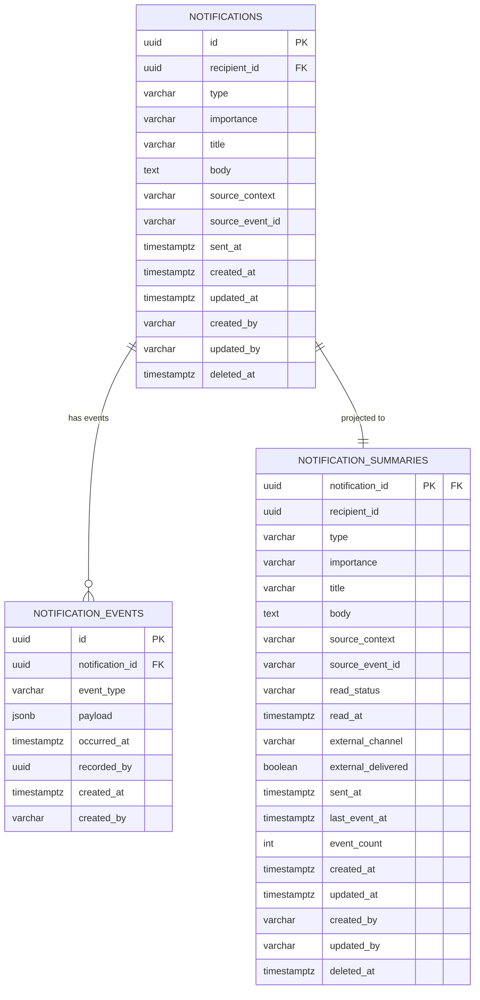

# 通知 データベース設計

## 概要

ユーザーへの通知（36協定アラート・承認リマインダー・
打刻忘れ等）を配送・管理する集約のデータベース設計。

**コンテキスト:** 通知
**構成:** イミュータブルデータモデル + Read Model（アプリケーション層同期）
**RDBMS:** PostgreSQL 16.x

---

## テーブル一覧

| # | テーブル名 | 種別 | 説明 |
|---|-----------|------|------|
| 1 | `notifications` | Write Model | 通知（集約ルート・不変属性） |
| 2 | `notification_events` | Write Model | 通知イベント（追記のみ） |
| 3 | `notification_summaries` | Read Model | 通知サマリー（アプリ同期） |

---

## ER図



---

## Write Model

### notifications（通知）

集約ルート。不変属性のみを保持する。
状態変更は `notification_events` への追記で表現する。

**テーブル名:** `notifications`

| カラム | 型 | NULL | デフォルト | 説明 |
|--------|-----|------|-----------|------|
| id | UUID | NO | gen_random_uuid() | 主キー |
| recipient_id | UUID | NO | - | 受信者ユーザーID |
| type | VARCHAR(50) | NO | - | 通知種別 |
| importance | VARCHAR(10) | NO | - | 重要度 |
| title | VARCHAR(100) | NO | - | 通知タイトル |
| body | TEXT | NO | - | 通知本文（1-1000文字） |
| source_context | VARCHAR(20) | NO | - | 発生元コンテキスト |
| source_event_id | VARCHAR(255) | YES | NULL | 発生元イベントID |
| sent_at | TIMESTAMPTZ | NO | CURRENT_TIMESTAMP | 送信日時 |
| created_at | TIMESTAMPTZ | NO | CURRENT_TIMESTAMP | 作成日時 |
| updated_at | TIMESTAMPTZ | NO | CURRENT_TIMESTAMP | 更新日時 |
| created_by | VARCHAR(255) | NO | - | 作成者 |
| updated_by | VARCHAR(255) | NO | - | 更新者 |
| deleted_at | TIMESTAMPTZ | YES | NULL | 論理削除日時 |

**制約:**

| 制約名 | 種類 | カラム | 説明 |
|--------|------|--------|------|
| pk_notifications | PRIMARY KEY | id | 主キー |
| chk_notifications_type | CHECK | type | IN ('ARTICLE36_ALERT', 'UNAPPLIED_OVERTIME_ALERT', 'APPROVAL_REMINDER', 'APPROVAL_URGENCY', 'CLOCK_FORGOT', 'SHIFT_CHANGE', 'SPECIAL_LEAVE_GRANT', 'LEAVE_EXPIRY_WARNING', 'LEAVE_OBLIGATION_ALERT') |
| chk_notifications_importance | CHECK | importance | IN ('HIGH', 'MEDIUM', 'LOW') |
| chk_notifications_source_ctx | CHECK | source_context | IN ('ATTENDANCE', 'APPROVAL', 'LEAVE', 'MONTHLY') |

**インデックス:**

| インデックス名 | カラム | 用途 |
|---------------|--------|------|
| idx_notifications_recipient | recipient_id, sent_at DESC | ユーザー別通知取得 |
| idx_notifications_type | type | 通知種別検索 |
| idx_notifications_deleted_at | deleted_at | 論理削除フィルタ |

---

### notification_events（通知イベント）

集約に対する全ての状態変更をイベントとして記録する。
追記のみ（INSERT only）。UPDATE・DELETE は行わない。

**テーブル名:** `notification_events`

| カラム | 型 | NULL | デフォルト | 説明 |
|--------|-----|------|-----------|------|
| id | UUID | NO | gen_random_uuid() | イベントID |
| notification_id | UUID | NO | - | 通知ID |
| event_type | VARCHAR(50) | NO | - | イベント種別 |
| payload | JSONB | NO | '{}' | イベントデータ |
| occurred_at | TIMESTAMPTZ | NO | CURRENT_TIMESTAMP | 発生日時 |
| recorded_by | UUID | YES | - | 記録者ID |
| created_at | TIMESTAMPTZ | NO | CURRENT_TIMESTAMP | 作成日時 |
| created_by | VARCHAR(255) | NO | - | 作成者 |

**event_type の値:**

| event_type | 対応イベント | payload例 |
|------------|-------------|-----------|
| SENT | 通知が送信された | `{"notificationId": "...", "recipientId": "...", "type": "ARTICLE36_ALERT", "importance": "HIGH", "sourceContext": "ATTENDANCE"}` |
| EXTERNAL_DELIVERED | 外部通知が送信された | `{"channel": "SLACK", "deliveredAt": "..."}` |
| READ | 通知が既読になった | `{"recipientId": "...", "readAt": "..."}` |

**制約:**

| 制約名 | 種類 | カラム | 説明 |
|--------|------|--------|------|
| pk_notification_events | PRIMARY KEY | id | 主キー |
| fk_notification_events_notification | FOREIGN KEY | notification_id | notifications.id 参照 |
| chk_notification_events_type | CHECK | event_type | IN ('SENT', 'EXTERNAL_DELIVERED', 'READ') |

**インデックス:**

| インデックス名 | カラム | 用途 |
|---------------|--------|------|
| idx_ntf_events_lookup | notification_id, occurred_at DESC | 集約別イベント取得 |
| idx_ntf_events_type | event_type | イベントタイプ検索 |
| idx_ntf_events_occurred_at | occurred_at | 時系列クエリ |

---

## Read Model

### notification_summaries（通知サマリー）

イベントから導出される通知の現在状態を保持する。
`@TransactionalEventListener` によりアプリケーション層で同期更新する。
クエリ要件（未読通知一覧・通知履歴）に最適化した非正規化テーブル。

**テーブル名:** `notification_summaries`

| カラム | 型 | NULL | デフォルト | 説明 |
|--------|-----|------|-----------|------|
| notification_id | UUID | NO | - | 通知ID（主キー） |
| recipient_id | UUID | NO | - | 受信者ユーザーID |
| type | VARCHAR(50) | NO | - | 通知種別 |
| importance | VARCHAR(10) | NO | - | 重要度 |
| title | VARCHAR(100) | NO | - | 通知タイトル |
| body | TEXT | NO | - | 通知本文 |
| source_context | VARCHAR(20) | NO | - | 発生元コンテキスト |
| source_event_id | VARCHAR(255) | YES | NULL | 発生元イベントID |
| read_status | VARCHAR(10) | NO | 'UNREAD' | 既読状態 |
| read_at | TIMESTAMPTZ | YES | NULL | 既読日時 |
| external_channel | VARCHAR(10) | NO | 'NONE' | 外部配信チャネル |
| external_delivered | BOOLEAN | NO | FALSE | 外部配信済みフラグ |
| sent_at | TIMESTAMPTZ | NO | - | 送信日時 |
| last_event_at | TIMESTAMPTZ | YES | NULL | 最終イベント日時 |
| event_count | INTEGER | NO | 0 | イベント数 |
| created_at | TIMESTAMPTZ | NO | CURRENT_TIMESTAMP | 作成日時 |
| updated_at | TIMESTAMPTZ | NO | CURRENT_TIMESTAMP | 更新日時 |
| created_by | VARCHAR(255) | NO | - | 作成者 |
| updated_by | VARCHAR(255) | NO | - | 更新者 |
| deleted_at | TIMESTAMPTZ | YES | NULL | 論理削除日時 |

**制約:**

| 制約名 | 種類 | カラム | 説明 |
|--------|------|--------|------|
| pk_notification_summaries | PRIMARY KEY | notification_id | 主キー |
| fk_ntf_summaries_notification | FOREIGN KEY | notification_id | notifications.id 参照 |
| chk_ntf_summaries_read_status | CHECK | read_status | IN ('UNREAD', 'READ') |
| chk_ntf_summaries_importance | CHECK | importance | IN ('HIGH', 'MEDIUM', 'LOW') |
| chk_ntf_summaries_channel | CHECK | external_channel | IN ('NONE', 'SLACK', 'EMAIL', 'TEAMS') |

**インデックス:**

| インデックス名 | カラム | 用途 |
|---------------|--------|------|
| idx_ntf_summaries_unread | recipient_id, importance, sent_at DESC | 未読通知一覧クエリ（WHERE read_status = 'UNREAD'） |
| idx_ntf_summaries_history | recipient_id, sent_at DESC | 通知履歴クエリ |
| idx_ntf_summaries_read_status | read_status | 既読状態フィルタ |
| idx_ntf_summaries_type | type | 通知種別フィルタ |
| idx_ntf_summaries_source_ctx | source_context | 発生元コンテキストフィルタ |
| idx_ntf_summaries_deleted_at | deleted_at | 論理削除フィルタ |

**同期方式:** `@TransactionalEventListener`（アプリケーション層）

| イベント種別 | リードモデル処理 |
|-------------|------------------|
| SENT | INSERT: 通知の全不変属性を設定、read_status='UNREAD', external_channel='NONE', external_delivered=FALSE |
| EXTERNAL_DELIVERED | UPDATE: external_channel, external_delivered=TRUE 設定 |
| READ | UPDATE: read_status='READ', read_at 設定 |

---

## 不変条件とDB制約の対応

| 不変条件 | 対応方法 |
|---------|---------|
| INV-NTF-001: 既読は本人のみ | アプリケーション層で検証（recipient_id と操作者の一致確認） |
| INV-NTF-002: READ後はUNREADに戻せない | アプリケーション層で検証（イミュータブルモデルのためイベント追記で自然に保証） |
| INV-NTF-003: 外部配信は1回のみ | アプリケーション層で検証（EXTERNAL_DELIVERED イベントの存在チェック） |

---

## クエリ要件とインデックスの対応

| クエリ要件 | 対応テーブル | 使用インデックス |
|-----------|------------|----------------|
| 未読通知一覧（recipientId, importance, sourceContext, sentAt DESC） | notification_summaries | idx_ntf_summaries_unread, idx_ntf_summaries_source_ctx |
| 通知履歴（recipientId, importance, type, readStatus, sentAt range） | notification_summaries | idx_ntf_summaries_history, idx_ntf_summaries_type, idx_ntf_summaries_read_status |

---

## マイグレーション

### V1: Write Model

```sql
-- V1__create_notifications.sql

-- === Write Model ===

CREATE TABLE notifications (
    id UUID PRIMARY KEY DEFAULT gen_random_uuid(),
    recipient_id UUID NOT NULL,
    type VARCHAR(50) NOT NULL,
    importance VARCHAR(10) NOT NULL,
    title VARCHAR(100) NOT NULL,
    body TEXT NOT NULL,
    source_context VARCHAR(20) NOT NULL,
    source_event_id VARCHAR(255),
    sent_at TIMESTAMPTZ NOT NULL DEFAULT CURRENT_TIMESTAMP,
    created_at TIMESTAMPTZ NOT NULL DEFAULT CURRENT_TIMESTAMP,
    updated_at TIMESTAMPTZ NOT NULL DEFAULT CURRENT_TIMESTAMP,
    created_by VARCHAR(255) NOT NULL,
    updated_by VARCHAR(255) NOT NULL,
    deleted_at TIMESTAMPTZ,

    CONSTRAINT chk_notifications_type
        CHECK (type IN (
            'ARTICLE36_ALERT', 'UNAPPLIED_OVERTIME_ALERT',
            'APPROVAL_REMINDER', 'APPROVAL_URGENCY',
            'CLOCK_FORGOT', 'SHIFT_CHANGE',
            'SPECIAL_LEAVE_GRANT', 'LEAVE_EXPIRY_WARNING',
            'LEAVE_OBLIGATION_ALERT'
        )),
    CONSTRAINT chk_notifications_importance
        CHECK (importance IN ('HIGH', 'MEDIUM', 'LOW')),
    CONSTRAINT chk_notifications_source_ctx
        CHECK (source_context IN (
            'ATTENDANCE', 'APPROVAL', 'LEAVE', 'MONTHLY'
        ))
);

CREATE INDEX idx_notifications_recipient
    ON notifications (recipient_id, sent_at DESC);
CREATE INDEX idx_notifications_type
    ON notifications (type);
CREATE INDEX idx_notifications_deleted_at
    ON notifications (deleted_at)
    WHERE deleted_at IS NOT NULL;

-- イベントテーブル
CREATE TABLE notification_events (
    id UUID PRIMARY KEY DEFAULT gen_random_uuid(),
    notification_id UUID NOT NULL
        REFERENCES notifications(id),
    event_type VARCHAR(50) NOT NULL,
    payload JSONB NOT NULL DEFAULT '{}',
    occurred_at TIMESTAMPTZ NOT NULL DEFAULT CURRENT_TIMESTAMP,
    recorded_by UUID,
    created_at TIMESTAMPTZ NOT NULL DEFAULT CURRENT_TIMESTAMP,
    created_by VARCHAR(255) NOT NULL,

    CONSTRAINT chk_notification_events_type
        CHECK (event_type IN (
            'SENT', 'EXTERNAL_DELIVERED', 'READ'
        ))
);

CREATE INDEX idx_ntf_events_lookup
    ON notification_events (notification_id, occurred_at DESC);
CREATE INDEX idx_ntf_events_type
    ON notification_events (event_type);
CREATE INDEX idx_ntf_events_occurred_at
    ON notification_events (occurred_at);
```

### V2: Read Model

```sql
-- V2__create_notification_read_models.sql

-- === Read Model ===

-- 通知サマリー
CREATE TABLE notification_summaries (
    notification_id UUID PRIMARY KEY
        REFERENCES notifications(id),
    recipient_id UUID NOT NULL,
    type VARCHAR(50) NOT NULL,
    importance VARCHAR(10) NOT NULL,
    title VARCHAR(100) NOT NULL,
    body TEXT NOT NULL,
    source_context VARCHAR(20) NOT NULL,
    source_event_id VARCHAR(255),
    read_status VARCHAR(10) NOT NULL DEFAULT 'UNREAD',
    read_at TIMESTAMPTZ,
    external_channel VARCHAR(10) NOT NULL DEFAULT 'NONE',
    external_delivered BOOLEAN NOT NULL DEFAULT FALSE,
    sent_at TIMESTAMPTZ NOT NULL,
    last_event_at TIMESTAMPTZ,
    event_count INTEGER NOT NULL DEFAULT 0,
    created_at TIMESTAMPTZ NOT NULL DEFAULT CURRENT_TIMESTAMP,
    updated_at TIMESTAMPTZ NOT NULL DEFAULT CURRENT_TIMESTAMP,
    created_by VARCHAR(255) NOT NULL,
    updated_by VARCHAR(255) NOT NULL,
    deleted_at TIMESTAMPTZ,

    CONSTRAINT chk_ntf_summaries_read_status
        CHECK (read_status IN ('UNREAD', 'READ')),
    CONSTRAINT chk_ntf_summaries_importance
        CHECK (importance IN ('HIGH', 'MEDIUM', 'LOW')),
    CONSTRAINT chk_ntf_summaries_channel
        CHECK (external_channel IN (
            'NONE', 'SLACK', 'EMAIL', 'TEAMS'
        ))
);

CREATE INDEX idx_ntf_summaries_unread
    ON notification_summaries (recipient_id, importance, sent_at DESC)
    WHERE read_status = 'UNREAD';
CREATE INDEX idx_ntf_summaries_history
    ON notification_summaries (recipient_id, sent_at DESC);
CREATE INDEX idx_ntf_summaries_read_status
    ON notification_summaries (read_status);
CREATE INDEX idx_ntf_summaries_type
    ON notification_summaries (type);
CREATE INDEX idx_ntf_summaries_source_ctx
    ON notification_summaries (source_context);
CREATE INDEX idx_ntf_summaries_deleted_at
    ON notification_summaries (deleted_at)
    WHERE deleted_at IS NOT NULL;
```

### リードモデル同期方式

DBトリガーは使用しない。アプリケーション層で `@TransactionalEventListener` を使い同期更新する。

**方式:** Spring の `@TransactionalEventListener(phase = AFTER_COMMIT)` を使用し、
イベント保存と同一トランザクション完了後にリードモデルを更新する。

**実装クラス構成:**

| クラス | 責務 |
|--------|------|
| `NotificationSummaryProjector` | notification_events → notification_summaries の同期 |

**利点:**
- テスト容易性: 通常の Spring Bean としてユニットテスト可能
- デバッグ容易性: アプリログで同期処理を追跡可能
- デプロイ容易性: Flyway マイグレーションにトリガー管理が不要
- ORM互換性: JPA キャッシュとの矛盾が発生しない

**リードモデル再構築:**
イベントテーブルから任意の時点で `notification_summaries` を再構築可能。
バッチ処理として `NotificationSummaryRebuilder` を実装する。

---

## 履歴管理方針

| 対象 | 方針 | 説明 |
|------|------|------|
| notifications | イミュータブル（変更なし） | 通知の不変属性。作成後は変更しない |
| notification_events | イミュータブル（追記のみ） | 全操作をイベントとして記録。UPDATE/DELETE しない |
| notification_summaries | ミュータブル（上書き） | アプリ層（@TransactionalEventListener）で同期更新 |

---

## 値オブジェクトのマッピング

| 値オブジェクト | マッピング先 | 方式 |
|--------------|------------|------|
| NotificationTitle | notifications.title / notification_summaries.title | VARCHAR(100) に展開 |
| NotificationBody | notifications.body / notification_summaries.body | TEXT に展開（1-1000文字はアプリ層で検証） |

---

## 実装ノート

- **論理削除:** `deleted_at` カラム（notifications, notification_summaries）。
  部分インデックス `WHERE deleted_at IS NOT NULL` で対応
- **イベント不変性:** `notification_events` は INSERT のみ。
  一度保存したイベントは変更・削除しない
- **リードモデル再構築:** イベントから任意の時点で
  `notification_summaries` を再構築可能
- **冪等性:** 同一イベントを複数回処理しても
  結果が同じになるようにイベントリスナーを実装
- **未読通知インデックス最適化:** `idx_ntf_summaries_unread` は
  部分インデックス（WHERE read_status = 'UNREAD'）で
  未読通知一覧クエリの性能を最適化
- **外部配信の二重防止:** INV-NTF-003 はアプリケーション層で
  EXTERNAL_DELIVERED イベントの存在チェックにより保証

---

## 品質チェック結果

- [x] 全集約属性にカラムが対応している
  - notifications: 不変属性9個（id, recipient_id, type, importance, title, body, source_context, source_event_id, sent_at）
  - notification_summaries: 全13属性を非正規化（+ read_status, read_at, external_channel, external_delivered）
- [x] 不変条件がDB制約として表現されている
  - INV-NTF-001: アプリケーション層（recipient_id 一致確認）
  - INV-NTF-002: アプリケーション層（イミュータブルモデルで自然に保証）
  - INV-NTF-003: アプリケーション層（イベント存在チェック）
- [x] インデックスがクエリ要件をカバーしている
  - 未読通知一覧: idx_ntf_summaries_unread（部分インデックス）
  - 通知履歴: idx_ntf_summaries_history, idx_ntf_summaries_type, idx_ntf_summaries_read_status
- [x] 値オブジェクトが適切にマッピングされている
  - NotificationTitle → VARCHAR(100)
  - NotificationBody → TEXT（1-1000文字はアプリ層検証）
